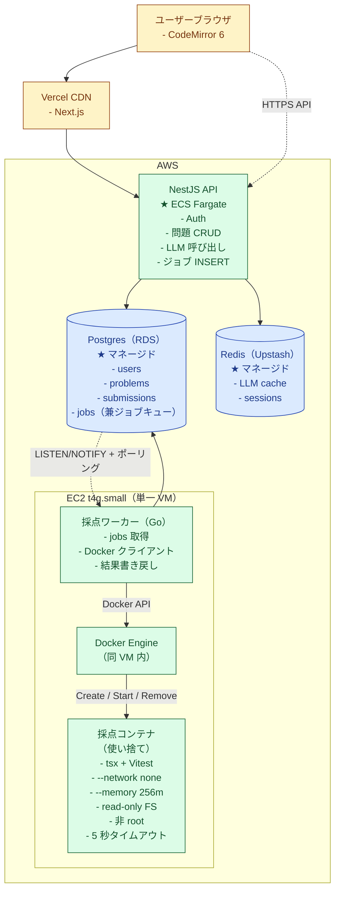

# システム全体構成

NestJS（API）と Go ワーカー（採点）は **物理的に別のマシンで動く**設計。理由は「Docker 操作権限が必要なホストと、ユーザーリクエストを受けるホストを分けたい」ため。

---

## 1. 物理配置の全体図



**読み方**：
- 実線 = 同期 HTTP / SQL、点線 = 非同期通知（LISTEN/NOTIFY）または最初の HTTPS リクエスト経路
- 青 = ストア、緑 = コンピュート、橙 = エッジ
- `★` 注記は配置種別を示す（マネージドサービス / 単一 VM 等）
- `jobs ★（ジョブキュー兼任）` は Postgres 内のテーブルでありながらジョブキューを兼任（→ [ADR 0001](docs/adr/0001-postgres-as-job-queue.md)）

---

## 2. NestJS と Go ワーカーを別マシンに分ける理由

| 観点 | 理由 |
|---|---|
| セキュリティ | Go ワーカーは `docker.sock` 操作権限が必要 = root 相当。ユーザーリクエストを受ける NestJS と同居させない |
| スケール特性 | NestJS：HTTP リクエスト数で水平スケール。Go ワーカー：CPU 集約的なコンテナ実行 |
| デプロイ環境 | NestJS：Cloud Run / Fargate（マネージド）。Go ワーカー：Docker Engine が必要なので EC2 |
| 障害分離 | 採点が暴走しても API は止まらない、API デプロイ中も採点継続可能 |

---

## 3. 各コンポーネントの責務

### Frontend（Next.js on Vercel）
- ページレンダリング（RSC）
- 認証セッション保持
- NestJS API を `fetch` で呼び出し
- 採点結果ポーリング（TanStack Query）
- CodeMirror 6 でコード入力

### NestJS API（ECS Fargate）
- Module 構成：Auth / Problems / Generation / Grading / Observability
- 認証（GitHub OAuth）、問題 CRUD、LLM 呼び出し、ジョブ INSERT、結果取得 API
- Docker 操作はしない

### Postgres（RDS）
- アプリデータ（users, problems, submissions）
- `jobs` テーブル（ジョブキュー兼任）
- LISTEN/NOTIFY のチャンネル提供

### Redis（Upstash）
- LLM レスポンスキャッシュ、セッション、レート制限
- ジョブキューには使わない

### Go 採点ワーカー（EC2）
- 常駐プロセス、ループで動く
- Postgres `jobs` を LISTEN/NOTIFY + ポーリングで監視
- ジョブ取得 → Docker API でサンドボックス起動 → 結果回収 → 書き戻し
- Docker Engine と同じ VM に住み、`/var/run/docker.sock` を直接使う

### 採点コンテナ（使い捨て）
- ジョブごとに 1 つ作って 1 つ捨てる
- Node.js + tsx + Vitest
- ネットワーク遮断、メモリ制限、読み取り専用 FS、非 root、5 秒タイムアウト

---

## 4. 1 ジョブが流れる経路


**読み方**：
- 実線矢印 = 同期呼び出し（HTTP / SQL）、点線矢印 = 非同期通知（NOTIFY）または HTTP レスポンス
- `activate` / `deactivate` は処理が走っている期間を示す
- 上から下に時系列。`Note over X,Y` はトランザクション境界・処理内容の補足
- SQL リテラルのシングルクォートと `→` 矢印・`...` 省略記号は Mermaid パーサ事故回避のため平文に置換（実装時は `'queued'` 等の正しい SQL リテラルを使う）

---

## 5. ローカル開発（Docker Compose）

本番と違って 1 マシンで動かす：

```yaml
services:
  postgres:
    image: postgres:16
  redis:
    image: redis:7
  nestjs:
    build: ./apps/api
    depends_on: [postgres, redis]
  worker:
    build: ./apps/grading-worker
    volumes:
      - /var/run/docker.sock:/var/run/docker.sock  # DooD でホスト Docker を使う
    depends_on: [postgres]
  next:
    build: ./apps/web
    depends_on: [nestjs]
```

`docker compose up` で全体起動。

---

## 6. デプロイ環境

| コンポーネント | デプロイ先 | 形態 |
|---|---|---|
| Next.js | Vercel | サーバレス |
| NestJS API | ECS Fargate | コンテナ |
| Postgres | RDS | マネージド |
| Redis | Upstash | サーバレス |
| Go ワーカー | EC2 t4g.small | VM 直（Docker Engine 必要） |

コスト目安：月 $10〜30。

---

## 7. 一行まとめ

> NestJS は「ジョブを Postgres に登録するだけ」、Go ワーカーは別 VM で「Postgres を見張りながら、Docker Engine に採点コンテナを作らせる」、Postgres が両者をつなぐ仲介役。
