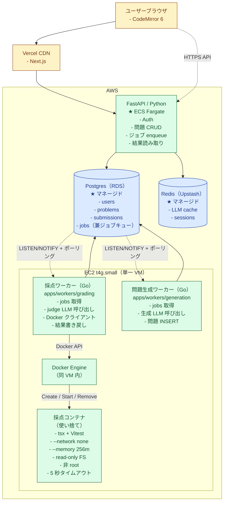
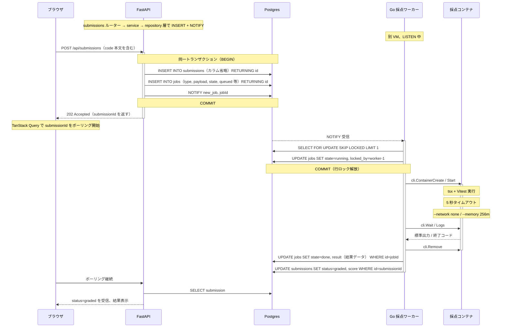

# システム全体構成

FastAPI（API）と Go ワーカー（採点 / 問題生成）は **物理的に別のマシンで動く**設計。理由は「Docker 操作権限が必要なホストと、ユーザーリクエストを受けるホストを分けたい」ため。LLM 呼び出しは Worker 側に集約する（→ [ADR 0040](docs/adr/0040-worker-grouping-and-llm-in-worker.md)）。

---

## 1. 物理配置の全体図



**読み方**：
- 実線 = 同期 HTTP / SQL、点線 = 非同期通知（LISTEN/NOTIFY）または最初の HTTPS リクエスト経路
- 青 = ストア、緑 = コンピュート、橙 = エッジ
- `★` 注記は配置種別を示す（マネージドサービス / 単一 VM 等）
- `jobs ★（ジョブキュー兼任）` は Postgres 内のテーブルでありながらジョブキューを兼任（→ [ADR 0004](docs/adr/0004-postgres-as-job-queue.md)）

---

## 2. FastAPI と Go ワーカーを別マシンに分ける理由

| 観点 | 理由 |
|---|---|
| セキュリティ | Go ワーカー（grading）は `docker.sock` 操作権限が必要 = root 相当。ユーザーリクエストを受ける FastAPI と同居させない |
| スケール特性 | FastAPI：HTTP リクエスト数で水平スケール。Go ワーカー：CPU 集約的なコンテナ実行 / LLM 呼び出し（→ [ADR 0040](docs/adr/0040-worker-grouping-and-llm-in-worker.md)） |
| デプロイ環境 | FastAPI：ECS Fargate（マネージド）。Go ワーカー：Docker Engine が必要なので EC2 |
| 障害分離 | 採点が暴走しても API は止まらない、API デプロイ中も採点継続可能 |

---

## 3. 各コンポーネントの責務

### Frontend（Next.js on Vercel）
- ページレンダリング（RSC）
- 認証セッション保持
- FastAPI を OpenAPI 由来の Hey API クライアント（[ADR 0006](docs/adr/0006-json-schema-as-single-source-of-truth.md)）で呼び出し
- 採点結果ポーリング（TanStack Query）
- CodeMirror 6 でコード入力

### FastAPI / Python（ECS Fargate）
- APIRouter 構成：auth / problems / submissions / jobs（enqueue のみ）/ healthz
- 責務：**認証（GitHub OAuth）・問題 CRUD・ジョブ enqueue・結果読み取り**（Worker が `submissions` / `jobs` テーブルへの結果書き戻しを担当するため、API 側は読み取り専用）
- **LLM 呼び出しは行わない**（Worker 側に集約、→ [ADR 0040](docs/adr/0040-worker-grouping-and-llm-in-worker.md)）
- Docker 操作はしない
- 共有データ型は **Pydantic を SSoT** とし、**境界別の 2 伝送路**で TS / Go に展開（→ [ADR 0006](docs/adr/0006-json-schema-as-single-source-of-truth.md)）：HTTP API 境界は FastAPI 自動 OpenAPI 3.1（`apps/api/openapi.json`）→ Hey API で TS 型 + Zod + HTTP クライアント生成、Job キュー境界は Pydantic `model.model_json_schema()` で個別 JSON Schema を `apps/api/job-schemas/` に出力 → quicktype `--src-lang schema` で Go struct 生成

### Postgres（RDS）
- アプリデータ（users, problems, submissions）
- `jobs` テーブル（ジョブキュー兼任）
- LISTEN/NOTIFY のチャンネル提供

### Redis（Upstash）
- LLM レスポンスキャッシュ、セッション、レート制限
- ジョブキューには使わない

### Go ワーカー（EC2、`apps/workers/<name>/` で系統別に分割、→ [ADR 0040](docs/adr/0040-worker-grouping-and-llm-in-worker.md)）
- 常駐プロセス、ループで動く
- Postgres `jobs` を LISTEN/NOTIFY + ポーリングで監視
- LLM 呼び出しは Worker 側に集約（プロンプトも `apps/workers/<name>/prompts/` に同居）
- **LLM プロバイダ抽象化層は Go ワーカー内に実装**（Anthropic / Gemini / OpenAI / OpenRouter を差し替え可能、API 側からは独立、→ [ADR 0007](docs/adr/0007-llm-provider-abstraction.md) / [ADR 0040](docs/adr/0040-worker-grouping-and-llm-in-worker.md)）

#### 採点ワーカー（`apps/workers/grading/`）
- ジョブ取得 → judge LLM 呼び出し → Docker API でサンドボックス起動 → 結果回収 → 書き戻し
- Docker Engine と同じ VM に住み、`/var/run/docker.sock` を直接使う

#### 問題生成ワーカー（`apps/workers/generation/`、将来追加）
- ジョブ取得 → 生成 LLM 呼び出し → 模範解答のサンドボックス検証 → `problems` INSERT

### 採点コンテナ（使い捨て）
- ジョブごとに 1 つ作って 1 つ捨てる
- Node.js + tsx + Vitest
- ネットワーク遮断、メモリ制限、読み取り専用 FS、非 root、5 秒タイムアウト

---

## 4. 1 ジョブが流れる経路



**読み方**：
- 実線矢印 = 同期呼び出し（HTTP / SQL）、点線矢印 = 非同期通知（NOTIFY）または HTTP レスポンス
- `activate` / `deactivate` は処理が走っている期間を示す
- 上から下に時系列。`Note over X,Y` はトランザクション境界・処理内容の補足
- SQL リテラルのシングルクォートと `→` 矢印・`...` 省略記号は Mermaid パーサ事故回避のため平文に置換（実装時は `'queued'` 等の正しい SQL リテラルを使う）

---

## 5. ローカル開発（Docker Compose）

本番と違って 1 マシンで動かす：

```yaml
services:
  postgres:
    image: postgres:16
  redis:
    image: redis:7
  api:
    build: ./apps/api  # FastAPI / Python
    depends_on: [postgres, redis]
  worker-grading:
    build: ./apps/workers/grading
    volumes:
      - /var/run/docker.sock:/var/run/docker.sock  # DooD でホスト Docker を使う
    depends_on: [postgres]
  # worker-generation は将来追加（apps/workers/generation/）
  next:
    build: ./apps/web
    depends_on: [api]
```

`docker compose up` で全体起動。

---

## 6. デプロイ環境

| コンポーネント | デプロイ先 | 形態 |
|---|---|---|
| Next.js | Vercel | サーバレス |
| FastAPI | ECS Fargate | コンテナ |
| Postgres | RDS | マネージド |
| Redis | Upstash | サーバレス |
| Go ワーカー | EC2 t4g.small | VM 直（Docker Engine 必要） |

コスト目安：月 $10〜30。

---

## 7. 一行まとめ

> FastAPI は「ジョブを Postgres に登録するだけ」、Go ワーカー（grading / generation）は別 VM で「Postgres を見張りながら、LLM を呼び、Docker Engine に採点コンテナを作らせる」、Postgres が両者をつなぐ仲介役。
