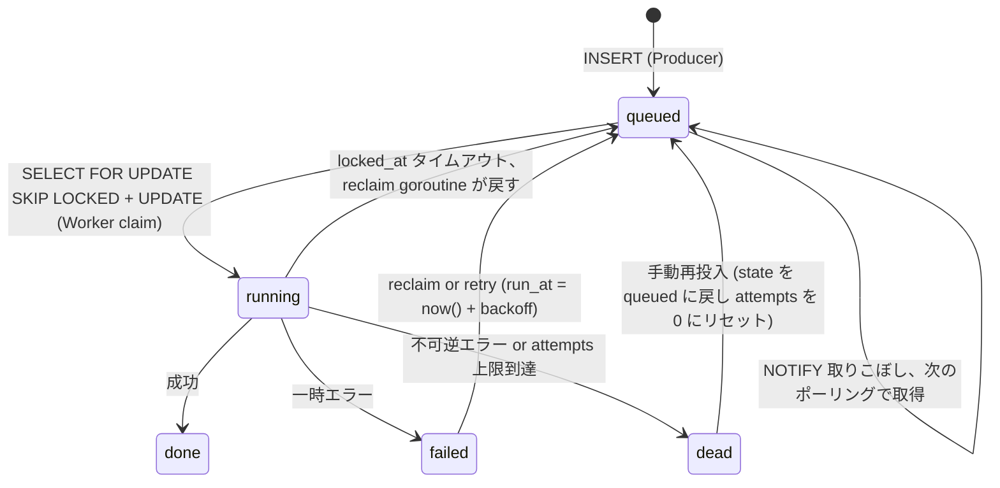

# 0046. ジョブキューの配送保証契約（at-least-once / 可視性タイムアウト / 指数バックオフリトライ / `state='dead'` DLQ）

- **Status**: Accepted
- **Date**: 2026-05-17
- **Decision-makers**: 神保

## Context（背景・課題）

[ADR 0004](./0004-postgres-as-job-queue.md) で「ジョブキューに Postgres `SELECT FOR UPDATE SKIP LOCKED` + `LISTEN/NOTIFY` を採用」する戦略判断は固めた。しかし **Worker 実装が前提とする契約レベル**は ADR 0004 では未定義で、関連情報が以下に断片的に散らばっている：

- [02-architecture.md: ジョブキュー](../requirements/2-foundation/02-architecture.md#ジョブキューpostgres-select-for-update-skip-locked)：可視性タイムアウト 5 分、リトライ、`state='dead'` を箇条書きで言及
- [.claude/rules/worker.md: スタックジョブのリクレイム](../../.claude/rules/worker.md)：reclaim SQL の擬似コード
- [.claude/rules/alembic-sqlalchemy.md: jobs テーブル](../../.claude/rules/alembic-sqlalchemy.md)：カラム設計と `LISTEN/NOTIFY` の擬似コード

このままだと R1-2 で Worker 実装に着手する時に「at-least-once か exactly-once か」「冪等性は Producer 側か Worker 側か」「NOTIFY を取りこぼした時の振る舞い」「DLQ は別テーブルか同テーブルか」が個別判断になり、Worker 実装 / Backend enqueue 側 / 観測性 / 運用が **同じ契約を共有できない**リスクがある。

本 ADR は **R1-2 着手前に配送保証契約を明文化**し、Backend（Producer）と Worker（Consumer）双方の前提を固定する。

### 業界用語と本プロジェクトの規模

- メッセージング業界の配送保証は一般に：at-most-once（最大 1 回） / at-least-once（最低 1 回、重複可） / exactly-once（厳密 1 回）の 3 段階
- 本プロジェクト規模（数百ジョブ/日、→ [ADR 0004](./0004-postgres-as-job-queue.md)）では exactly-once の実装コストは合わない
- exactly-once は「Producer × Broker × Consumer の 3 すべての協調が必要」で、Kafka EOS のような重い機構を要する

## Decision（決定内容）

ジョブキューの配送保証契約として以下を採用する。**戦略判断型 ADR**として本 ADR で完結させる（ADR 0004 の派生として固定する判断）。

### 配送保証レベル：at-least-once

- 各ジョブは **最低 1 回** Worker に届く。**重複処理が起こりうる**ことを Worker handler は前提とする
- exactly-once は採用しない（実装コストが規模に合わない）

### Producer（FastAPI）側の契約

| 項目 | 契約 |
|---|---|
| Enqueue 方式 | **アプリ INSERT と `INSERT jobs` + `NOTIFY` を同一トランザクションで実行**（Outbox パターン不要、→ [ADR 0004](./0004-postgres-as-job-queue.md)） |
| トランザクション境界 | `async with session.begin():` で囲み、COMMIT 失敗時はアプリ INSERT も jobs INSERT もロールバック（二重書き込み問題なし） |
| `NOTIFY` の扱い | Producer は `NOTIFY new_job, '<job_id>'` を必ず発火する。ただし **NOTIFY 失敗 = ジョブ消失ではない**（後述のポーリングで救済） |
| 冪等性キー | ジョブ payload に **業務上のユニーク識別子**（例：`submission_id`）を必ず含める。Worker 側の冪等性判定に使う |

### Worker（Go）側の契約

| 項目 | 契約 |
|---|---|
| ジョブ取得 SQL | `SELECT ... FOR UPDATE SKIP LOCKED LIMIT 1` で 1 件取得 → `UPDATE state='running', locked_at=now(), locked_by=$worker_id, attempts=attempts+1` を **同一トランザクションで即 COMMIT**（行ロックを長時間握らない） |
| 実行トランザクション | Docker 実行 / LLM 呼び出しは **別トランザクション**で行い、行ロックを開放した状態で処理 |
| 完了時の更新 | 成功時：`state='done', result=...`。失敗時：`state='failed', last_error=...` を別トランザクションで更新 |
| ハンドラの冪等性 | Worker handler は **同一ジョブが 2 回届いても副作用が 1 回分**になるように実装する責務を負う（payload の `submission_id` で重複検出、UPDATE は ID 指定で安全） |
| `panic` の扱い | `recover()` で吸収し `state='failed'` に遷移、Worker 本体は継続稼働 |

### 可視性タイムアウト：5 分

- `locked_at < now() - interval '5 min'` のジョブを **スタックジョブ**とみなし、別の `reclaim` goroutine が `state='queued'`, `locked_at=NULL`, `locked_by=NULL` に戻す
- `attempts` は claim 時にすでに +1 されているため、reclaim 自体では increment しない
- タイムアウト値の根拠：採点ジョブは Vitest 実行 5 秒（→ [.claude/rules/worker.md: 採点コンテナの制約](../../.claude/rules/worker.md)）+ Docker 起動 ~200ms + LLM Judge ~30 秒 = 通常完了は 1 分以内に余裕で収まる。5 分は **Worker クラッシュ・SIGKILL 検出までの最大待ち時間**

### リトライポリシー：指数バックオフ

| 試行回数 | `run_at` 再設定値 |
|---|---|
| 1 回目失敗 → 2 回目 | `run_at = now() + interval '10 sec'` |
| 2 回目失敗 → 3 回目 | `run_at = now() + interval '60 sec'` |
| 3 回目失敗 | `state='dead'` に遷移（DLQ） |

- 最大試行回数（既定）：**3 回**（環境変数 `JOB_MAX_ATTEMPTS` で上書き可能）
- リトライ可能エラー（DB 接続エラー / LLM 一時障害 / タイムアウト）と不可逆エラー（コードのコンパイルエラー等）を Worker handler 側で区別し、不可逆エラーは即 `state='dead'` に遷移して試行回数を消費しない

### DLQ：`state='dead'` カラムで表現（別テーブルは作らない）

- DLQ 専用テーブルは作らず、`jobs.state = 'dead'` 値で表現
- 監視は `SELECT count(*) FROM jobs WHERE state='dead'`、再投入は `UPDATE jobs SET state='queued', attempts=0 WHERE id=$1`
- 観測性のアラート：直近 1 時間で `state='dead'` が 5 件以上増加でメール通知（→ [04-observability.md: アラート](../requirements/2-foundation/04-observability.md#アラート)）

### `LISTEN/NOTIFY` の位置づけ：best-effort なヒント

- `NOTIFY` は **取りこぼし許容**のレイテンシ最適化として位置付ける（保証付きの配送ではない）
- 配送保証の本体は **30 秒間隔のポーリング**（`SELECT ... FOR UPDATE SKIP LOCKED`）
- NOTIFY が消える条件：Postgres 再起動 / クライアント切断中の発火 / `NOTIFY` 発火前にコミット失敗
- Worker は `LISTEN/NOTIFY` + ポーリングのハイブリッドループ（→ [.claude/rules/worker.md: LISTEN/NOTIFY + 低頻度ポーリングのハイブリッド](../../.claude/rules/worker.md)）

### ジョブ state の遷移図

## Why（採用理由）

### 1. at-least-once は exactly-once より実装コストが圧倒的に低い

- exactly-once は Producer / Broker / Consumer の 3 者協調 + 重複検出ストアが必要（Kafka EOS / 2PC 等）。本プロジェクト規模では過剰
- at-least-once + **Worker handler の冪等性で吸収**するのが現実的かつ十分。`submission_id` 等の業務キーがあれば重複処理は UPDATE で吸収可能

### 2. `LISTEN/NOTIFY` を best-effort にするのが Postgres 流の正しい設計

- `NOTIFY` は **Postgres 公式ドキュメントで「配送保証はない」と明記**されている：クライアント切断中の発火 / Postgres 再起動 / WAL replay 後では消える
- よって `NOTIFY` を **唯一の取得契機にしてはいけない**。配送保証の本体は SQL ポーリングに置き、`NOTIFY` はあくまでレイテンシ短縮のヒント
- 30 秒ポーリングは「数百ジョブ/日」規模では Postgres 負荷ゼロに等しい（→ [ADR 0004](./0004-postgres-as-job-queue.md)）

### 3. 可視性タイムアウト 5 分は実行時間に対して十分な余白

- 採点本体 5 秒 + Docker 起動 + LLM Judge を含めても通常 1 分以内で完了
- 5 分はクラッシュ検出として現実的な最小値（短すぎると正常実行中の reclaim が起き重複処理が増える）
- 環境変数（`RECLAIM_AFTER_MINUTES`、既定 5）で運用調整可能（→ [.claude/rules/worker.md: 環境変数](../../.claude/rules/worker.md)）

### 4. `SKIP LOCKED` でロック競合を回避

- 複数 Worker が同時に `SELECT FOR UPDATE` した時、`SKIP LOCKED` がない場合は他 Worker が `wait` 状態になりスループット劣化
- `SKIP LOCKED` を付けることで「他 Worker が押さえた行を飛ばす」動作になり、Worker 並列度を線形にスケール可能（→ [ADR 0004](./0004-postgres-as-job-queue.md)）

### 5. DLQ を別テーブルにしない理由

- 業務上「死んだジョブ」は **同じ jobs テーブルで状態だけ違う**ものとして扱える
- 別テーブル化すると INSERT/DELETE で物理的に行を移動する必要があり、observability ツールから見て履歴が分断される
- `state='dead'` なら `SELECT * FROM jobs WHERE state IN ('dead','failed') ORDER BY updated_at DESC` で運用クエリが書ける（→ [ADR 0004](./0004-postgres-as-job-queue.md)）

### 6. 指数バックオフは過剰でなく現実的なリトライ間隔

- 10 秒 → 60 秒 → dead の 3 段は「LLM 一時 429 / DB 一過性接続失敗」を吸収するのに必要十分
- より長い backoff（分単位）が必要になる障害（プロバイダ障害等）は `dead` 後の手動再投入で運用する方が運用負荷が低い

### 7. ハンドラ冪等性を **Worker 側責務**として明文化する

- at-least-once 採用 = 重複処理は契約上発生しうる
- 「いつ重複が起こりうるか」を ADR で明示することで、Worker 実装時に handler が UPSERT 風（`INSERT ... ON CONFLICT` / `UPDATE WHERE id` 等）で書かれることを担保する
- Producer 側で重複防止する設計（dedup ストア）は Postgres ジョブキューの利点を打ち消すため不採用

## Alternatives Considered（検討した代替案）

| 候補 | 概要 | 採用しなかった理由 |
|---|---|---|
| **at-least-once + 冪等性は Worker 側** | （採用） | — |
| **exactly-once（2PC / Outbox + dedup ストア）** | 厳密 1 回配送 | Producer × Broker × Consumer 協調が必要、Kafka EOS 級の機構が要る、規模に合わない |
| **at-most-once（取り逃し許容）** | リトライなし、消えたら諦め | 採点ジョブが消えると UX 致命的、ポートフォリオとして許容不可 |
| **DLQ を別テーブル** (`jobs_dead`) | DLQ 物理分離 | 物理移動の INSERT/DELETE が増える、観測性で履歴分断、運用クエリが複雑化 |
| **`LISTEN/NOTIFY` のみ（ポーリングなし）** | 完全プッシュ | NOTIFY 取りこぼし時にジョブが永久に取得されない、Postgres 再起動で詰む |
| **30 秒ポーリングのみ（NOTIFY なし）** | シンプル | 通常時のレイテンシが平均 15 秒 / 最悪 30 秒で UX 悪化、ユーザーが待つ |
| **可視性タイムアウト 30 秒** | 短い | 通常実行も 30 秒超えるケースがあり（LLM Judge）、reclaim が起きて重複処理が頻発 |
| **可視性タイムアウト 30 分** | 長い | Worker クラッシュ検出が遅すぎ、ユーザーが待たされる |
| **`FOR UPDATE NOWAIT`** | 競合即時失敗 | スループット低下、複数 Worker 並列度を活かせない |
| **リトライなし、即 dead** | シンプル | DB 一過性エラー / LLM 一時 429 で簡単に dead 化し、運用負荷が増える |
| **固定間隔リトライ（毎回 10 秒）** | シンプル | プロバイダ障害時に 3 回連続で同じタイミングを叩き、復旧前に dead 化しやすい |
| **試行回数上限なし（無限リトライ）** | 永久に再試行 | 不可逆エラーで永久にループ、運用上の検知が困難、コスト青天井 |

## Consequences（結果・トレードオフ）

### 得られるもの

- Worker 実装が「同一ジョブが 2 回届く前提で冪等に書く」というシンプルな契約に従える
- Producer 側は `INSERT + NOTIFY` を同一トランザクションで投げるだけで Outbox パターン不要
- `LISTEN/NOTIFY` 取りこぼし時もポーリングで救済され、ジョブが永久に滞留しない
- Worker クラッシュ時も 5 分以内に reclaim され、別 Worker が拾う
- DLQ が同テーブル `state='dead'` で表現され、`SELECT * FROM jobs WHERE state='dead'` で運用が完結
- 配送保証契約が Backend / Worker / 観測性で共有され、認識の齟齬がなくなる

### 失うもの・受容するリスク

- **重複処理が起こりうる**：Worker handler の冪等性実装漏れがあると副作用が二重に走る
  - **対策**：handler レビュー時に `submission_id` 等の冪等性キーが使われているか確認する観点を skill 化（→ [/worker-implement](../../.claude/skills/worker-implement/SKILL.md)）
- **exactly-once が必要な業務（決済等）には不向き**
  - 受容：本プロジェクトは採点・問題生成のみ、決済は無い
- **可視性タイムアウトより長い処理は強制 reclaim される**：5 分超の重処理は重複実行になる
  - **対策**：長時間ジョブは内部で `locked_at` を heartbeat 更新する仕組みを必要時に追加（現状は不要）
- **`LISTEN/NOTIFY` が機能しない環境**（接続切断中・Postgres 再起動直後等）でレイテンシが最大 30 秒まで悪化
  - 受容：MVP 期は許容、必要なら NOTIFY 復旧 + 強制ポーリングを併用する余地あり

### 将来の見直しトリガー

- **ジョブ実行時間が 5 分を恒常的に超える**：可視性タイムアウト見直し（環境変数で先に対応、慢性化したら ADR 更新）
- **`state='dead'` の発生率が想定（数百ジョブ/日に対し 1% 未満）を超える**：エラー分類とリトライポリシーの再設計
- **ジョブが日次 10 万件を超える**：そもそも Postgres ジョブキュー卒業のタイミング（→ [ADR 0004](./0004-postgres-as-job-queue.md)）。NATS JetStream + at-least-once / exactly-once 検討
- **決済・課金など exactly-once が業務上必要な機能を追加**：別ストリーム or 2PC 機構を導入（現プロジェクトでは想定なし）
- **LLM プロバイダの 429 が常態化**：プロバイダ側の rate limit と協調するリトライバジェット（leaky bucket 等）を Worker に追加

## References

- [ADR 0004](./0004-postgres-as-job-queue.md) — ジョブキュー本体の戦略判断（本 ADR の前提）
- [ADR 0005](./0005-redis-not-for-job-queue.md) — Redis Streams を採用しない判断（本 ADR の文脈）
- [ADR 0010](./0010-w3c-trace-context-in-job-payload.md) — ジョブ payload にトレース ID を埋め込む（リトライ越しの観測性を担保）
- [ADR 0016](./0016-go-for-grading-worker.md) — Worker を Go で実装
- [02-architecture.md: ジョブキュー](../requirements/2-foundation/02-architecture.md#ジョブキューpostgres-select-for-update-skip-locked) — 概観
- [04-observability.md: アラート](../requirements/2-foundation/04-observability.md#アラート) — DLQ 増加アラート
- [.claude/rules/worker.md](../../.claude/rules/worker.md) — Worker 実装契約 SSoT（本 ADR の擬似コード版）
- [.claude/rules/alembic-sqlalchemy.md](../../.claude/rules/alembic-sqlalchemy.md) — jobs テーブル設計と `LISTEN/NOTIFY` 擬似コード
- [Postgres docs: NOTIFY](https://www.postgresql.org/docs/current/sql-notify.html) — NOTIFY の配送保証が無い旨の公式記述
