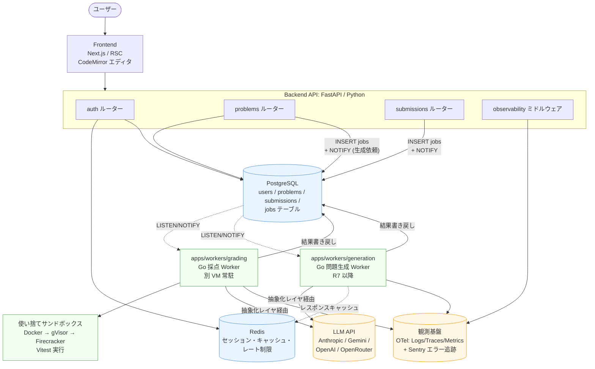
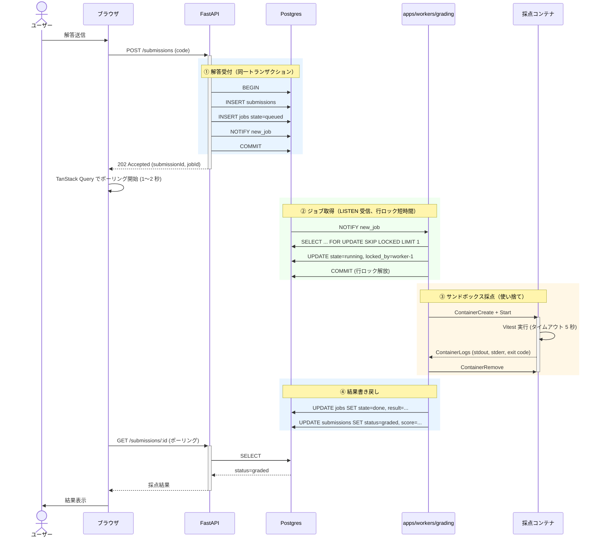
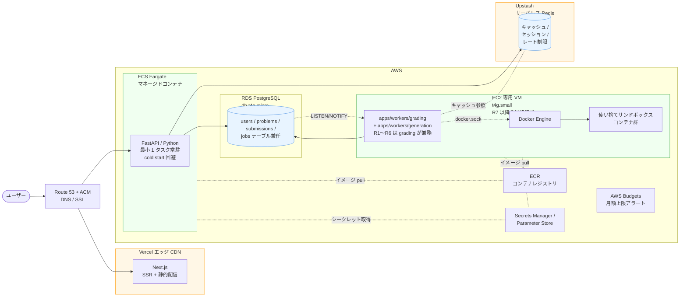

# 02. アーキテクチャ・インフラ構成

> **このドキュメントの守備範囲**：システム全体の論理構造、コンポーネントの責務、データ・ジョブの流れ。
> **使うフレームワーク・ライブラリ・サービスの具体名や選定理由**は [05-runtime-stack.md](./05-runtime-stack.md) を参照。

---

## 全体構成（概念図）

**読み方**：

- 実線（`-->`）：同期的な呼び出し
- 点線（`-.->`）：非同期 / 通知（LISTEN/NOTIFY）/ オプショナル経路（キャッシュヒット時）
- ストア（青）：永続データ層
- 外部サービス（橙）：自前ホスティング以外
- ワーカー層（緑）：別 VM で動く非同期処理

---

## 言語構成ロードマップ

| フェーズ | 言語構成 | 目的 |
|---|---|---|
| R0（基盤・雛形） | 同左（言語構成は確定、本実装は R1） | mise / uv / pnpm / Docker Compose / CI 雛形のセットアップ。アプリケーションの本実装は R1 から（→ [01-roadmap.md](../5-roadmap/01-roadmap.md)） |
| MVP（R1〜） | Python（FastAPI / Backend API）+ TypeScript（Web フロントエンド）+ Go（apps/workers/grading） | Backend は当初から Python（→ [ADR 0033](../../adr/0033-backend-language-pivot-to-python.md) / [ADR 0034](../../adr/0034-fastapi-for-backend.md)）。Go はワーカーの軽量・高速性と Docker 操作の強みを活かす |
| R1〜R6 | 上記（生成ジョブは `apps/workers/grading` が兼務） | R7 で `apps/workers/generation` に切り出すまで、生成 LLM 呼び出しも grading Worker 内で実行（→ [01-roadmap.md](../5-roadmap/01-roadmap.md) R1-3） |
| R7 以降（任意・Later） | 上記 + 問題生成 Worker（Go、apps/workers/generation） | 問題生成 LLM 呼び出しを専用 Worker に分離（→ [ADR 0040](../../adr/0040-worker-grouping-and-llm-in-worker.md) / [01-roadmap.md](../5-roadmap/01-roadmap.md) R7）。Backend API は enqueue のみに集中 |
| 将来 | 採点対象言語の多言語化（Python、Next.js 等） | 言語アダプタ層を通じて追加 |

---

## コンポーネントの責務

### Frontend
- ページレンダリング（RSC 中心）
- 認証セッション保持
- Backend API（FastAPI）呼び出し（一覧・詳細取得は RSC 直 fetch、ジョブ進捗ポーリングはクライアント側）
- コードエディタ UI（TypeScript の即時型診断つき）
- 採点結果ポーリング

→ 採用技術・ライブラリは [05-runtime-stack: フロントエンド](./05-runtime-stack.md#フロントエンド)

### Backend API（FastAPI / Python）
ユーザーリクエストを受け、認証・問題管理・ジョブ投入を担当する中核アプリ（→ [ADR 0033](../../adr/0033-backend-language-pivot-to-python.md) / [ADR 0034](../../adr/0034-fastapi-for-backend.md)）。**LLM 呼び出しは行わない**（Worker 側に集約 → [ADR 0040](../../adr/0040-worker-grouping-and-llm-in-worker.md)）。

#### 主要ルーター構成
- `auth` ルーター：認証・セッション（GitHub OAuth）
- `problems` ルーター：問題 CRUD、生成リクエストのエンキュー
- `submissions` ルーター：解答受付・採点ジョブのエンキュー・結果取得
- `health` ルーター：`/healthz` / `/readyz`
- 横断：`observability` ミドルウェア（OTel 計装 + エラー追跡）

#### 設計スタイル
APIRouter 単位の機能別レイアウト + シンプルレイヤード（Router / Service）で統一。データアクセスは Service から SQLAlchemy 2.0（async）を直接呼び出し、Repository レイヤは設けない。Pydantic v2 をスキーマ・バリデーションの SSoT とし、OpenAPI 3.1 を `apps/api/openapi.json` に静的配信して TS / Go の型を生成する（→ [ADR 0006](../../adr/0006-json-schema-as-single-source-of-truth.md)）。過剰な抽象化は避け、MVP の実装速度を優先する。

→ 採用フレームワーク・ライブラリ・選定理由は [05-runtime-stack: バックエンド API](./05-runtime-stack.md#バックエンド-apifastapi--python)

### ジョブキュー（Postgres `SELECT FOR UPDATE SKIP LOCKED`）

#### 方式
専用キューミドルウェアを使わず、Postgres に `jobs` テーブルを置いて行ロックでキュー化する。

#### 役割
FastAPI から採点・問題生成の仕事を登録し、Go ワーカー（apps/workers/grading・apps/workers/generation）がそれを取り出して処理する（→ [ADR 0040](../../adr/0040-worker-grouping-and-llm-in-worker.md)）。
- FastAPI（Producer）：`INSERT INTO jobs ...` で登録
- Go ワーカー（Consumer）：`SELECT ... FOR UPDATE SKIP LOCKED LIMIT 1` で取り出し

#### 運用作法
- 行ロックを Docker 実行中ずっと握らない。`locked_at`/`locked_by` を更新してコミット → 別トランザクションで実行 → 完了後に `state='done'`
- スタックジョブは `locked_at < now() - interval '5 min'` のレコードを定期的にリクレイム
- リトライは `run_at = now() + exponential_backoff`、最大試行回数超過で `state='dead'`（DLQ）

#### ペイロード
JSONB 形式。ジョブスキーマは Pydantic v2 を SSoT とし（[ADR 0006](../../adr/0006-json-schema-as-single-source-of-truth.md)）、境界別 2 伝送路で型生成：HTTP API 境界は `apps/api/openapi.json`（OpenAPI 3.1）→ TS（Hey API）、Job キュー境界は `apps/api/job-schemas/`（個別 JSON Schema）→ Go（quicktype `--src-lang schema`）。

#### 取得方式
Postgres `LISTEN/NOTIFY` によるプッシュ通知 + 低頻度ポーリング（30 秒）のハイブリッド。
- INSERT 時に `NOTIFY new_job` を発火し、ワーカーは `LISTEN` で即応答
- NOTIFY 取りこぼし対策として低頻度ポーリングを併用

#### スケール時の移行先
ファンアウトや Pub/Sub が必要になった場合は NATS JetStream に移行する方針（README に明記）。

→ テーブル設計・採用ライブラリ・選定理由は [05-runtime-stack: ジョブキュー](./05-runtime-stack.md#ジョブキューpostgres-select-for-update-skip-locked)

### Workers（Go、apps/workers/*）

採点・問題生成・将来の RAG 等を担う非同期ワーカー群。Backend API は LLM を呼ばず、**Worker が LLM 呼び出しを担う**（→ [ADR 0040](../../adr/0040-worker-grouping-and-llm-in-worker.md)）。

#### apps/workers/grading（採点 Worker、R0）

役割：
- Postgres `jobs` テーブルから `FOR UPDATE SKIP LOCKED` でジョブ取得
- Docker API で隔離コンテナ起動
- TypeScript コードを Vitest で実行（MVP は TS 固定。多言語対応は将来、言語アダプタ層を通じて拡張）
- LLM-as-a-Judge 呼び出し（生成と異なる別プロバイダ・別モデル、`prompts/judge/` 配下のプロンプト）
- 実行結果（成否・失敗ケース・stdout/stderr・所要時間・Judge スコア）を Postgres に書き戻し、ジョブの `state` を更新

設計の特徴：
- 常駐プロセス、`LISTEN/NOTIFY` + ポーリングのハイブリッドでジョブ取得
- goroutine による並列採点
- Docker Engine と同じ VM に住み、`/var/run/docker.sock` 経由で Docker 操作

#### apps/workers/generation（問題生成 Worker、R7 以降）

R7 で切り出すまでは生成ジョブも `apps/workers/grading` が兼務する（→ [01-roadmap.md](../5-roadmap/01-roadmap.md) R1-3 / R7）。Worker を分離しても役割は同じ：

役割：
- 問題生成リクエストの非同期処理（Backend API は enqueue のみで即 202 を返す）
- LLM 呼び出し（生成プロバイダ、`prompts/generation/` 配下のプロンプト）
- 構造化出力を Pydantic 由来 JSON Schema から quicktype `--src-lang schema` で生成した Go struct でバリデーション（Job キュー境界、→ [ADR 0006](../../adr/0006-json-schema-as-single-source-of-truth.md)） → サンドボックスで模範解答検証 → 別プロバイダの Judge 評価 → DB 保存
- レスポンスキャッシュ参照（Redis、`prompt_hash` キー）

→ 採用言語・ライブラリ・選定理由は [05-runtime-stack: Workers](./05-runtime-stack.md#workersappsworkersgo)

### サンドボックスランナー（apps/workers/grading 内で実行）

#### 使い捨てコンテナ方式
ジョブごとに採点コンテナを生成 → 実行 → 破棄。
- 起動オーバーヘッドは約 200ms（段階 1 / Docker での想定実測、採点本体の 5〜15%、許容範囲）。隔離強化段階 2 以降でも上限 500ms を維持する目標 → SSoT は [01-non-functional.md: パフォーマンス](./01-non-functional.md#パフォーマンス)
- 前回実行の影響が原理的に残らない強い隔離保証を優先
- スループットが問題化した場合は R3（gVisor）でウォームプール、R9（Firecracker）への移行を検討

#### 段階的な隔離強化
- 初期実装：Docker + 制限付き（`--network none`, `--memory`, `--cpus`, `--read-only`, 非 root, tmpfs `/tmp`）
- 発展：gVisor で追加のシステムコール隔離
- さらに発展：Firecracker microVM で起動速度・隔離強度向上
- 各方式の比較を README にベンチマーク付きで記載

→ 実行対象・テストランナー等の詳細は [05-runtime-stack: サンドボックス](./05-runtime-stack.md#サンドボックス)

### データストア
- **PostgreSQL**：ユーザー、問題、解答履歴、ジョブキュー（`jobs` テーブル）
- **Redis**：LLM レスポンスキャッシュ、セッション、レート制限（**ジョブキュー用途では使わない**）

→ 採用バージョン・ORM・ホスティング先は [05-runtime-stack: データベース / キャッシュ](./05-runtime-stack.md#データベース)

---

## 1 ジョブが流れる完全な経路

ユーザーが解答を送信した瞬間からの流れ：

**重要な設計ポイント**：

| 段階 | キーポイント |
|---|---|
| ① 解答受付 | INSERT submissions + INSERT jobs + NOTIFY を **同一トランザクション**で実行 → Outbox パターン不要、二重書き込み問題なし（[ADR 0004](../../adr/0004-postgres-as-job-queue.md)） |
| ② ジョブ取得 | 行ロックは **短時間で COMMIT**。Docker 実行中はロックを握らない（スタックジョブ防止） |
| ③ サンドボックス採点 | **使い捨てコンテナ**：1 ジョブ 1 コンテナ、実行後即破棄。前回実行の影響が残らない（[ADR 0009](../../adr/0009-disposable-sandbox-container.md)） |
| ④ 結果書き戻し | jobs.state='done' と submissions.status='graded' を別トランザクションで更新。冪等性のため UPDATE は ID 指定で安全 |

**`trace_id` の連結**：①〜④ の全段階を単一トレースで可視化するため、ジョブペイロードに W3C Trace Context を埋め込む（[ADR 0010](../../adr/0010-w3c-trace-context-in-job-payload.md)）。

---

## インフラの論理配置

### クラウド：AWS に確定
- 求人需要・情報量・エコシステムを最重視
- マルチクラウド（GCP 併用等）はメリットより複雑度のコストが上回るため不採用
- AWS 内で IAM・ネットワーク・観測性を綺麗に設計することにフォーカス

### 物理配置（責務分離）

**配置の責務分離（責務 → 配置 → 採用理由）**：

| コンポーネント | 配置 | 採用理由 |
|---|---|---|
| Frontend | Vercel（エッジ CDN） | Next.js とのファーストパーティ統合、無料枠、SSR + 静的配信のグローバル分散（→ [ADR 0013](../../adr/0013-vercel-for-frontend-hosting.md)） |
| Backend API | ECS Fargate（マネージドコンテナ） | 軽量・水平スケール、Docker 操作不要、最小タスク 1 で cold start 回避 |
| 採点ワーカー（apps/workers/grading） | EC2 専用 VM | **Docker Engine が必要**、`docker.sock` 操作権限を API から分離（最小権限原則） |
| DB（兼ジョブキュー） | RDS PostgreSQL | 永続化、バックアップ、PITR、無料枠活用 |
| キャッシュ | Upstash Redis（サーバレス） | 消えても OK な高頻度アクセス、無料枠、ElastiCache よりコスト効率 |
| シークレット | Secrets Manager / Parameter Store | API キー・OAuth Secret・SESSION_SECRET の集中管理 |
| コンテナレジストリ | ECR | サンドボックスイメージ・API イメージのバージョニング |
| コスト管理 | AWS Budgets | 月額上限アラート（[01 非機能要件: コスト](./01-non-functional.md#コスト) と連動） |

**API と採点ワーカー（apps/workers/grading）を別計算リソースに分けている設計上の意図**：

- **権限の最小化**：API 側に `docker.sock` を持たせない（脱獄リスク低減）
- **スケール特性の違い**：API は Fargate で水平スケール、ワーカーは EC2 で goroutine 並列
- **failure isolation**：ワーカークラッシュが API 可用性に波及しない

→ 具体的な AWS サービス名・無料枠・コスト試算は [05-runtime-stack: インフラ](./05-runtime-stack.md#インフラ)
