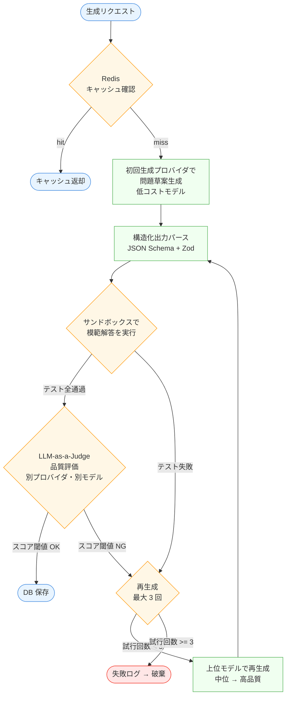
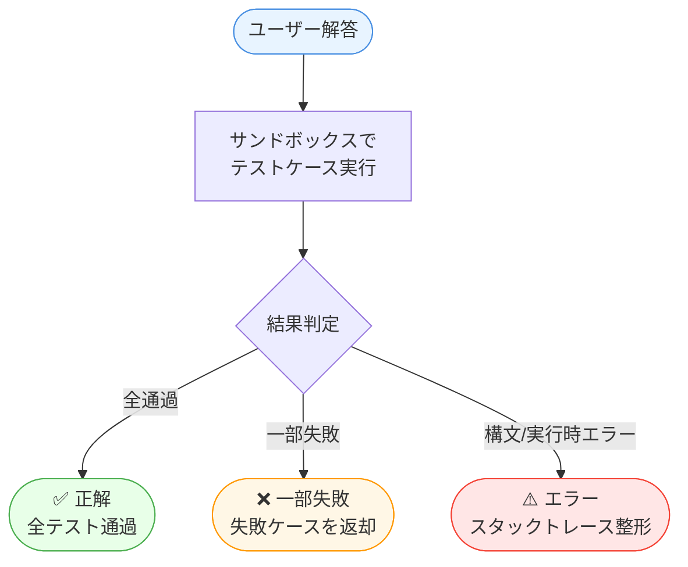

# 03. LLM 問題生成・評価パイプライン

> **このドキュメントの守備範囲**：LLM による問題生成・評価のパイプライン全体設計、品質評価の多層防御、コスト最適化方針、プロンプト管理方針、採点フロー。
> **採用 LLM プロバイダ・モデル・SDK の選定理由**は [05-runtime-stack.md: LLM](./05-runtime-stack.md#llm) を参照。
> **コンポーネントの責務**は [02-architecture.md](./02-architecture.md)、**観測性メトリクス**は [04-observability.md](./04-observability.md) を参照。

---

## モデル選定ポリシー（最重要）

LLM 市場の変化が速く、半年単位で「最適なモデル」が変わるため、**特定モデルへの依存を排除する設計を最優先**とする。

- **`LlmProvider` 抽象化レイヤ**を介して LLM を呼び出す（Anthropic / Google / OpenAI / OpenRouter / DeepSeek 等を差し替え可能）
- 構造化出力の正規化、キャッシュ、コスト計測、観測性スパン、リトライ・フォールバックは抽象化レイヤに集約
- プロバイダ・モデルは設定ファイル（YAML）で切替可能、コード変更不要
- 具体的なモデル選定は MVP では実装着手時に最も合理的なものを 1〜2 個選び、R2 以降にベンチマークと運用ログに基づき適時更新する
- 本ドキュメントで挙げる具体的モデル名（Haiku / Sonnet / Opus 等）は**初期想定**であり、実装時に再評価する
- → 設計判断の詳細は [ADR 0007: LLM プロバイダ抽象化戦略](../../adr/0007-llm-provider-abstraction.md)

## 生成フロー



**フローの読み方**：

- **🟦 終端ノード**（リクエスト / キャッシュ返却 / DB 保存）
- **🟧 判定ノード**（キャッシュ確認 / サンドボックス検証 / Judge 評価 / 再試行判定）
- **🟩 処理ノード**（生成 / パース / 上位モデル再生成）
- **🟥 失敗終端**（最大試行超過で破棄）

**設計上のキーポイント**：

| ステップ | 設計判断 |
|---|---|
| キャッシュ確認 | `prompt_hash` でキー化、TTL 7 日。プロバイダ非依存 |
| 構造化出力パース | Zod でランタイムバリデーション。スキーマ違反は再生成へ |
| サンドボックス検証 | 模範解答が**全テスト通過**しなければ即破棄（[ADR 0009](../../adr/0009-disposable-sandbox-container.md)）|
| Judge 評価 | **生成と異なるプロバイダ**で評価し自己評価バイアス回避（[ADR 0008](../../adr/0008-custom-llm-judge.md)）|
| 再生成戦略 | 試行ごとに**上位モデルへ昇格**（コスト最適化、最大 3 回）|
| 失敗ログ | 破棄しても**観測ログには残す**（再生成失敗パターン分析）|

## 各要素の要件

### プロンプト管理
- プロンプトは YAML ファイルで管理（`prompts/` ディレクトリ）
- バージョン番号付与（`v1`, `v2`...）、Git 履歴と連動
- A/B テスト：本番で複数バージョンを並行稼働、生成品質を比較

### 構造化出力
- 各プロバイダの tool_use / function calling / JSON mode で以下を強制
- プロバイダ差分は `LlmProvider` 抽象化レイヤで吸収し、Zod スキーマで最終バリデーション
  ```json
  {
    "title": "string",
    "description": "string",
    "examples": [{"input": "...", "output": "..."}],
    "test_cases": [{"input": "...", "expected": "..."}],
    "reference_solution": "string (typescript code)",
    "language": "typescript",
    "difficulty": "easy | medium | hard",
    "category": "string"
  }
  ```

### 品質評価の 4 レイヤ（多層防御）

LLM 生成をそのまま信用せず、以下の 4 レイヤで問題品質を担保する。これが本サイトの差別化軸。

#### レイヤ 1：決定論的チェック（MVP で実装）
LLM を使わず、コード実行で自動判定できる検証。**最優先かつ最も安い品質ゲート**。

- **模範解答が全テストを通過する**：通らない問題は即破棄
- **ミューテーションテスト**（R2 以降）：模範解答をわざと改変（`+`→`-`, `>`→`>=` など）し、テストが落ちるかを検証。落ちないならテストが甘い＝品質不十分
  - 採用ツールは [05-runtime-stack: 品質評価まわりのツール](./05-runtime-stack.md#品質評価まわりのツール) を参照
- **テストケース多様性**：入力の境界値・空・null・型の揺らぎをカバーしているか
- **実行の決定性**：同入力で同出力になるか（乱数・日時依存の検出）
- **実行時間・メモリ**：制限内か

#### レイヤ 2：LLM-as-a-Judge（R2 で実装）
決定論では測れない主観的な品質を別モデル（生成と異なる中位〜高品質モデル）で評価。

- 評価軸（各 1-5、複数回実行して平均）：
  - 問題文の明確さ
  - テストケースの網羅性
  - 難易度の妥当性（指定難度と実装難度の乖離）
  - 教育的価値
  - 既視感・独自性
- **キャリブレーション**：人間評価した少数サンプルと Judge スコアの相関を取り、Judge の信頼性を定期確認
- **生成モデルと Judge モデルは別プロバイダ・別モデル**にする（自己評価バイアス回避）
- 合計スコア閾値（例：20/25）を下回ったら再生成

#### レイヤ 3：ユーザー行動シグナル（運用後自動収集）
本番投入後に最も客観的な品質指標となる。

- 正答率（高すぎ／低すぎは難易度ミスマッチ）
- 平均解答時間
- ギブアップ率
- ユーザー👍/👎 評価
- 繰り返し解答時の正答率（学習効果の測定）

#### レイヤ 4：集合的評価（R7 で実装、Python バッチ）
生成済み問題全体に対する分析。

- **重複検出**：問題文・模範解答を embedding → クラスタリングで類似問題を検出
- **カテゴリ分布 / 難易度分布**：偏りの検出
- **過去問題の一括再評価**：Judge プロンプト改善時の回帰テスト
- **人間評価との相関分析**：Judge の精度モニタリング

### コスト最適化
- **モデル段階利用**（具体名は実装時決定、初期想定として記載）：
  - 初回生成：低コスト・高速モデル
  - 再生成 / 評価：中位モデル（生成と異なるベンダーが望ましい）
  - 最終フォールバック：高品質モデル
  - → 各役割のプロバイダは YAML 設定で切替
- **キャッシュ**：
  - プロンプト + パラメータのハッシュをキーに Redis 保存
  - TTL は 7 日
  - プロバイダ非依存で動作（抽象化レイヤに実装）
- **トークン削減**：
  - 各プロバイダのプロンプトキャッシュ機能（Anthropic Prompt Caching、Gemini Context Caching 等）を活用。プロバイダ固有 API への依存度はトレードオフとして受容（→ [ADR 0007: 失うもの](../../adr/0007-llm-provider-abstraction.md#失うもの受容するリスク)）
  - 既存問題の再出題を優先し、新規生成 API 呼び出し自体を減らす

### 採点フロー



→ 詳細な採点ジョブの完全な経路（NestJS → Postgres → Go ワーカー → サンドボックス）は [02-architecture.md: 1 ジョブが流れる完全な経路](./02-architecture.md#1-ジョブが流れる完全な経路) を参照。

## メトリクス（観測性と連動）
- 生成成功率 = 保存された問題 / 生成リクエスト数
- 平均生成コスト（USD / 問題）
- Judge スコア分布（各軸ごと）
- 再生成回数の分布
- ミューテーションテストのキルレート（R2 以降）
- Judge と人間評価の相関係数（R7 以降）
- 重複検出率、カテゴリ分布、難易度分布（R7 以降）
