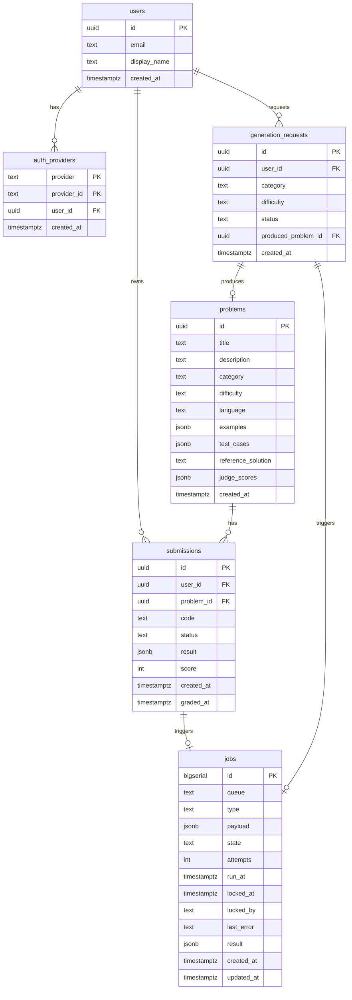

# 01. データモデル（横断方針）

> **このドキュメントの守備範囲**：ER 図（全体俯瞰）、命名規則、横断的な設計方針（ID 戦略・タイムスタンプ・JSON カラム・ジョブペイロード共通フィールド・マイグレーション運用・将来拡張の予告）。
> **個別テーブルのカラム単位の最終仕様**は **Drizzle スキーマ（`apps/api/src/drizzle/schema/`）が SSoT**。
> **個別機能で使うテーブル / 集計クエリ**は [features/](../4-features/) を参照。
> **ORM・マイグレーションツール選定**は [05-runtime-stack.md](../2-foundation/05-runtime-stack.md#データベース)、**ジョブキューの仕組み**は [02-architecture.md](../2-foundation/02-architecture.md#ジョブキューpostgres-select-for-update-skip-locked) を参照。

---

## ER 図(全体俯瞰)

各テーブルの **カラム単位の最終仕様（型・制約・デフォルト・インデックス）は Drizzle スキーマが SSoT**。本図は構造の俯瞰用。

---

## 命名規則

| 対象 | ルール | 例 |
|---|---|---|
| テーブル名 | 複数形・スネークケース | `users`, `submissions`, `generation_requests` |
| カラム名 | スネークケース | `created_at`, `user_id` |
| 主キー | `id`（UUID または BIGSERIAL） | — |
| 外部キー | `<参照テーブル単数形>_id` | `user_id`, `problem_id` |
| タイムスタンプ | `created_at` / `updated_at` / `<イベント名>_at` | `graded_at`, `locked_at` |
| 状態カラム | `state`（マシン的）/ `status`（ユーザー視点）を使い分け | `jobs.state`, `submissions.status` |
| JSON カラム | JSONB を使う、必ずスキーマを別途文書化 | `payload`, `result`, `examples` |

---

## 横断方針

### ID 戦略

- **アプリエンティティ**：UUID（`gen_random_uuid()`）。グローバル一意・推測困難・分散容易
- **ジョブテーブル（`jobs`）のみ BIGSERIAL**：処理順序を直感的に扱う運用上の利点を優先

### タイムゾーン

- すべて `TIMESTAMPTZ` で **UTC** 保持
- 表示時に JST 変換（dayjs 等）

### ハードデリート方針

- ソフトデリートは原則使わない（`deleted_at` 列を追加しない）
- 例外的に必要な場合は個別に検討し、ADR で記録する

### JSON カラム運用

- 型は **JSONB**（高速・GIN インデックス可能）
- 複数機能で共有するペイロードは **JSON Schema を SSoT** とし、TS / Go 両方の型を自動生成（→ [ADR 0014](../../adr/0014-json-schema-as-single-source-of-truth.md)）
- 自由形式 JSON カラムでも、コメントまたは別ドキュメントでスキーマを文書化する

### ジョブペイロード共通フィールド：`traceContext`

すべてのジョブ種別の `payload` に **`traceContext` を必須**として含める。NestJS（Producer）から Go ワーカー（Consumer）へ OTel Context をプロセス境界をまたいで伝播するため。詳細は：

- [ADR 0017: W3C Trace Context をジョブペイロードに埋め込む](../../adr/0017-w3c-trace-context-in-job-payload.md)（採用方式・代替案・実装方針）
- [04-observability.md: プロセス境界をまたぐトレース連携](../2-foundation/04-observability.md#プロセス境界をまたぐトレース連携r1-で必須)

具体的な JSON Schema 定義は **`packages/shared-types/schemas/job.schema.json`（実装着手時に作成）が SSoT**。本ドキュメントには共通フィールドの存在のみを示す。

### 認証スキーマの分離

`users` と `auth_providers` を分離してプロバイダ ID をユーザーに直接持たせない設計。複数 OAuth プロバイダへの拡張余地を構造的に確保するため（→ [ADR 0015](../../adr/0015-github-oauth-with-extensible-design.md)）。

### インデックス設計の方針

横断的な設計方針のみここに記載。テーブル個別のインデックス定義は **Drizzle スキーマが SSoT**。

- **読み込み頻度が高いクエリには必ずインデックスを張る**：特に `jobs(queue, state, run_at)` はワーカー取得クエリの中核（[ADR 0001](../../adr/0001-postgres-as-job-queue.md)）
- **`created_at DESC` で並べる履歴系**：複合インデックスで対応（例：`submissions(user_id, created_at DESC)`）
- **JSONB の中身検索**：必要が出てから GIN インデックスを追加（MVP では未使用）

---

## マイグレーション運用

- マイグレーションは **Drizzle で管理**（→ [05-runtime-stack.md: データベース](../2-foundation/05-runtime-stack.md#データベース)、[ADR 0016](../../adr/0016-drizzle-orm-over-prisma.md)）
- 1 マイグレーション = 1 つの論理変更
- **後方互換性を保つ順序で書く**：カラム追加 → 書き込みコード更新 → 旧カラム削除
- 本番マイグレーションは GitHub Actions の **手動承認ジョブ**で実行
- 適用済み SQL ファイルは原則編集しない（→ [.claude/rules/drizzle.md](../../../.claude/rules/drizzle.md)）

---

## 将来拡張の想定（pgvector / ベクトル検索、R7 で導入）

R7で RAG・重複検出・意味的検索・教材引用ヒント等を導入する際、以下のスキーマ変更を予定する。MVP では未導入。

- `CREATE EXTENSION IF NOT EXISTS vector;`
- `problems.embedding`（`vector(N)`）を追加：問題文 + 模範解答の埋め込み
- `documents` テーブルを新設：RAG 用の教材コンテンツ（チャンキング後の段落本文 + embedding + ライセンス情報）
- HNSW / IVFFlat インデックスは運用ログに基づき選定

具体的なカラム定義・次元数・モデル選定は **R7 着手時に専用 ADR を起票して確定**する（採用 LLM プロバイダ次第で次元数が変わるため、可逆な判断は遅延させる方針：[CLAUDE.md](../../../.claude/CLAUDE.md)）。
