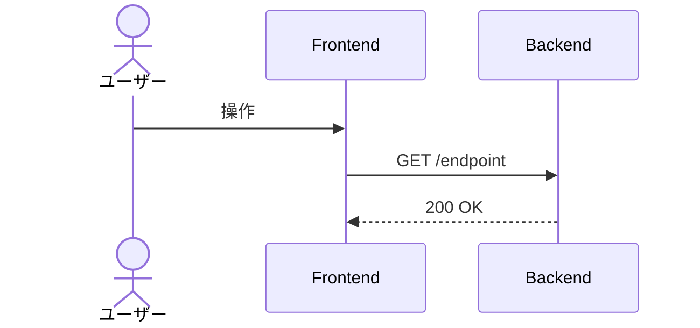

# {機能名}

<!--
配置先：`docs/requirements/4-features/<name>.md`（フラット配置、数値 ID なし）
  - 1 ドメイン 1 ファイル：authentication.md / grading.md / learning.md 等
  - 1 ドメイン内に複数ワークフローがある時のみ prefix で分割：problem-generation.md / problem-display-and-answer.md
新規作成は `/new-requirements` カスタムコマンド経由を推奨。
セクション順序：WHY（ストーリー）→ WHAT（概要 / ビジネスルール / スコープ外）→
              機能一覧（全体俯瞰）→ HOW（データ / 画面 / フロー / API / バリデーション）
              → 完成検証（受入条件）→ 進捗（ステータス）→ 外部参照（関連）
-->

## ユーザーストーリー

- **役割**：{ゲスト / 認証ユーザー / 管理者 等}
- **やりたいこと**：{何をしたいか}
- **得られる価値**：{なぜそれをしたいか・得られる価値}

<!-- 複数のロールが関わる場合は同じ 3 行セットを並べてよい -->

## 概要

この機能が何を解決するか、誰が使うか（1-2 行）

## ビジネスルール

- コードからは読み取りにくいドメイン知識
- 判断基準、条件分岐、業務上の制約
- **内部実装の制約**もここに書く（例：「採点コンテナは使い捨て」「テーブル分離」「セッションは Redis 保管」）

## スコープ外（このスプリントでは扱わない）

- 含めない範囲を明示する（スコープクリープ防止）
- 関連する将来機能があれば `[機能名](./<name>.md)` でリンクする

## 機能一覧

このドメインで提供する操作の全体俯瞰。詳細仕様は下の各 HOW セクション + OpenAPI（`apps/api/openapi.json`）が SSoT。

| 操作 | 対象ロール | 認証 | 概要 |
|---|---|---|---|
| {操作 1} | {ゲスト / 認証ユーザー} | 不要 / 必須 | {1 行で何ができるか} |
| {操作 2} | ... | ... | ... |

## データモデル

関連テーブル名と関係の概要のみ記載する。**詳細スキーマの SSoT は SQLAlchemy 2.0 model（`apps/api/app/models/`、`Mapped[T]` 方式、→ [ADR 0037](../../adr/0037-sqlalchemy-alembic-for-database.md)）**。

- `users` ← `auth_providers`（FK）
- 詳細は [3-cross-cutting/01-data-model.md](../3-cross-cutting/01-data-model.md) を参照

## 画面

<!-- 該当画面がない API のみの機能では削除可 -->

### {画面名}（対象：{ゲスト / 認証ユーザー / 管理者}）

- **ルート**：`/...`
- **概要**：1 行で画面の目的
- **主要コンポーネント**：ComponentA / ComponentB
- **使用 API**：
  - `GET /endpoint` — 説明
  - `POST /endpoint` — 説明
- **主要インタラクション**：
  - 操作 1 の説明

## ユーザーフロー

<!--
時系列で actor 間メッセージが交錯 → Mermaid sequenceDiagram。
分岐が多い複雑フロー → Mermaid flowchart。
3〜4 ステップの線形 → 番号付き箇条書きで足りる（→ docs-rules.md §8）。
-->

### {フロー名}（対象：{ゲスト / 認証ユーザー / 管理者}）

## API

<!-- 該当エンドポイントがない場合はセクションごと削除可 -->

| メソッド | パス | 用途 | 認証 |
|---|---|---|---|
| GET | `/...` | 説明 | 任意 / 必須 |

**機械可読の最新仕様は OpenAPI（`apps/api/openapi.json`、ランタイムは FastAPI の `/openapi.json`）が SSoT**。本セクションは設計意図の記録（パスとロール対応の俯瞰）。Pydantic クラスのコピーは貼らない（→ [ADR 0006](../../adr/0006-json-schema-as-single-source-of-truth.md)）。

## バリデーション

| フィールド | ルール | エラーメッセージ |
|---|---|---|
| name | 必須、1〜50 文字 | 名前を入力してください |

## 受け入れ条件（Definition of Done）

> **ユーザー / API クライアントから観測可能なふるまい** だけに絞る。「DB 上で○○」「Depends で○○」等の実装制約はビジネスルールに書く。

- [ ] 条件 1（観測可能・テスト可能な振る舞いとして書く）
- [ ] 条件 2

## ステータス

タスク単位の細目チェック（リリース単位の進捗は [01-roadmap.md](../5-roadmap/01-roadmap.md) で管理）。

- [ ] 要件定義完了
- [ ] バックエンド実装完了
- [ ] フロントエンド実装完了
- [ ] ワーカー実装完了（必要な場合のみ）
- [ ] ユニットテスト完了
- [ ] E2E テスト完了
- [ ] **受け入れ条件すべて満たす**
- [ ] PR マージ済み

## 関連

- **関連機能**：[機能名](./<name>.md)
- **関連 ADR**：[ADR XXXX](../../adr/XXXX-...md)
- **横断要件**：[2-foundation/01-non-functional.md](../2-foundation/01-non-functional.md)（性能・セキュリティ）など
