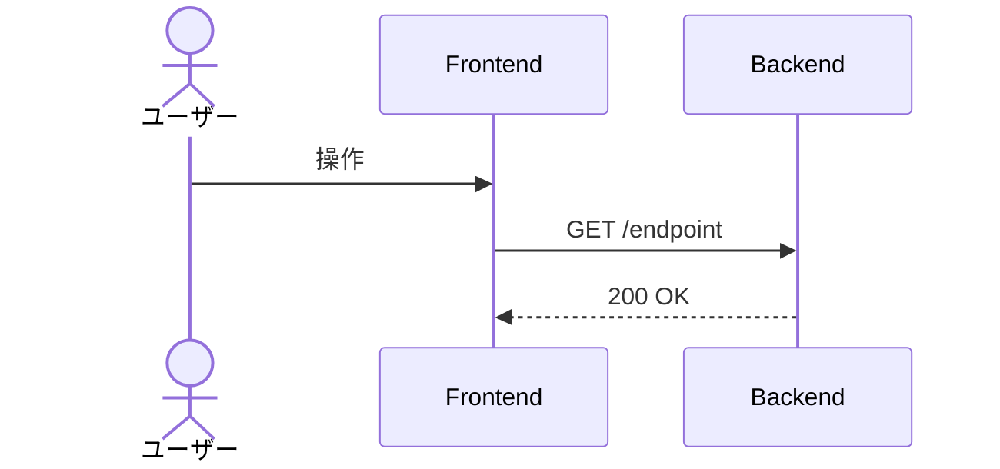
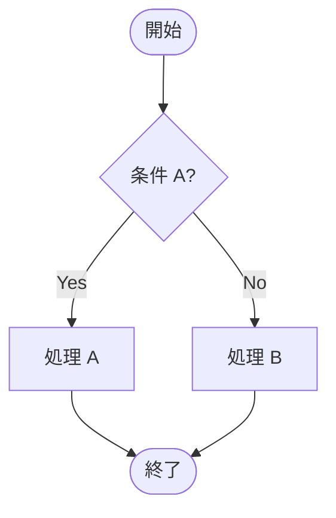

# {機能名}

<!--
配置先：`docs/requirements/4-features/<name>.md`（フラット配置、数値 ID なし）
  - 1 ドメイン 1 ファイル：authentication.md / grading.md / learning.md 等
  - 1 ドメイン内に複数ワークフローがある時のみ prefix で分割：problem-generation.md / problem-display-and-answer.md
新規作成は `/new-requirements` カスタムコマンド経由を推奨。
セクション順序：WHY（ストーリー）→ WHAT（概要 / ビジネスルール / スコープ外）→
              機能一覧（全体俯瞰）→ HOW（データ / 画面 / フロー / API / バリデーション）
              → 完成検証（受入条件）→ 進捗（ステータス）→ 外部参照（関連）

長期運用の原則（このテンプレを使う全機能ファイルに適用）：
  1. コードや OpenAPI / SQLAlchemy から読み取れる事実は書かない。書くのは "なぜ"（業務理由）と "観測可能な振る舞い" だけ
  2. ファイル長は許容する（行数で分割しない）。分割トリガはドメイン境界のみ
  3. ビジネスルールが 30 行を超えたら H3 サブセクションに割る（壁を防ぐ）
  4. バリデーション節は業務上の理由があるルールのみ書く（必須・長さ等の機械的検証は Pydantic / Zod が SSoT）
  5. **HTML コメント（`<!--` で始まる注釈ブロック）は削除しない**（このコメント自身を含む）。CLAUDE が将来の更新時に運用ルールを再認識するための裏ルールとして埋め込まれているため、本文整理時にまとめて消さない
-->

## ユーザーストーリー

- **役割**：{ゲスト / 認証ユーザー / 管理者 等}
- **やりたいこと**：{何をしたいか}
- **得られる価値**：{なぜそれをしたいか・得られる価値}

<!-- 複数のロールが関わる場合は同じ 3 行セットを並べてよい -->

## 概要

この機能が何を解決するか、誰が使うか（1-2 行）

## ビジネスルール

> ルールが 30 行を超えたら下記のように H3 サブセクションに分割する（壁を防ぐ）。ルール群が 1〜2 個なら H3 を省いて直接箇条書きでよい。
>
> 書く内容：コードからは読み取りにくいドメイン知識 / 判断基準・条件分岐・業務上の制約 / **内部実装の制約**（例：「採点コンテナは使い捨て」「テーブル分離」「セッションは Redis 保管」）。

### {ルール群 1（例：認可ポリシー）}

- ルール 1
- ルール 2

### {ルール群 2（例：状態遷移）}

- ルール 1
- ルール 2

## スコープ外（このスプリントでは扱わない）

- 含めない範囲を明示する（スコープクリープ防止）
- 関連する将来機能があれば `[機能名](./<name>.md)` でリンクする

## 機能一覧

このドメインで提供する操作の全体俯瞰 + **長いファイルの目次**。詳細仕様は下の各 HOW セクション + OpenAPI（`apps/api/openapi.json`）が SSoT。
**詳細列のアンカーリンクは、下記の対応する画面 / フロー / API のセクション見出し（H3）に飛ぶように張る**。

| 操作 | 対象ロール | 認証 | 概要 | 詳細 |
|---|---|---|---|---|
| {操作 1} | {ゲスト / 認証ユーザー} | 不要 / 必須 | {1 行で何ができるか} | [#{セクション名}](#セクション名) |
| {操作 2} | ... | ... | ... | [#{セクション名}](#セクション名) |

## データモデル

> **関わるテーブル名の列挙のみ**。カラム定義・関係詳細は書かない（drift 防止）。スキーマの SSoT は SQLAlchemy model（`apps/api/app/models/`、→ [ADR 0037](../../adr/0037-sqlalchemy-alembic-for-database.md)）、全体俯瞰は [3-cross-cutting/01-data-model.md](../3-cross-cutting/01-data-model.md)。

関わるテーブル：`users` / `auth_providers`

## 画面

<!--
該当画面がない API のみの機能では削除可。
コンポーネント名・使用 API リストは書かない（Next.js コードと OpenAPI が SSoT、drift 防止）。
書くのは画面の目的と、コードを読まないと分からない振る舞いだけ。
-->

### {画面名}（対象：{ゲスト / 認証ユーザー / 管理者}）

- **ルート**：`/...`
- **目的**：1 行で何のための画面か
- **非自明な相互作用**：
  - hover で何が出る / disabled になる条件 / 空状態の表示 / 確認モーダルの出るタイミング 等
  - コードを読めば分かることは書かない

## ユーザーフロー

<!--
フロー 1 つにつき 1 つの表現方法を選ぶ。判断指針（→ docs-rules.md §8）：
  - 3〜4 ステップの線形 → 番号付き箇条書きで足りる
  - 時系列で actor 間メッセージが交錯 → Mermaid sequenceDiagram
  - 分岐が多い複雑フロー → Mermaid flowchart
以下は 3 種類の例。実際のファイルでは該当する形式だけ残し、他は削除する。
-->

### {線形フロー名（番号付き箇条書きで足りる例）}（対象：{ロール}）

1. ユーザーが X をクリック
2. API が Y を返す
3. 画面に Z が表示される

### {時系列フロー名（actor 間メッセージが交錯する例）}（対象：{ロール}）

### {分岐フロー名（条件分岐が多い例）}（対象：{ロール}）

## API

<!-- 該当エンドポイントがない場合はセクションごと削除可 -->

| メソッド | パス | 用途 | 認証 |
|---|---|---|---|
| GET | `/...` | 説明 | 任意 / 必須 |

**機械可読の最新仕様は OpenAPI（`apps/api/openapi.json`、ランタイムは FastAPI の `/openapi.json`）が SSoT**。本セクションは設計意図の記録（パスとロール対応の俯瞰）。Pydantic クラスのコピーは貼らない（→ [ADR 0006](../../adr/0006-json-schema-as-single-source-of-truth.md)）。

## バリデーション

> **業務上の理由があるルールのみ**を書く（例：「ニックネームに本名を含めさせない方針」「招待コードは大文字英数字 8 桁の決まり」）。必須・最大長・型・正規表現等の**機械的検証は Pydantic / Zod が SSoT** なのでここには書かない（drift 防止、→ [ADR 0006](../../adr/0006-json-schema-as-single-source-of-truth.md)）。
> 業務上のルールが 1 個も無い機能ではセクションごと削除可。

| フィールド | 業務ルール | 理由 / エラーメッセージ |
|---|---|---|
| {フィールド名} | {業務上の制約} | {なぜそのルールか / ユーザーに見せるメッセージ} |

## 受け入れ条件（Definition of Done）

> **役割**：プロダクトとして "完成した" と言える条件。**ユーザー / API クライアントから観測可能なふるまい** だけに絞る。「DB 上で○○」「Depends で○○」等の実装制約はビジネスルールに書く。
>
> **長期運用**：機能の振る舞い仕様の累積。機能が育つほど条件は**追加されていく**し、既存条件も仕様変更で**更新される**。**変更・追加された条件は再検証が必要なので未チェックに戻す**（既存で変わってない条件はチェック維持、全リセットはしない）。観測可能な振る舞いが変わったらここを直すのが SSoT 更新の第一歩。過去版の履歴は git log で辿る。

- [ ] 条件 1（観測可能・テスト可能な振る舞いとして書く）
- [ ] 条件 2

## ステータス

> **役割**：開発工程としてどこまで進んだかのチェックリスト（"プロダクトの完成条件" は上の受け入れ条件、"リリース単位の進捗" は [01-roadmap.md](../5-roadmap/01-roadmap.md) で管理）。
>
> **長期運用**：機能を再着手・大きく改修するたびに**チェックを外してリセットする**（過去の完了履歴は残さない、履歴は git log と PR で辿る）。常に「この機能の現在の状態」だけを映す鏡として使う。

- [ ] バックエンド実装完了
- [ ] フロントエンド実装完了
- [ ] ワーカー実装完了（必要な場合のみ）
- [ ] ユニットテスト完了
- [ ] E2E テスト完了
- [ ] **受け入れ条件すべて満たす**
- [ ] PR マージ済み

## 関連

- **関連機能**：[機能名](./<name>.md)
- **関連 ADR**：[ADR XXXX](../../adr/XXXX-...md)
- **横断要件**：[2-foundation/01-non-functional.md](../2-foundation/01-non-functional.md)（性能・セキュリティ）など
