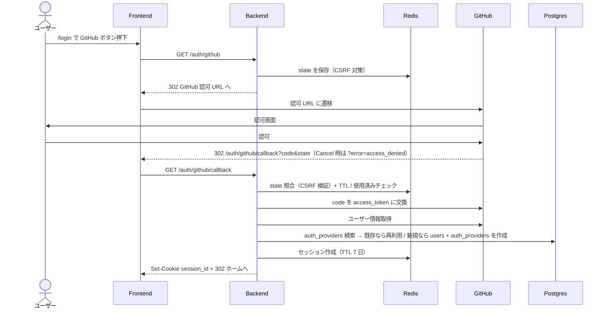

# 認証（GitHub OAuth ログイン）

<!--
配置先：`docs/requirements/4-features/<name>.md`（フラット配置、数値 ID なし）
新規作成・更新は `/new-requirements` カスタムコマンド経由を推奨。
セクション順序：WHY（ストーリー）→ WHAT（概要 / ビジネスルール / スコープ外）→
              機能一覧（全体俯瞰）→ HOW（データ / 画面 / フロー / API / バリデーション）
              → 完成検証（受入条件）→ 進捗（ステータス）→ 外部参照（関連）

長期運用の原則（このファイルを更新する全タイミングで適用）：
  1. コードや OpenAPI / SQLAlchemy から読み取れる事実は書かない。書くのは "なぜ"（業務理由）と "観測可能な振る舞い" だけ
  2. ファイル長は許容する（行数で分割しない）。分割トリガはドメイン境界のみ
  3. ビジネスルールが 30 行を超えたら H3 サブセクションに割る（壁を防ぐ）
  4. バリデーション節は業務上の理由があるルールのみ書く（必須・長さ等の機械的検証は Pydantic / Zod が SSoT）
  5. **HTML コメント（`<!--` で始まる注釈ブロック）は削除しない**（このコメント自身を含む）。CLAUDE が将来の更新時に運用ルールを再認識するための裏ルールとして埋め込まれているため、本文整理時にまとめて消さない
-->

## ユーザーストーリー

- **役割**：プログラミング学習者（ゲスト）
- **やりたいこと**：GitHub アカウントでログインしたい
- **得られる価値**：別途アカウントを登録する手間を省きつつ、自分の学習履歴を保存できる状態でサービスを利用したい

<!-- 複数のロールが関わる場合は同じ 3 行セットを並べてよい -->

## 概要

ユーザー認証ドメイン全体の SSoT。MVP では GitHub OAuth 1 本に絞るが、**将来 Google / Email-Password 等を追加可能な拡張設計**を維持する。プログラミング学習者がターゲット（→ [1-vision/02-personas.md](../1-vision/02-personas.md)）のため複数プロバイダは過剰と判断し、新規プロバイダ追加は需要が出てから対応する。

本文書は以下の 2 部構成で書く：

- **§1 認証基盤（プロバイダ非依存）**：将来 Google OAuth / Email-Password 等を追加した時にそのまま再利用される、ユーザー / セッション / 認可ガードの共通仕様
- **§2 GitHub OAuth プロバイダ実装**：§1 の基盤に乗る、GitHub に固有な OAuth フロー / GitHub API 連携

新しいプロバイダ（例：Google OAuth）を追加するときは §2 と並列に §3 / §4 として書き足す。§1 が 300 行を超えるか §N が 5 個を超えた段階で、`auth-foundation.md` への切り出し + `auth-<provider>.md` への分割を検討する。

## ビジネスルール

§1 / §2 のそれぞれで分けて記載（§1.1 / §2.1 を参照）。

## スコープ外（このスプリントでは扱わない）

- メールアドレス + パスワード認証（拡張時に新規 Strategy として追加）
- 2 要素認証（2FA）：R7 以降で必要性を再評価
- パスワードリセット機能：OAuth のみのため不要
- Google / Apple / Email-Password OAuth：拡張余地として設計上は残すが本機能の対象外
- ユーザープロフィール編集（表示名変更等）：別機能として切り出す
- アカウント削除（退会）：[01-non-functional.md](../2-foundation/01-non-functional.md) のハードデリート方針に従い、必要になったら別機能化

## 機能一覧

このドメインで提供する操作の全体俯瞰。詳細仕様は §1 / §2 + OpenAPI（`apps/api/openapi.json`）が SSoT。

| 操作 | 対象ロール | 認証 | 概要 | 詳細 |
|---|---|---|---|---|
| GitHub でログイン開始 | ゲスト | 不要 | `GET /auth/github` で GitHub の認可画面へリダイレクト | [#2-github-oauth-フロー対象ゲスト--認証ユーザー](#23-github-oauth-フロー対象ゲスト--認証ユーザー) |
| GitHub OAuth コールバック | ゲスト → 認証ユーザー | 不要 | `GET /auth/github/callback` で code 検証・セッション確立 | [#23-github-oauth-フロー対象ゲスト--認証ユーザー](#23-github-oauth-フロー対象ゲスト--認証ユーザー) |
| 現在ユーザー情報取得 | 認証ユーザー | 必須 | `GET /auth/me` で id / display_name / email を返す | [#14-共通-api](#14-共通-api) |
| ログアウト | 認証ユーザー | 必須 | `POST /auth/logout` でセッション破棄 | [#16-共通フロー](#16-共通フロー) |
| Google でログイン | 将来 | 不要 | §3 として後日追加（現状未実装） | - |
| Email + パスワードでログイン | 将来 | 不要 | §4 として後日追加（現状未実装） | - |

---

## §1 認証基盤（プロバイダ非依存）

> このセクションは GitHub OAuth に依存しない共通仕様。将来 Google OAuth / Email-Password 等を追加した時もそのまま再利用される。

### §1.1 ビジネスルール（基盤）

- **匿名利用は不可**：問題の生成・解答送信・学習履歴の記録には認証が必須
- **複数セッション許容**：同一ユーザーが PC + スマホ等の複数端末・ブラウザで同時にログインしてよい。各セッションは独立して TTL 7 日（学習サイトの複数端末利用と相性をとる）
- **問題閲覧（一覧・詳細）はゲストでも可能**：解答送信のみ認証必須（→ [./problem-display-and-answer.md](./problem-display-and-answer.md)）
- **メールアドレスは取得できれば保存するが UNIQUE 制約は付けない**（プロバイダ側でメール非公開のユーザーが存在しうるため）
- **同一プロバイダの同一外部 ID = 同一ユーザー**：既存 `auth_providers.provider_id` と一致するなら既存 `users` を再利用（プロバイダごとの判定ロジックは §2 で定義）
- **データは users / auth_providers の 2 テーブル分離**：プロバイダ ID をユーザーに直接持たせず、将来複数プロバイダを連携できる構造を維持（実装制約）
- **認証要否はルーター単位の DI ガードで制御**：デフォルト認証必須、public は個別に上書き（実装制約。具体的な仕組みは [.claude/rules/backend.md](../../../.claude/rules/backend.md)）
- **認証 API（`GET /auth/me`）が 5xx / ネットワーク断で失敗した時の FE 側挙動**：認証要否の最終判定は API（`Depends(get_current_user)`）の 401 が SSoT。FE 側の認証ガードは UX 用の早期リダイレクトなので、500 等の障害で勝手にログアウト相当に倒さない方針を採る。
  - **キャッシュあり**：直近の `/auth/me` 成功値が残っている間は `isAuthenticated` を維持し、画面遷移を止めない（一時的な障害で操作を奪わない）
  - **キャッシュなし（初回訪問中に障害）**：認証必須ページでは「ログイン状態を確認できませんでした」の障害メッセージ + 再試行ボタンを表示する（永続的な白画面に倒さない）。再試行で `/auth/me` が 200 を返したら通常表示、401 を返したら `/login` へリダイレクト

### §1.2 データモデル

> **関わるテーブル名の列挙のみ**。カラム定義・関係詳細は書かない（drift 防止）。スキーマの SSoT は SQLAlchemy model（`apps/api/app/models/`、→ [ADR 0037](../../adr/0037-sqlalchemy-alembic-for-database.md)）、全体俯瞰は [3-cross-cutting/01-data-model.md](../3-cross-cutting/01-data-model.md)。

関わるテーブル：`users` / `auth_providers`

### §1.3 セッション

- 保存先：**Redis**（→ [ADR 0047](../../adr/0047-session-store-on-redis.md)）、TTL 7 日
- クライアント：Cookie に `session_id` を `HttpOnly` + `Secure` + `SameSite=Lax` で発行
- 延長ポリシー：ユーザー操作のたびに TTL リセット（rolling session）
- **ログイン時の旧セッション無効化**：OAuth コールバックでセッションを発行する直前に、リクエストに付いている旧 `session_id` Cookie に対応する Redis セッションを破棄してから新規 `sid` を発行する。再ログイン（別アカウントへの切替等、ログアウトを挟まない遷移）で旧セッションが TTL 切れまで Redis に残り、共有端末や Cookie 漏洩経路で乗っ取りに使われる余地を縮めるための防御。新しい `sid` は CSPRNG で都度生成し、リクエストに付いていた古い値は受け継がない（セッション ID の再発行）
- CSRF 対策（OAuth フロー）：状態を持つフローでは `state` パラメータを Redis に事前格納してコールバックで照合（具体的な扱いは §2 のプロバイダごとに定義）
- `state` トークン運用：**TTL 10 分 + 1 回使い切り**（照合成功時に Redis から即削除、リプレイ攻撃防止）。ユーザーが GitHub 認可画面で時間を要する可能性に余裕を持たせつつ、放置されたトークンを長く残さない
- CSRF 対策（状態変更 API 全般）：ログイン後の POST / PUT / DELETE / PATCH（本ドメインでは `/auth/logout`）には double submit cookie 方式で `X-CSRF-Token` ヘッダーを検証する。仕様の SSoT は [3-cross-cutting/02-api-conventions.md: CSRF 対策](../3-cross-cutting/02-api-conventions.md#csrf-対策double-submit-cookie)

### §1.4 共通 API

<!--
本セクションは API-first 設計の SSoT（実装前の契約）。以下 4 ステップを必ず意識する：

  1. API 設計：このセクションで API テーブル + JSON 例を先に書く（実装前）
  2. バックエンド実装：/backend-implement が本セクションに沿って Pydantic + FastAPI を実装
  3. API の吐き出し：mise run api:openapi-export で apps/api/openapi.json を出力
  4. API 設計をバックエンド実装に合わせて更新：差分があれば本セクションを追従更新
     （実装が SSoT、本セクションは契約の鏡）

所有権ルール：本ドメインは `/auth/*` 系エンドポイントを所有する。他 feature は
`→ [authentication.md#xxx](./authentication.md#xxx)` でアンカー参照のみ（重複させない）。
-->

| メソッド | パス | 用途 | 認証 | 詳細 |
|---|---|---|---|---|
| POST | `/auth/logout` | ログアウト（セッション破棄） | 必須 | [#post-authlogout](#post-authlogout) |
| GET | `/auth/me` | 現在のユーザー情報取得 | 必須 | [#get-authme](#get-authme) |

機械可読の最新仕様は OpenAPI（`apps/api/openapi.json`、ランタイムは FastAPI の `/openapi.json`）が SSoT。本セクションは API-first 設計の人間可読版 + 契約の鏡（→ [ADR 0006](../../adr/0006-json-schema-as-single-source-of-truth.md)）。401 セマンティクスは [3-cross-cutting/02-api-conventions.md](../3-cross-cutting/02-api-conventions.md#認証セッション) を参照。

#### JSON 例

##### GET /auth/me

- 認証：必須
- 使う feature：[authentication.md](./authentication.md) + [problem-display-and-answer.md](./problem-display-and-answer.md)（ゲストの解答送信時の未認証判定）
- レスポンス 200:

```json
{ "id": "<uuid>", "displayName": "aicodingdrill", "email": "ai.coding.drill@exsamle.com" }
```

##### POST /auth/logout

- 認証：必須
- 使う feature：[authentication.md](./authentication.md)
- レスポンス：204 No Content（ボディなし）

### §1.5 共通画面コンポーネント

#### ヘッダーのログイン状態表示（対象：全ユーザー）

- **目的**：全画面共通ヘッダーに現在のログイン状態を表示する
- **使用 API**：
  - `GET /auth/me` — 現在のユーザー情報取得
  - `POST /auth/logout` — ログアウト
- **主要インタラクション**：
  - 未認証時はログインボタン、認証時はユーザー名 + ログアウトボタンに切り替わる
  - ログインボタン押下で `/login`（§2.2 ログイン画面）へ遷移
  - ログアウトボタン押下時の挙動は [§1.6 ログアウトフロー](#16-共通フロー)を参照

### §1.6 共通フロー

#### ログアウトフロー（対象：認証ユーザー）

短い線形フローなので箇条書きで足りる（→ docs-rules.md §8）：

1. ログアウトボタンを押下 — 全画面共通ヘッダー
2. `POST /auth/logout` を送信し、Redis 上のセッション削除・Cookie クリアが行われる — Backend
3. ホーム `/` にリダイレクトされ、未認証状態に戻る — 画面遷移（問題閲覧はゲストでも可能なため、ログアウト後もサービスの顔が見える状態に戻す）

---

## §2 GitHub OAuth プロバイダ実装

> このセクションは §1 の基盤に乗る、GitHub に固有な部分のみ。Google OAuth 等を追加するときは本セクションと並列に §3 / §4 を作る。

### §2.1 ビジネスルール（GitHub 固有）

- **GitHub の `id`（数値）を `auth_providers.provider_id` として `provider='github'` で保存**：既存 `auth_providers` と一致するなら既存 `users` を再利用、新規なら `users` + `auth_providers` を同一トランザクションで作成
- **OAuth scope は要求しない**（空 scope）：MVP では email を使う具体用途がないため認可画面の摩擦を最小化する。公開 email を持つユーザーからは取得できるが、非公開設定のユーザーは `users.email = NULL` で保存される。将来メール通知等が必要になったら `user:email` scope 追加 + 既存ユーザーへの再認可導線を別途設計
- **GitHub からの取得情報**：`id`（必須）、`name` / `login`（display_name 決定に利用、下記ルール）、`email`（公開していれば保存）
- **`display_name` の決定ロジック**：`name` → `login` の順でフォールバック。`name` が `null` または空文字列なら `login` を採用する（`login` は GitHub アカウントに必ず存在するため最終フォールバックとして安全）
- **再ログイン時は GitHub の最新値で `display_name` / `email` を上書き**：ユーザーが GitHub 側で名前 / 公開メールを変えたら自動追随する。将来「サイト内の表示名編集」機能（スコープ外）を追加する際は、この同期ポリシーを見直す
- **OAuth エラー応答（`?error=access_denied` 等）の扱い**：GitHub から `code` ではなく `error` クエリで戻ってきた場合（ユーザーが認可画面で Cancel した、GitHub 側障害等）、セッションは作らず `/login` にリダイレクトし、トーストで「ログインをキャンセルしました。再度お試しください」等のメッセージを表示する（エラー種別ごとに文言を出し分けるかは UI 実装時に判断）

### §2.2 ログイン画面（対象：ゲスト）

- **ルート**：`/login`
- **目的**：未認証ユーザーが GitHub OAuth フローを開始するエントリポイント
- **使用 API**：
  - `GET /auth/github` — OAuth 開始（GitHub へリダイレクト）
- **主要インタラクション**：
  - 「GitHub でログイン」ボタン押下時の挙動は [§2.3 GitHub OAuth フロー](#23-github-oauth-フロー対象ゲスト--認証ユーザー)を参照
  - 認可後 `/auth/github/callback` を経由して自動でホームへ遷移する（戻り先 URL が `?next=` で指定されていればそちらを優先、許容ルールは [§2.5 バリデーション](#25-バリデーション)）
  - **ログイン済みユーザーが `/login` に来た場合はホーム `/` へリダイレクト**（`?next=` 指定があればそちらを優先）。二重ログインの動線を作らないため

### §2.3 GitHub OAuth フロー（対象：ゲスト → 認証ユーザー）

時系列で actor 間メッセージが交錯する非線形フローのため Mermaid `sequenceDiagram` で示す（→ docs-rules.md §8 の判断指針）。



凡例：

- 実線 `->>` = 同期リクエスト、点線 `-->>` = レスポンス
- CSRF 対策の `state` は Redis 経由で渡す（§1.3）
- セッション仕様は §1.3 の共通仕様に従う

### §2.4 GitHub 固有 API

| メソッド | パス | 用途 | 認証 | 詳細 |
|---|---|---|---|---|
| GET | `/auth/github` | OAuth 開始（GitHub へリダイレクト） | ゲスト | [#get-authgithub](#get-authgithub) |
| GET | `/auth/github/callback` | OAuth コールバック、セッション確立 | ゲスト | [#get-authgithubcallback](#get-authgithubcallback) |

#### JSON 例

##### GET /auth/github

- 認証：不要（ゲスト）
- 使う feature：[authentication.md](./authentication.md)
- レスポンス：302 リダイレクト（GitHub の認可 URL へ。ボディなし。`state` は Redis に保存後にクエリへ付与）

##### GET /auth/github/callback

- 認証：不要（ゲスト）
- 使う feature：[authentication.md](./authentication.md)
- クエリパラメータ：
  - `code`（GitHub が発行した認可コード）
  - `state`（CSRF 対策トークン、Redis 上の事前発行値と照合）
- レスポンス：常に 302 リダイレクト（成功時 / 失敗時とも）
  - 成功時：ホーム `/` または `?next=` 指定先（同一オリジン相対パスのみ、それ以外はホーム）へ。`Set-Cookie: session_id=...; HttpOnly; Secure; SameSite=Lax` と `Set-Cookie: csrf_token=...; Secure; SameSite=Lax`（HttpOnly なし）を併発
  - `state` 不一致 / TTL 切れ / 再利用時：`/login?auth_error=state_invalid` へ 302（新規セッションは作られない、Frontend がトースト表示）
  - GitHub から `?error=access_denied` 等が返った時：`/login?auth_error=oauth_canceled` へ 302
  - GitHub からの code 交換失敗等：`/login?auth_error=oauth_failed` へ 302

### §2.5 バリデーション

> **業務上の理由があるルールのみ**を書く（例：「ニックネームに本名を含めさせない方針」「招待コードは大文字英数字 8 桁の決まり」）。必須・最大長・型・正規表現等の**機械的検証は Pydantic / Zod が SSoT** なのでここには書かない（drift 防止、→ [ADR 0006](../../adr/0006-json-schema-as-single-source-of-truth.md)）。

| フィールド | 業務ルール | 理由 / エラーメッセージ |
|---|---|---|
| `code` | 取得失敗・改ざん時は再ログインへ誘導 | UX 方針として無効な認可コードでセッションを作らせない。「認証情報が不正です。再度ログインしてください」 |
| `state` | Redis 上の事前発行値と一致しなければ拒否 | CSRF 対策（攻撃者が偽コールバックでセッションを乗っ取るのを防ぐ）。「認証セッションが無効です。再度ログインしてください」 |
| `next` | `/` で始まる相対パスのみ許容、それ以外（`//evil.com` / `http(s)://...` 等）はホーム `/` へフォールバック。**URL エンコード経由（例：`/%2F%2Fevil.com`）でデコード後に `//` で始まる値も同様に拒否する** | オープンリダイレクト対策（攻撃者が `/login?next=https://evil.com` や `/login?next=/%2F%2Fevil.com` 形式で偽サイトへ誘導するのを防ぐ）。拒否時はエラー表示せず黙ってホームへ送る |
| `error` | GitHub から `?error=...` が返ったらセッションを作らず `/login?auth_error=<種別>` へリダイレクト | ユーザーが認可をキャンセルした / GitHub 側障害等の正常系。Frontend はクエリを読んでトーストで通知 |

---

## 受け入れ条件（Definition of Done）

> **役割**：プロダクトとして "完成した" と言える条件。**ユーザー / API クライアントから観測可能なふるまい** だけに絞る。「DB 上で○○」「Depends で○○」等の実装制約はビジネスルールに書く。
>
> **長期運用**：機能の振る舞い仕様の累積。機能が育つほど条件は**追加されていく**し、既存条件も仕様変更で**更新される**。**変更・追加された条件は再検証が必要なので未チェックに戻す**（既存で変わってない条件はチェック維持、全リセットはしない）。観測可能な振る舞いが変わったらここを直すのが SSoT 更新の第一歩。過去版の履歴は git log で辿る。

**§1 認証基盤に紐づく項目**

- [ ] ログイン後、`GET /auth/me` が 200 で現在ユーザーの情報を返す
- [ ] セッションは 7 日間有効で、ユーザーが操作するたびに有効期限が延長される
- [ ] ログアウトボタン押下後、`GET /auth/me` が 401 を返し未認証状態に戻る
- [ ] セッション期限切れ後にアクセスすると 401 が返り、再ログインを要求される
- [ ] 認証必須エンドポイントに未認証でアクセスすると 401 が返る（デフォルト認証必須）

**§2 GitHub プロバイダ実装に紐づく項目**

- [ ] ヘッダーまたは `/login` 画面に「GitHub でログイン」ボタンが表示される
- [ ] ボタン押下で GitHub の認可画面に遷移する
- [ ] 認可後、自動的にコールバック処理が走り、ログイン状態でホーム画面に遷移する
- [ ] 同じ GitHub アカウントで再ログインしても、`GET /auth/me` が返すユーザー ID が初回と同一（重複ユーザーが作られない）
- [ ] `state` 不一致のコールバックでは新規セッションが作られず `/login?auth_error=state_invalid` へ 302（CSRF 対策、Frontend がトースト表示）
- [ ] `state` トークン発行から 10 分超のコールバックも同様に `/login?auth_error=state_invalid` へ 302（TTL 切れも CSRF と同じ扱い）
- [ ] 同じ `state` でコールバックを 2 回送ると 2 回目も `/login?auth_error=state_invalid` へ 302（1 回使い切り）
- [ ] GitHub プロフィールに `name` が設定済みのユーザーは `GET /auth/me` の `displayName` に `name` が返る、未設定なら `login` が返る
- [ ] ログイン済みユーザーが `/login` を開くとホーム `/` へリダイレクトされる（`?next=` 指定があればそちら優先）
- [ ] `/login?next=https://evil.com` のような外部 URL を指定してログインしてもホーム `/` に遷移する（外部誘導されない）
- [ ] `/login?next=/%2F%2Fevil.com` のような URL エンコード経由の `//evil.com` を指定してもホーム `/` に遷移する（デコード後の検証で弾く）
- [ ] GitHub 認可画面で Cancel を押すと `/login` に戻り、トーストで「ログインをキャンセルしました」等の通知が出る（セッションは作られない）
- [ ] ログアウト成功後はホーム `/` に遷移する（`/login` には自動で飛ばない）
- [ ] 同一ユーザーで PC とスマホからそれぞれログインした時、両方のセッションが同時に有効（先にログインした側が切れない）
- [ ] ログアウトを挟まずに同じブラウザで再ログインした時、ログイン直前まで使っていた旧 `session_id` で `GET /auth/me` を叩くと 401 が返る（旧セッションは Redis から破棄される）
- [ ] GitHub プロフィールの `name` を変更してから再ログインすると、`GET /auth/me` の `displayName` が新しい値で返る（DB が最新値で上書きされる）
- [ ] `POST /auth/logout` を `X-CSRF-Token` ヘッダーなしで送ると 403 が返る（double submit cookie 検証）

## ステータス

> **役割**：開発工程としてどこまで進んだかのチェックリスト（"プロダクトの完成条件" は上の受け入れ条件、"リリース単位の進捗" は [01-roadmap.md](../5-roadmap/01-roadmap.md) で管理）。
>
> **長期運用**：機能を再着手・大きく改修するたびに**チェックを外してリセットする**（過去の完了履歴は残さない、履歴は git log と PR で辿る）。常に「この機能の現在の状態」だけを映す鏡として使う。

- [x] バックエンド実装完了（auth ルーター / セッションサービス / GitHub OAuth クライアント）
- [x] バックエンドユニットテスト完了（auth サービス / GitHub クライアントのモックテスト、pytest、→ [ADR 0038](../../adr/0038-test-frameworks.md)）
- [x] フロントエンド実装完了（ログイン画面 / ヘッダーメニュー）
- [x] フロントエンドユニットテスト完了（pure 関数 / lib/api / Hook / コンポーネント、MSW + Vitest、→ [ADR 0038](../../adr/0038-test-frameworks.md)）
- [ ] E2E テスト完了（ログイン〜ログアウトの主要フロー、Playwright、→ [ADR 0038](../../adr/0038-test-frameworks.md)）
- [ ] **受け入れ条件すべて満たす**

## 関連

- **関連 ADR**：
  - [ADR 0011: GitHub OAuth で拡張可能設計](../../adr/0011-github-oauth-with-extensible-design.md)
  - [ADR 0034: バックエンドフレームワークに FastAPI](../../adr/0034-fastapi-for-backend.md)
  - [ADR 0037: SQLAlchemy 2.0 + Alembic](../../adr/0037-sqlalchemy-alembic-for-database.md)
  - [ADR 0047: Redis セッションストア](../../adr/0047-session-store-on-redis.md)
- **横断要件**：
  - 認証アーキテクチャ：[2-foundation/02-architecture.md](../2-foundation/02-architecture.md#backend-apifastapi--python)
  - セッション・レート制限：[2-foundation/01-non-functional.md](../2-foundation/01-non-functional.md)
  - 認証関連 API 仕様：[3-cross-cutting/02-api-conventions.md](../3-cross-cutting/02-api-conventions.md#認証セッション)
- **データモデル**：[3-cross-cutting/01-data-model.md](../3-cross-cutting/01-data-model.md)
- **ペルソナ**：[1-vision/02-personas.md](../1-vision/02-personas.md)（想定ターゲットは GitHub アカウント所有者の中級プログラマ）
- **実装ルール**：[.claude/rules/backend.md](../../../.claude/rules/backend.md)
