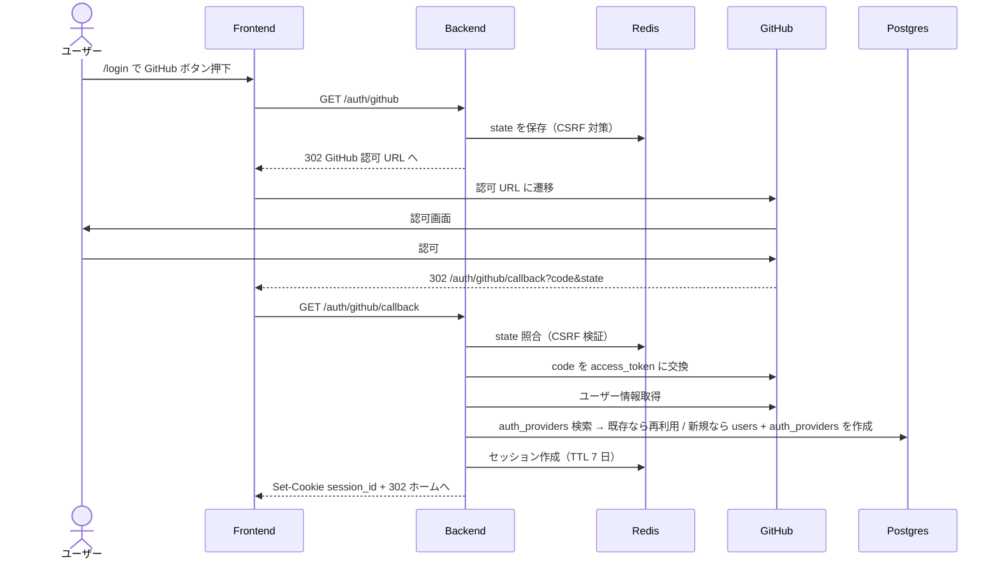

# 認証（GitHub OAuth ログイン）

## ユーザーストーリー

- **役割**：プログラミング学習者（ゲスト）
- **やりたいこと**：GitHub アカウントでログインしたい
- **得られる価値**：別途アカウントを登録する手間を省きつつ、自分の学習履歴を保存できる状態でサービスを利用したい

## 概要

ユーザー認証ドメイン全体の SSoT。MVP では GitHub OAuth 1 本に絞るが、**将来 Google / Email-Password 等を追加可能な拡張設計**を維持する。プログラミング学習者がターゲット（→ [1-vision/02-personas.md](../1-vision/02-personas.md)）のため複数プロバイダは過剰と判断し、新規プロバイダ追加は需要が出てから対応する。

本文書は以下の 2 部構成で書く：

- **§1 認証基盤（プロバイダ非依存）**：将来 Google OAuth / Email-Password 等を追加した時にそのまま再利用される、ユーザー / セッション / 認可ガードの共通仕様
- **§2 GitHub OAuth プロバイダ実装**：§1 の基盤に乗る、GitHub に固有な OAuth フロー / GitHub API 連携

新しいプロバイダ（例：Google OAuth）を追加するときは §2 と並列に §3 / §4 として書き足す。§1 が 300 行を超えるか §N が 5 個を超えた段階で、`auth-foundation.md` への切り出し + `auth-<provider>.md` への分割を検討する。

## ビジネスルール

§1 / §2 のそれぞれで分けて記載（§1.1 / §2.1 を参照）。

## スコープ外（このスプリントでは扱わない）

- メールアドレス + パスワード認証（拡張時に新規 Strategy として追加）
- 2 要素認証（2FA）：R7 以降で必要性を再評価
- パスワードリセット機能：OAuth のみのため不要
- Google / Apple / Email-Password OAuth：拡張余地として設計上は残すが本機能の対象外
- ユーザープロフィール編集（表示名変更等）：別機能として切り出す
- アカウント削除（退会）：[01-non-functional.md](../2-foundation/01-non-functional.md) のハードデリート方針に従い、必要になったら別機能化

## 機能一覧

このドメインで提供する操作の全体俯瞰。詳細仕様は §1 / §2 + OpenAPI（`apps/api/openapi.json`）が SSoT。

| 操作 | 対象ロール | 認証 | 概要 |
|---|---|---|---|
| GitHub でログイン開始 | ゲスト | 不要 | `GET /auth/github` で GitHub の認可画面へリダイレクト（§2.3） |
| GitHub OAuth コールバック | ゲスト → 認証ユーザー | 不要 | `GET /auth/github/callback` で code 検証・セッション確立（§2.3） |
| 現在ユーザー情報取得 | 認証ユーザー | 必須 | `GET /auth/me` で id / display_name / email を返す（§1.4） |
| ログアウト | 認証ユーザー | 必須 | `POST /auth/logout` でセッション破棄（§1.4） |
| Google でログイン | 将来 | 不要 | §3 として後日追加（現状未実装） |
| Email + パスワードでログイン | 将来 | 不要 | §4 として後日追加（現状未実装） |

---

## §1 認証基盤（プロバイダ非依存）

> このセクションは GitHub OAuth に依存しない共通仕様。将来 Google OAuth / Email-Password 等を追加した時もそのまま再利用される。

### §1.1 ビジネスルール（基盤）

- **匿名利用は不可**：問題の生成・解答送信・学習履歴の記録には認証が必須
- **問題閲覧（一覧・詳細）はゲストでも可能**：解答送信のみ認証必須（→ [./problem-display-and-answer.md](./problem-display-and-answer.md)）
- **メールアドレスは取得できれば保存するが UNIQUE 制約は付けない**（プロバイダ側でメール非公開のユーザーが存在しうるため）
- **同一プロバイダの同一外部 ID = 同一ユーザー**：既存 `auth_providers.provider_id` と一致するなら既存 `users` を再利用（プロバイダごとの判定ロジックは §2 で定義）
- **データは users / auth_providers の 2 テーブル分離**：プロバイダ ID をユーザーに直接持たせず、将来複数プロバイダを連携できる構造を維持（実装制約）
- **認証要否はルーター単位の DI ガードで制御**：デフォルト認証必須、public は個別に上書き（実装制約。具体的な仕組みは [.claude/rules/backend.md](../../../.claude/rules/backend.md)）

### §1.2 データモデル

詳細は [3-cross-cutting/01-data-model.md](../3-cross-cutting/01-data-model.md) と SQLAlchemy 2.0 model（`apps/api/app/models/`、`Mapped[T]` 方式、→ [ADR 0037](../../adr/0037-sqlalchemy-alembic-for-database.md)）を参照。

- `users`：プロバイダ非依存のユーザー情報（`id`, `email?`, `display_name`, `created_at`）
- `auth_providers`：プロバイダごとの ID マッピング（`provider` 列挙、`provider_id`, `user_id` FK）
- 関係：`users 1 — N auth_providers`（同一ユーザーが将来複数プロバイダを持てる構造）

### §1.3 セッション

- 保存先：**Redis**（→ [ADR 0047](../../adr/0047-session-store-on-redis.md)）、TTL 7 日
- クライアント：Cookie に `session_id` を `HttpOnly` + `Secure` + `SameSite=Lax` で発行
- 延長ポリシー：ユーザー操作のたびに TTL リセット（rolling session）
- CSRF 対策：状態を持つフローでは `state` パラメータを Redis に事前格納してコールバックで照合（具体的な扱いは §2 のプロバイダごとに定義）

### §1.4 共通 API

| メソッド | パス | 用途 | 認証 |
|---|---|---|---|
| POST | `/auth/logout` | ログアウト（セッション破棄） | 必須 |
| GET | `/auth/me` | 現在のユーザー情報取得 | 必須 |

機械可読の最新仕様は OpenAPI（`apps/api/openapi.json`、ランタイムは FastAPI の `/openapi.json`）が SSoT。本セクションは設計意図の記録（→ [ADR 0006](../../adr/0006-json-schema-as-single-source-of-truth.md)）。401 セマンティクスは [3-cross-cutting/02-api-conventions.md](../3-cross-cutting/02-api-conventions.md#認証セッション) を参照。

### §1.5 共通画面コンポーネント

#### ヘッダーのログイン状態表示（対象：全ユーザー）

- **概要**：未認証時はログインボタン、認証時はユーザー名 + ログアウトボタンを表示
- **主要コンポーネント**：`<HeaderUserMenu />`
- **使用 API**：
  - `GET /auth/me` — 現在のユーザー情報取得
  - `POST /auth/logout` — ログアウト

### §1.6 共通フロー

#### ログアウトフロー（対象：認証ユーザー）

短い線形フローなので箇条書きで足りる（→ docs-rules.md §8）：

1. ユーザーがヘッダーのログアウトボタンを押下
2. `POST /auth/logout` でセッション破棄リクエスト
3. サーバが Redis 上のセッションを削除し、Cookie をクリア
4. ホーム画面（または `/login`）にリダイレクト、未認証状態に戻る

---

## §2 GitHub OAuth プロバイダ実装

> このセクションは §1 の基盤に乗る、GitHub に固有な部分のみ。Google OAuth 等を追加するときは本セクションと並列に §3 / §4 を作る。

### §2.1 ビジネスルール（GitHub 固有）

- **GitHub の `id`（数値）を `auth_providers.provider_id` として `provider='github'` で保存**：既存 `auth_providers` と一致するなら既存 `users` を再利用、新規なら `users` + `auth_providers` を同一トランザクションで作成
- **GitHub からの取得情報**：`id`（必須）、`login`（display_name にフォールバック利用）、`email`（公開していれば保存）

### §2.2 ログイン画面（対象：ゲスト）

- **ルート**：`/login`
- **概要**：未認証ユーザーが GitHub OAuth フローを開始するエントリポイント
- **主要コンポーネント**：`<GitHubLoginButton />`
- **使用 API**：
  - `GET /auth/github` — OAuth 開始（GitHub へリダイレクト）
- **主要インタラクション**：
  - ボタンクリックで GitHub の認可画面に遷移
  - 認可後 `/auth/github/callback` に戻り、自動でホームへ遷移

### §2.3 GitHub OAuth フロー（対象：ゲスト → 認証ユーザー）

時系列で actor 間メッセージが交錯する非線形フローのため Mermaid `sequenceDiagram` で示す（→ docs-rules.md §8 の判断指針）。

凡例：

- 実線 `->>` = 同期リクエスト、点線 `-->>` = レスポンス
- CSRF 対策の `state` は Redis 経由で渡す（§1.3）
- セッション仕様は §1.3 の共通仕様に従う

### §2.4 GitHub 固有 API

| メソッド | パス | 用途 | 認証 |
|---|---|---|---|
| GET | `/auth/github` | OAuth 開始（GitHub へリダイレクト） | ゲスト |
| GET | `/auth/github/callback` | OAuth コールバック、セッション確立 | ゲスト |

### §2.5 バリデーション

OAuth コールバックの `code` / `state` パラメータは GitHub 側 / Redis 側で生成・保存されるため、サーバ側はフォーマットチェックのみ：

| フィールド | ルール | エラーメッセージ |
|---|---|---|
| `code` | 必須（クエリパラメータ） | 認証情報が不正です。再度ログインしてください |
| `state` | 必須、Redis 上の事前発行値と一致 | 認証セッションが無効です。再度ログインしてください |

---

## 受け入れ条件（Definition of Done）

> ユーザー / API クライアントから観測可能な振る舞いに絞る。内部実装の制約（テーブル分離 / DI ガード方式 / Redis 利用 等）は §1.1 / §2.1 のビジネスルールに記述。

**§1 認証基盤に紐づく項目**

- [ ] ログイン後、`GET /auth/me` が 200 で現在ユーザーの情報を返す
- [ ] セッションは 7 日間有効で、ユーザーが操作するたびに有効期限が延長される
- [ ] ログアウトボタン押下後、`GET /auth/me` が 401 を返し未認証状態に戻る
- [ ] セッション期限切れ後にアクセスすると 401 が返り、再ログインを要求される
- [ ] 認証必須エンドポイントに未認証でアクセスすると 401 が返る（デフォルト認証必須）

**§2 GitHub プロバイダ実装に紐づく項目**

- [ ] ヘッダーまたは `/login` 画面に「GitHub でログイン」ボタンが表示される
- [ ] ボタン押下で GitHub の認可画面に遷移する
- [ ] 認可後、自動的にコールバック処理が走り、ログイン状態でホーム画面に遷移する
- [ ] 同じ GitHub アカウントで再ログインしても、`GET /auth/me` が返すユーザー ID が初回と同一（重複ユーザーが作られない）
- [ ] `state` 不一致のコールバックは 4xx で拒否される（CSRF 対策）

## ステータス

タスク単位の細目チェック（リリース単位の進捗は [01-roadmap.md](../5-roadmap/01-roadmap.md) を参照）。

- [ ] 要件定義完了
- [ ] バックエンド実装完了（auth ルーター / セッションサービス / GitHub OAuth クライアント）
- [ ] フロントエンド実装完了（ログイン画面 / ヘッダーメニュー）
- [ ] ユニットテスト完了（auth サービス / GitHub クライアントのモックテスト、→ [ADR 0038](../../adr/0038-test-frameworks.md)）
- [ ] E2E テスト完了（ログイン〜ログアウトの主要フロー、Playwright）
- [ ] **受け入れ条件すべて満たす**
- [ ] PR マージ済み

## 関連

- **関連 ADR**：
  - [ADR 0011: GitHub OAuth で拡張可能設計](../../adr/0011-github-oauth-with-extensible-design.md)
  - [ADR 0034: バックエンドフレームワークに FastAPI](../../adr/0034-fastapi-for-backend.md)
  - [ADR 0037: SQLAlchemy 2.0 + Alembic](../../adr/0037-sqlalchemy-alembic-for-database.md)
  - [ADR 0047: Redis セッションストア](../../adr/0047-session-store-on-redis.md)
- **横断要件**：
  - 認証アーキテクチャ：[2-foundation/02-architecture.md](../2-foundation/02-architecture.md#backend-apifastapi--python)
  - セッション・レート制限：[2-foundation/01-non-functional.md](../2-foundation/01-non-functional.md)
  - 認証関連 API 仕様：[3-cross-cutting/02-api-conventions.md](../3-cross-cutting/02-api-conventions.md#認証セッション)
- **データモデル**：[3-cross-cutting/01-data-model.md](../3-cross-cutting/01-data-model.md)
- **ペルソナ**：[1-vision/02-personas.md](../1-vision/02-personas.md)（想定ターゲットは GitHub アカウント所有者の中級プログラマ）
- **実装ルール**：[.claude/rules/backend.md](../../../.claude/rules/backend.md)
