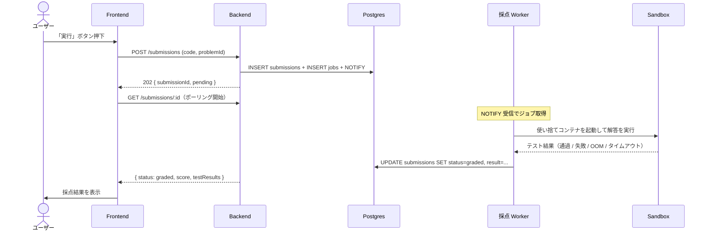

# 自動採点

## ユーザーストーリー

- **役割**：認証ユーザー（プログラミング学習者）
- **やりたいこと**：自分の解答コードを送信すると、自動で実行・採点されて結果が即座に返ってくる
- **得られる価値**：手動レビューを待たず、即時フィードバックを受けて学習効率を最大化できる

## 概要

ユーザーの解答コードをサンドボックスで実行し、生成済みのテストケースで自動採点する機能。本サービスの中核で、**「LLM の出力を信用せず、サンドボックスで動作保証する」設計思想**が最も色濃く出る部分。

## ビジネスルール

- **セキュリティ最優先**：ユーザーが書いたコードは攻撃コードである可能性を前提に扱う
  - ネットワーク遮断（`--network none`）
  - ファイルシステム書き込み制限（`/tmp` のみ）
  - CPU・メモリ制限（cgroups）
  - 非 root 実行
  - 実行時間 5 秒上限
- **使い捨てコンテナ**：前回実行の影響が原理的に残らない（1 ジョブ = 1 コンテナ、→ [ADR 0009](../../adr/0009-disposable-sandbox-container.md)）
- **隔離レイヤの段階的進化**：Docker → gVisor → Firecracker（→ [2-foundation/05-runtime-stack.md](../2-foundation/05-runtime-stack.md#サンドボックス)）
- **採点失敗ケースは要因別に整形**：「テスト不合格」「構文エラー」「実行時例外」「OOM」「タイムアウト」を区別
- **trace_id の連結**：API リクエスト → ジョブ → 採点 Worker（`apps/workers/grading`）処理 → 採点結果が単一トレースで追える（→ [ADR 0010](../../adr/0010-w3c-trace-context-in-job-payload.md)、[ADR 0040](../../adr/0040-worker-grouping-and-llm-in-worker.md)）
- **解答送信は冪等的に蓄積**：同じ問題に何度送信しても submission が新しい行として作られる（履歴目的）
- **採点結果の所有権チェック**：`submissions.user_id` と現在ユーザーが一致するもののみ閲覧可（実装制約）

## スコープ外（このスプリントでは扱わない）

- 解答コードの保存・SNS 共有
- LLM ヒント機能（[LLM ヒント機能](../5-roadmap/01-roadmap.md#llm-ヒント機能)）
- 複数言語対応（MVP は TypeScript のみ）
- 部分点（テストケース重み付け）：MVP は通過数 / 全数の単純集計
- カスタムジャッジ（競技プログラミング風の特殊判定）
- gVisor / Firecracker への切り替え（R3 / R9）

## 機能一覧

このドメインで提供する操作の全体俯瞰。詳細仕様は下の各 HOW セクション + OpenAPI（`apps/api/openapi.json`）が SSoT。

| 操作 | 対象ロール | 認証 | 概要 |
|---|---|---|---|
| 解答送信（採点ジョブ投入） | 認証ユーザー | 必須 | `POST /submissions` で解答コードを送信、202 + `submissionId` 即返 |
| 採点結果取得 | 認証ユーザー | 必須 | `GET /submissions/:id` でポーリング、`status='graded'` で結果取得 |
| 自分の解答履歴一覧 | 認証ユーザー | 必須 | `GET /submissions` で過去の解答を新しい順に取得（履歴ドメインからも参照） |

## データモデル

詳細は [3-cross-cutting/01-data-model.md](../3-cross-cutting/01-data-model.md) を参照。

- `submissions`：解答送信ごとに作成（`id`, `user_id`, `problem_id`, `code`, `status`, `result?`, `score?`, `created_at`, `graded_at?`）
- `jobs`：採点ジョブのキューイング（`queue='grading'`, `type='grade'`, `payload: { traceContext, submissionId, problemId, code, language, timeoutMs }`、→ [3-cross-cutting/01-data-model.md: ジョブペイロード](../3-cross-cutting/01-data-model.md#ジョブペイロード共通フィールドtracecontext)、[ADR 0010](../../adr/0010-w3c-trace-context-in-job-payload.md)、[ADR 0040](../../adr/0040-worker-grouping-and-llm-in-worker.md)）

## 画面

### 採点結果表示（対象：認証ユーザー）

採点結果は専用画面ではなく、[問題詳細・解答画面](./problem-display-and-answer.md) 内の `<GradingResult />` コンポーネントとして表示される。

- **概要**：解答送信後、ポーリングで採点結果を取得し、結果に応じた表示
- **主要コンポーネント**：
  - `<GradingPendingIndicator />`（採点中スピナー）
  - `<GradingResultPass />`（正解：通過数表示・所要時間・お祝いメッセージ）
  - `<GradingResultFail />`（失敗：失敗ケース・期待値・実際の出力・差分）
  - `<GradingResultError />`（実行時エラー / タイムアウト：スタックトレース整形）
- **使用 API**：
  - `POST /submissions` — 解答送信（202 + submissionId）
  - `GET /submissions/:id` — ポーリングで結果取得
- **主要インタラクション**：
  - `status='pending'` / `'running'` の間ポーリング継続
  - `status='graded'` で停止し、結果を表示
  - `status='failed'` で再試行ボタン提示

## ユーザーフロー

### 採点フロー（対象：認証ユーザー）

時系列で actor 間メッセージ（ユーザー / Frontend / Backend / DB / Worker / Sandbox）が交錯するため Mermaid `sequenceDiagram` で示す（→ docs-rules.md §8）。

なお、ジョブキュー機構の詳細（`SELECT FOR UPDATE SKIP LOCKED` 等）は **[02-architecture.md: 1 ジョブが流れる完全な経路](../2-foundation/02-architecture.md#1-ジョブが流れる完全な経路)** に集約しているため本セクションは機能側の概要のみを示す。



失敗系の扱い：

- **テスト不合格**：`status='graded'`、`score < totalCount`、`result.testResults` に失敗ケース内訳
- **タイムアウト**：Worker が `ContainerWait` のタイムアウト発火 → ContainerKill → `result.failure_type='timeout_killed'`
- **OOM**：Docker が OOM Kill → `result.failure_type='oom_killed'`
- **構文エラー**：トランスパイル失敗 → `result.failure_type='syntax_error'`、stderr 整形して返却
- **再試行可能エラー**：DB 接続一時失敗等 → リトライ（最大 3 回、指数バックオフ）→ 全失敗で `state='dead'`（DLQ）

## API

| メソッド | パス | 用途 | 認証 |
|---|---|---|---|
| POST | `/submissions` | 解答送信 → 採点ジョブ投入 | 必須 |
| GET | `/submissions/:id` | 解答 + 採点結果取得（ポーリング用） | 必須 |
| GET | `/submissions` | 自分の解答履歴一覧 | 必須 |

機械可読の最新仕様は OpenAPI（`apps/api/openapi.json`、ランタイムは FastAPI の `/openapi.json`）が SSoT。リクエスト・レスポンスのスキーマは Pydantic で `apps/api/app/schemas/submissions.py` に定義（本ファイルにコピーしない、→ [ADR 0006](../../adr/0006-json-schema-as-single-source-of-truth.md)）。

### JSON 例

`POST /submissions` リクエスト：
```json
{
  "problemId": "<uuid>",
  "code": "export function solve(n: number) { ... }"
}
```

レスポンス（202）：
```json
{
  "submissionId": "<uuid>",
  "status": "pending"
}
```

`GET /submissions/:id` レスポンス（採点完了後）：
```json
{
  "id": "<uuid>",
  "problemId": "<uuid>",
  "status": "graded",
  "score": 5,
  "totalCount": 5,
  "result": {
    "passed": true,
    "durationMs": 1340,
    "testResults": [
      { "name": "case1", "passed": true, "durationMs": 120 }
    ]
  },
  "gradedAt": "2026-05-10T10:00:00Z"
}
```

## バリデーション

| フィールド | ルール | エラーメッセージ |
|---|---|---|
| `problemId` | 必須、UUID、存在する問題 | 問題が存在しません |
| `code` | 必須、64KB 以下 | コードのサイズが上限を超えています |

## 受け入れ条件（Definition of Done）

> 外部から観測可能な振る舞いに絞る。サンドボックス使い捨てやコンテナ制限フラグはビジネスルール参照。

- [ ] 「実行」ボタン押下で `POST /submissions` に解答が送信され、`202 Accepted` + `submissionId` が即返る
- [ ] フロントは `GET /submissions/:id` を 1〜2 秒間隔でポーリングし、採点結果を取得する
- [ ] 全テストケース通過 → 「正解」表示 + 通過数 / 全数（例：5/5）
- [ ] 一部失敗 → 失敗したテストケース名・期待値・実際の出力・差分を表示
- [ ] 構文エラー / 実行時例外 → スタックトレースを整形して表示
- [ ] タイムアウト（5 秒超過） → 「タイムアウト」と表示
- [ ] OOM / メモリ超過 → 「メモリ使用量超過」と表示
- [ ] 型パズル系カテゴリは型チェック（`tsc --noEmit` 想定）の型エラー有無で判定
- [ ] 他ユーザーの `submissions/:id` には 403 / 404 が返って閲覧不可
- [ ] レート制限：同一ユーザーで `1 分 / 30 回` を超えると `429` を返す（→ [3-cross-cutting/02-api-conventions.md](../3-cross-cutting/02-api-conventions.md#レート制限)）
- [ ] 採点結果は再取得しても同じ内容が返る（永続保存）

## ステータス

タスク単位の細目チェック（リリース単位の進捗は [01-roadmap.md](../5-roadmap/01-roadmap.md) を参照）。

- [ ] 要件定義完了
- [ ] バックエンド実装完了（submissions ルーター：enqueue + 結果取得のみ。サンドボックス処理は含めない）
- [ ] 採点 Worker 実装完了（`apps/workers/grading`：ジョブ取得・サンドボックス起動・結果書き戻し）
- [ ] サンドボックス実装完了（Docker + 制限フラグ、R3 で gVisor 切替）
- [ ] フロントエンド実装完了（採点結果表示コンポーネント）
- [ ] ユニットテスト完了（pytest（API）+ Go testing + testify（Worker、SandboxRunner のモックテスト）、→ [ADR 0038](../../adr/0038-test-frameworks.md)）
- [ ] E2E テスト完了（解答送信 → 採点完了 → 結果表示の主要フロー、Playwright）
- [ ] **受け入れ条件すべて満たす**
- [ ] PR マージ済み

## 関連

- **関連機能**：
  - [問題生成リクエスト](./problem-generation.md)（生成時のサンドボックス検証は同じ仕組み）
  - [問題表示・解答](./problem-display-and-answer.md)（解答送信のエントリポイント）
  - [学習履歴](./learning.md)（採点結果が履歴に集約される）
- **関連 ADR**：
  - [ADR 0004: Postgres ジョブキュー](../../adr/0004-postgres-as-job-queue.md)
  - [ADR 0016: Go で採点ワーカーを実装](../../adr/0016-go-for-grading-worker.md)
  - [ADR 0009: 使い捨てサンドボックスコンテナ](../../adr/0009-disposable-sandbox-container.md)
  - [ADR 0010: W3C Trace Context をジョブペイロードに埋め込む](../../adr/0010-w3c-trace-context-in-job-payload.md)
  - [ADR 0034: バックエンドフレームワークに FastAPI](../../adr/0034-fastapi-for-backend.md)
  - [ADR 0040: Worker のグルーピングと LLM 呼び出しを Worker 側に置く](../../adr/0040-worker-grouping-and-llm-in-worker.md)
- **横断要件**：
  - アーキテクチャ（採点フロー）：[2-foundation/02-architecture.md](../2-foundation/02-architecture.md#1-ジョブが流れる完全な経路)
  - 非機能（性能・セキュリティ）：[2-foundation/01-non-functional.md](../2-foundation/01-non-functional.md)
  - 観測性：[2-foundation/04-observability.md](../2-foundation/04-observability.md)
- **実装ルール**：[.claude/rules/backend.md](../../../.claude/rules/backend.md)、[.claude/rules/worker.md](../../../.claude/rules/worker.md)
