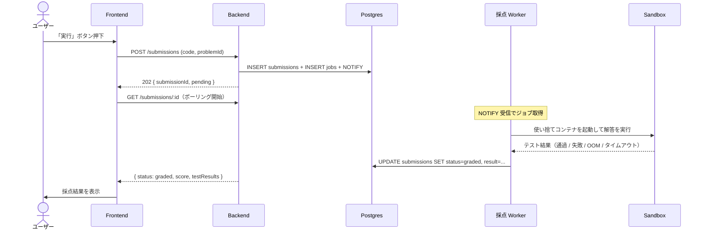

# 自動採点

<!--
配置先：`docs/requirements/4-features/<name>.md`（フラット配置、数値 ID なし）
新規作成・更新は `/new-requirements` カスタムコマンド経由を推奨。
セクション順序：WHY（ストーリー）→ WHAT（概要 / ビジネスルール / スコープ外）→
              機能一覧（全体俯瞰）→ HOW（データ / 画面 / フロー / API / バリデーション）
              → 完成検証（受入条件）→ 進捗（ステータス）→ 外部参照（関連）

長期運用の原則（このファイルを更新する全タイミングで適用）：
  1. コードや OpenAPI / SQLAlchemy から読み取れる事実は書かない。書くのは "なぜ"（業務理由）と "観測可能な振る舞い" だけ
  2. ファイル長は許容する（行数で分割しない）。分割トリガはドメイン境界のみ
  3. ビジネスルールが 30 行を超えたら H3 サブセクションに割る（壁を防ぐ）
  4. バリデーション節は業務上の理由があるルールのみ書く（必須・長さ等の機械的検証は Pydantic / Zod が SSoT）
  5. **HTML コメント（`<!--` で始まる注釈ブロック）は削除しない**（このコメント自身を含む）。CLAUDE が将来の更新時に運用ルールを再認識するための裏ルールとして埋め込まれているため、本文整理時にまとめて消さない
-->

## ユーザーストーリー

- **役割**：認証ユーザー（プログラミング学習者）
- **やりたいこと**：自分の解答コードを送信すると、自動で実行・採点されて結果が即座に返ってくる
- **得られる価値**：手動レビューを待たず、即時フィードバックを受けて学習効率を最大化できる

<!-- 複数のロールが関わる場合は同じ 3 行セットを並べてよい -->

## 概要

ユーザーの解答コードをサンドボックスで実行し、生成済みのテストケースで自動採点する機能。本サービスの中核で、**「LLM の出力を信用せず、サンドボックスで動作保証する」設計思想**が最も色濃く出る部分。

## ビジネスルール

- **セキュリティ最優先**：ユーザーが書いたコードは攻撃コードである可能性を前提に扱う
  - ネットワーク遮断（外部通信不可、攻撃コードからの外部攻撃・外部リソース取得を防ぐ）
  - ファイルシステム書き込み制限（テンポラリのみ書き込み可、ホスト側への影響を防ぐ）
  - CPU・メモリ制限（DoS 攻撃・暴走コードからホストを守る）
  - 非 root 実行（権限昇格攻撃を防ぐ）
  - 実行時間 5 秒上限
- **使い捨てコンテナ**：前回実行の影響が原理的に残らない（1 ジョブ = 1 コンテナ、→ [ADR 0009](../../adr/0009-disposable-sandbox-container.md)）
- **隔離レイヤの段階的進化**：Docker → gVisor → Firecracker（→ [2-foundation/05-runtime-stack.md](../2-foundation/05-runtime-stack.md#サンドボックス)）
- **採点失敗ケースは要因別に整形**：「テスト不合格」「構文エラー」「実行時例外」「OOM」「タイムアウト」を区別
- **trace_id の連結**：API リクエスト → ジョブ → 採点 Worker（`apps/workers/grading`）処理 → 採点結果が単一トレースで追える（→ [ADR 0010](../../adr/0010-w3c-trace-context-in-job-payload.md)、[ADR 0040](../../adr/0040-worker-grouping-and-llm-in-worker.md)）
- **解答送信は冪等的に蓄積**：同じ問題に何度送信しても submission が新しい行として作られる（履歴目的）
- **採点結果の所有権チェック**：`submissions.user_id` と現在ユーザーが一致するもののみ閲覧可（実装制約）
- **採点に LLM は使わない**：本ドメインの「採点」は**サンドボックス + テストケース判定のみ**で完結する（決定論的判定、再現性確保）。`apps/workers/grading/prompts/judge/` 配下に Judge プロンプトが置かれるが、これは同 Worker が R1〜R6 に問題生成を兼務する都合の便宜的配置で、**責務は問題生成側**にある（→ [problem-generation.md: ビジネスルール](./problem-generation.md#ビジネスルール)）。LLM ヒント機能は R6 で別途実装（→ スコープ外）

## スコープ外（このスプリントでは扱わない）

- 解答コードの保存・SNS 共有
- LLM ヒント機能（[LLM ヒント機能](../5-roadmap/01-roadmap.md#llm-ヒント機能)）
- 複数言語対応（MVP は TypeScript のみ）
- 部分点（テストケース重み付け）：MVP は通過数 / 全数の単純集計
- カスタムジャッジ（競技プログラミング風の特殊判定）
- gVisor / Firecracker への切り替え（R3 / R9）

## 機能一覧

このドメインで提供する操作の全体俯瞰。詳細仕様は下の各 HOW セクション + OpenAPI（`apps/api/openapi.json`）が SSoT。

| 操作 | 対象ロール | 認証 | 概要 | 詳細 |
|---|---|---|---|---|
| 解答送信（採点ジョブ投入） | 認証ユーザー | 必須 | `POST /submissions` で解答コードを送信、202 + `submissionId` 即返 | [#採点フロー対象認証ユーザー](#採点フロー対象認証ユーザー) |
| 採点結果取得 | 認証ユーザー | 必須 | `GET /submissions/:id` でポーリング、`status='graded'` で結果取得 | [#採点結果表示対象認証ユーザー](#採点結果表示対象認証ユーザー) |
| 自分の解答履歴一覧 | 認証ユーザー | 必須 | `GET /submissions` で過去の解答を新しい順に取得（履歴ドメインからも参照） | [#api](#api) |

## データモデル

> **関わるテーブル名の列挙のみ**。カラム定義・関係詳細は書かない（drift 防止）。スキーマの SSoT は SQLAlchemy model（`apps/api/app/models/`、→ [ADR 0037](../../adr/0037-sqlalchemy-alembic-for-database.md)）、全体俯瞰は [3-cross-cutting/01-data-model.md](../3-cross-cutting/01-data-model.md)。

関わるテーブル：`submissions` / `jobs`

## 画面

### 採点結果表示（対象：認証ユーザー）

採点結果は専用画面ではなく、[問題詳細・解答画面](./problem-display-and-answer.md) 内のコンポーネントとして表示される。

- **目的**：解答送信後、ポーリングで採点結果を取得し、結果の種類（正解 / 失敗 / 実行時エラー / タイムアウト）に応じて表示形式を切り替える
- **使用 API**：
  - `POST /submissions` — 解答送信（202 + submissionId）
  - `GET /submissions/:id` — ポーリングで結果取得
- **主要インタラクション**：
  - 採点中はスピナーを表示、`status='graded'` で停止して結果を表示
  - 失敗ケースには期待値・実際の出力・差分を併記する
  - `status='failed'`（インフラ起因の失敗）では再試行ボタンを提示

## ユーザーフロー

### 採点フロー（対象：認証ユーザー）

時系列で actor 間メッセージ（ユーザー / Frontend / Backend / DB / Worker / Sandbox）が交錯するため Mermaid `sequenceDiagram` で示す（→ docs-rules.md §8）。

なお、ジョブキュー機構の詳細（`SELECT FOR UPDATE SKIP LOCKED` 等）は **[02-architecture.md: 1 ジョブが流れる完全な経路](../2-foundation/02-architecture.md#1-ジョブが流れる完全な経路)** に集約しているため本セクションは機能側の概要のみを示す。



失敗系のユーザー観測：

- **テスト不合格**：失敗したテストケースの内訳が表示される
- **タイムアウト**：実行時間上限を超えると採点中断と表示される
- **メモリ超過**：「メモリ使用量超過」が表示される
- **構文エラー**：エラー内容が整形されて表示される
- **一時的なシステムエラー**：自動再試行され、最終的に失敗した場合は再実行ボタンが提示される

具体的な失敗種別の識別子・リトライ回数・DLQ メカニズムは Worker 実装（`apps/workers/grading`）が SSoT。

## API

<!--
本セクションは API-first 設計の SSoT（実装前の契約）。以下 4 ステップを必ず意識する：

  1. API 設計：このセクションで API テーブル + JSON 例を先に書く（実装前）
  2. バックエンド実装：/backend-implement が本セクションに沿って Pydantic + FastAPI を実装
  3. API の吐き出し：mise run api:openapi-export で apps/api/openapi.json を出力
  4. API 設計をバックエンド実装に合わせて更新：差分があれば本セクションを追従更新
     （実装が SSoT、本セクションは契約の鏡）

所有権ルール：本ドメインは `/submissions` 系エンドポイントを所有する。他 feature は
`→ [grading.md#xxx](./grading.md#xxx)` でアンカー参照のみ（重複させない）。
-->

| メソッド | パス | 用途 | 認証 | 詳細 |
|---|---|---|---|---|
| POST | `/submissions` | 解答送信 → 採点ジョブ投入 | 必須 | [#post-submissions](#post-submissions) |
| GET | `/submissions/:id` | 解答 + 採点結果取得（ポーリング用） | 必須 | [#get-submissionsid](#get-submissionsid) |
| GET | `/submissions` | 自分の解答履歴一覧 | 必須 | [#get-submissions](#get-submissions) |

機械可読の最新仕様は OpenAPI（`apps/api/openapi.json`、ランタイムは FastAPI の `/openapi.json`）が SSoT。本セクションは API-first 設計の人間可読版 + 契約の鏡（→ [ADR 0006](../../adr/0006-json-schema-as-single-source-of-truth.md)）。

### JSON 例

#### POST /submissions

- 認証：必須
- 使う feature：[grading.md](./grading.md) + [problem-display-and-answer.md](./problem-display-and-answer.md)（解答画面の「実行」ボタンから呼ぶ）
- リクエスト:

```json
{
  "problemId": "<uuid>",
  "code": "export function solve(n: number) { return n * 2; }"
}
```

- レスポンス 202:

```json
{ "submissionId": "<uuid>", "status": "pending" }
```

#### GET /submissions/:id

- 認証：必須
- 使う feature：[grading.md](./grading.md) + [problem-display-and-answer.md](./problem-display-and-answer.md)（採点結果ポーリング）
- レスポンス 200（採点完了後）:

```json
{
  "id": "<uuid>",
  "problemId": "<uuid>",
  "status": "graded",
  "score": 5,
  "totalCount": 5,
  "result": {
    "passed": true,
    "durationMs": 1340,
    "testResults": [
      { "name": "case1", "passed": true, "durationMs": 120 }
    ]
  },
  "gradedAt": "2026-05-10T10:00:00Z"
}
```

#### GET /submissions

- 認証：必須
- 使う feature：[grading.md](./grading.md) + [learning.md](./learning.md)（学習履歴一覧画面から呼ぶ）
- クエリパラメータ：`page`（既定 1）/ `pageSize`（既定 20）
- レスポンス 200:

```json
{
  "items": [
    {
      "id": "<uuid>",
      "problemId": "<uuid>",
      "problemTitle": "二倍にして返す",
      "status": "graded",
      "score": 5,
      "totalCount": 5,
      "gradedAt": "2026-05-10T10:00:00Z"
    }
  ],
  "page": 1,
  "pageSize": 20,
  "totalPages": 3
}
```

## バリデーション

> **業務上の理由があるルールのみ**を書く（例：「ニックネームに本名を含めさせない方針」「招待コードは大文字英数字 8 桁の決まり」）。必須・最大長・型・正規表現等の**機械的検証は Pydantic / Zod が SSoT** なのでここには書かない（drift 防止、→ [ADR 0006](../../adr/0006-json-schema-as-single-source-of-truth.md)）。

| フィールド | 業務ルール | 理由 / エラーメッセージ |
|---|---|---|
| `code` | 64KB 以下 | サンドボックスの実行コスト・LLM Judge 入力長を抑える業務上の上限（攻撃的な巨大入力対策にも兼用）。「コードのサイズが上限を超えています」 |

## 受け入れ条件（Definition of Done）

> **役割**：プロダクトとして "完成した" と言える条件。**ユーザー / API クライアントから観測可能なふるまい** だけに絞る。「DB 上で○○」「Depends で○○」等の実装制約はビジネスルールに書く。
>
> **長期運用**：機能の振る舞い仕様の累積。機能が育つほど条件は**追加されていく**し、既存条件も仕様変更で**更新される**。**変更・追加された条件は再検証が必要なので未チェックに戻す**（既存で変わってない条件はチェック維持、全リセットはしない）。観測可能な振る舞いが変わったらここを直すのが SSoT 更新の第一歩。過去版の履歴は git log で辿る。

- [ ] 「実行」ボタン押下で `POST /submissions` に解答が送信され、`202 Accepted` + `submissionId` が即返る
- [ ] フロントは `GET /submissions/:id` を 1〜2 秒間隔でポーリングし、採点結果を取得する
- [ ] 全テストケース通過 → 「正解」表示 + 通過数 / 全数（例：5/5）
- [ ] 一部失敗 → 失敗したテストケース名・期待値・実際の出力・差分を表示
- [ ] 構文エラー / 実行時例外 → スタックトレースを整形して表示
- [ ] タイムアウト（5 秒超過） → 「タイムアウト」と表示
- [ ] OOM / メモリ超過 → 「メモリ使用量超過」と表示
- [ ] 型パズル系カテゴリは型エラーの有無が採点結果に反映される
- [ ] 他ユーザーの `submissions/:id` には 403 / 404 が返って閲覧不可
- [ ] レート制限：同一ユーザーで `1 分 / 30 回` を超えると `429` を返す（→ [3-cross-cutting/02-api-conventions.md](../3-cross-cutting/02-api-conventions.md#レート制限)）
- [ ] 採点結果は再取得しても同じ内容が返る（永続保存）

## ステータス

> **役割**：開発工程としてどこまで進んだかのチェックリスト（"プロダクトの完成条件" は上の受け入れ条件、"リリース単位の進捗" は [01-roadmap.md](../5-roadmap/01-roadmap.md) で管理）。
>
> **長期運用**：機能を再着手・大きく改修するたびに**チェックを外してリセットする**（過去の完了履歴は残さない、履歴は git log と PR で辿る）。常に「この機能の現在の状態」だけを映す鏡として使う。

- [ ] バックエンド実装完了（submissions ルーター：enqueue + 結果取得のみ。サンドボックス処理は含めない）
- [ ] 採点 Worker 実装完了（`apps/workers/grading`：ジョブ取得・サンドボックス起動・結果書き戻し）
- [ ] サンドボックス実装完了（Docker + 制限フラグ、R3 で gVisor 切替）
- [ ] フロントエンド実装完了（採点結果表示コンポーネント）
- [ ] ユニットテスト完了（pytest（API）+ Go testing + testify（Worker、SandboxRunner のモックテスト）、→ [ADR 0038](../../adr/0038-test-frameworks.md)）
- [ ] E2E テスト完了（解答送信 → 採点完了 → 結果表示の主要フロー、Playwright）
- [ ] **受け入れ条件すべて満たす**

## 関連

- **関連機能**：
  - [問題生成リクエスト](./problem-generation.md)（生成時のサンドボックス検証は同じ仕組み）
  - [問題表示・解答](./problem-display-and-answer.md)（解答送信のエントリポイント）
  - [学習履歴](./learning.md)（採点結果が履歴に集約される）
- **関連 ADR**：
  - [ADR 0004: Postgres ジョブキュー](../../adr/0004-postgres-as-job-queue.md)
  - [ADR 0016: Go で採点ワーカーを実装](../../adr/0016-go-for-grading-worker.md)
  - [ADR 0009: 使い捨てサンドボックスコンテナ](../../adr/0009-disposable-sandbox-container.md)
  - [ADR 0010: W3C Trace Context をジョブペイロードに埋め込む](../../adr/0010-w3c-trace-context-in-job-payload.md)
  - [ADR 0034: バックエンドフレームワークに FastAPI](../../adr/0034-fastapi-for-backend.md)
  - [ADR 0040: Worker のグルーピングと LLM 呼び出しを Worker 側に置く](../../adr/0040-worker-grouping-and-llm-in-worker.md)
- **横断要件**：
  - アーキテクチャ（採点フロー）：[2-foundation/02-architecture.md](../2-foundation/02-architecture.md#1-ジョブが流れる完全な経路)
  - 非機能（性能・セキュリティ）：[2-foundation/01-non-functional.md](../2-foundation/01-non-functional.md)
  - 観測性：[2-foundation/04-observability.md](../2-foundation/04-observability.md)
- **実装ルール**：[.claude/rules/backend.md](../../../.claude/rules/backend.md)、[.claude/rules/worker.md](../../../.claude/rules/worker.md)
