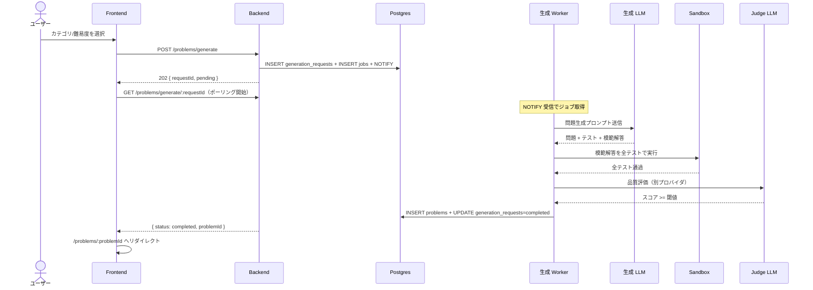

# 問題生成リクエスト

## ユーザーストーリー

- **役割**：認証ユーザー（プログラミング学習者）
- **やりたいこと**：カテゴリと難易度を指定して新しい TypeScript 問題を生成リクエストしたい
- **得られる価値**：既存の問題に縛られず、自分の興味・弱点に応じた練習問題を無限に得られる

## 概要

LLM に問題本文・入出力例・テストケース・模範解答を生成させる機能。LLM の出力を信用せず、サンドボックス実行で動作保証してから DB に保存する点が本サービスの差別化軸。

## ビジネスルール

- **LLM の出力をそのまま信用しない**：必ずサンドボックス検証 + Judge を通したものだけを保存（→ [CLAUDE.md](../../../.claude/CLAUDE.md) 設計思想）
- **生成と Judge は別プロバイダ・別モデル**：自己評価バイアス回避（→ [ADR 0008](../../adr/0008-custom-llm-judge.md)）
- **モデル段階利用**：初回は低コスト・高速モデル、再生成時に上位モデル、Judge は中位モデル（→ [03-llm-pipeline.md: コスト最適化](../2-foundation/03-llm-pipeline.md#コスト最適化)）
- **同一プロンプトの結果は Redis キャッシュで再利用**（TTL 7 日、`prompt_hash` をキー）
- **生成ジョブの trace_id はリクエストから採点完了まで連結**（→ [ADR 0010](../../adr/0010-w3c-trace-context-in-job-payload.md)）
- **API は enqueue 専用**：LLM 呼び出しは Worker 側に閉じる（実装制約、→ [ADR 0040](../../adr/0040-worker-grouping-and-llm-in-worker.md)）
- **Worker の所在**：R1〜R6 は採点 Worker（`apps/workers/grading`）が兼務、R7 で `apps/workers/generation` に切り出し（実装ロードマップ、→ [01-roadmap.md](../5-roadmap/01-roadmap.md)）

## スコープ外（このスプリントでは扱わない）

- 学習履歴・弱点に基づく適応生成（[適応型出題](../5-roadmap/01-roadmap.md#適応型出題) で別途実装）
- ユーザーが独自プロンプトを書ける生成モード（プロンプトインジェクションリスクのため当面実装しない）
- 複数問題のバッチ生成（必要性が出てから検討）
- 問題の差し替え・再生成リクエスト（モデル変更後の品質再評価バッチは R7 で）
- 問題の手動編集機能（[管理ダッシュボード](../5-roadmap/01-roadmap.md#管理ダッシュボード) で扱う）

## 機能一覧

このドメインで提供する操作の全体俯瞰。詳細仕様は下の各 HOW セクション + OpenAPI（`apps/api/openapi.json`）が SSoT。

| 操作 | 対象ロール | 認証 | 概要 |
|---|---|---|---|
| 問題生成リクエスト | 認証ユーザー | 必須 | `POST /problems/generate` でカテゴリ・難易度を指定し、生成ジョブを投入。202 即返 |
| 生成ステータス取得 | 認証ユーザー | 必須 | `GET /problems/generate/:requestId` でポーリング、完了時に `problemId` を取得 |

## データモデル

詳細は [3-cross-cutting/01-data-model.md](../3-cross-cutting/01-data-model.md) を参照。

- `generation_requests`：生成リクエストの状態管理（`requestId`, `category`, `difficulty`, `status`, `produced_problem_id?`）
- `problems`：生成成功した問題（`title`, `description`, `examples`, `test_cases`, `reference_solution`, `judge_scores?`）
- `jobs`：問題生成ジョブのキューイング（`queue='generation'`, `type='generate-problem'`, `payload`, `state`）。詳細は [ADR 0004](../../adr/0004-postgres-as-job-queue.md)

## 画面

### 問題生成画面（対象：認証ユーザー）

- **ルート**：`/problems/new`
- **概要**：カテゴリ・難易度を選択して生成をリクエストする画面
- **主要コンポーネント**：`<GenerateProblemForm />`、`<CategorySelector />`、`<DifficultySelector />`
- **使用 API**：
  - `POST /problems/generate` — 生成リクエスト（202 + requestId）
- **主要インタラクション**：
  - フォーム送信で `requestId` を取得し、生成ステータス画面に遷移

### 生成ステータス画面（対象：認証ユーザー）

- **ルート**：`/problems/generate/:requestId`
- **概要**：非同期生成の進捗を表示し、完了したら問題詳細へ自動遷移
- **主要コンポーネント**：`<GenerationStatus />`（1〜2 秒間隔ポーリング）
- **使用 API**：
  - `GET /problems/generate/:requestId` — ステータス取得
- **主要インタラクション**：
  - `status === 'completed'` → `/problems/:problemId` へリダイレクト
  - `status === 'failed'` → エラー表示 + 再試行ボタン

## ユーザーフロー

### 問題生成フロー（対象：認証ユーザー）

時系列で actor 間メッセージ（ユーザー / Frontend / Backend / DB / Worker / LLM / Sandbox / Judge）が交錯するため Mermaid `sequenceDiagram` で示す。



凡例：

- 失敗系（LLM 出力スキーマ違反 / サンドボックス失敗 / Judge スコア不合格）は**上位モデルで最大 3 回再生成**。全試行失敗で `status='failed'` をフロントに返す
- ジョブキュー機構の詳細（`SELECT FOR UPDATE SKIP LOCKED` 等）は [02-architecture.md: 1 ジョブが流れる完全な経路](../2-foundation/02-architecture.md#1-ジョブが流れる完全な経路) を参照

## API

| メソッド | パス | 用途 | 認証 |
|---|---|---|---|
| POST | `/problems/generate` | 生成リクエスト（202 + requestId 即返） | 必須 |
| GET | `/problems/generate/:requestId` | 生成ステータス取得（ポーリング用） | 必須 |

機械可読の最新仕様は OpenAPI（`apps/api/openapi.json`、ランタイムは FastAPI の `/openapi.json`）が SSoT。

### JSON 例

`POST /problems/generate` リクエスト：
```json
{
  "category": "array",
  "difficulty": "easy"
}
```

レスポンス（202）：
```json
{
  "requestId": "<uuid>",
  "status": "pending"
}
```

`GET /problems/generate/:requestId` レスポンス（完了時）：
```json
{
  "requestId": "<uuid>",
  "status": "completed",
  "problemId": "<uuid>"
}
```

## バリデーション

| フィールド | ルール | エラーメッセージ |
|---|---|---|
| `category` | 必須、許可値リスト内（string / array / recursion / async / type-puzzle） | カテゴリを指定してください |
| `difficulty` | 必須、`easy` / `medium` / `hard` のいずれか | 難易度を指定してください |

## 受け入れ条件（Definition of Done）

> 外部から観測可能な振る舞いに絞る。内部の Worker 配置 / モデル切替戦略 / プロンプトキャッシュ等はビジネスルール参照。

- [ ] 問題生成画面でカテゴリ・難易度を選択して送信できる
- [ ] 送信後、API は `202 Accepted` + `requestId` を即座に返す（同期で待たせない）
- [ ] 生成中はステータス画面で「生成中…」と表示される
- [ ] `GET /problems/generate/:requestId` のポーリングでステータス遷移が取得できる
- [ ] 生成成功時：新規作成された問題ページに自動遷移する
- [ ] 生成失敗時（最大 3 回再生成しても全失敗）：失敗ステータスを表示し、再試行ボタンを提供する
- [ ] 生成リクエストのコスト（USD）と所要時間が観測ログに記録される（→ [04-observability.md](../2-foundation/04-observability.md)）
- [ ] レート制限：同一ユーザーで `1 分 / 5 回` を超えると `429` を返す（→ [02-api-conventions.md](../3-cross-cutting/02-api-conventions.md#レート制限)）

## ステータス

タスク単位の細目チェック（リリース単位の進捗は [01-roadmap.md](../5-roadmap/01-roadmap.md) を参照）。

- [ ] 要件定義完了
- [ ] バックエンド実装完了（generation ルーター：enqueue + ステータス取得のみ、LLM 呼び出しは含めない、→ [ADR 0040](../../adr/0040-worker-grouping-and-llm-in-worker.md)）
- [ ] 生成 Worker 実装完了（R1〜R6 は `apps/workers/grading` が兼務、R7 以降に `apps/workers/generation` に切り出し）
- [ ] フロントエンド実装完了（生成画面 / ステータス画面）
- [ ] ユニットテスト完了（pytest（API）+ Go testing + testify（Worker）、→ [ADR 0038](../../adr/0038-test-frameworks.md)）
- [ ] E2E テスト完了（生成 → 完了 → 問題遷移の主要フロー）
- [ ] **受け入れ条件すべて満たす**
- [ ] PR マージ済み

## 関連

- **関連機能**：
  - [問題表示・解答](./problem-display-and-answer.md)（生成された問題はここで使われる）
  - [自動採点](./grading.md)（生成時のサンドボックス検証は採点と同じ仕組み）
- **関連 ADR**：
  - [ADR 0004: Postgres ジョブキュー](../../adr/0004-postgres-as-job-queue.md)
  - [ADR 0008: LLM-as-a-Judge を自前実装](../../adr/0008-custom-llm-judge.md)
  - [ADR 0007: LLM プロバイダ抽象化（Worker 側に集約）](../../adr/0007-llm-provider-abstraction.md)
  - [ADR 0010: W3C Trace Context をジョブペイロードに埋め込む](../../adr/0010-w3c-trace-context-in-job-payload.md)
  - [ADR 0034: バックエンドフレームワークに FastAPI](../../adr/0034-fastapi-for-backend.md)
  - [ADR 0040: Worker のグルーピングと LLM 呼び出しを Worker 側に置く](../../adr/0040-worker-grouping-and-llm-in-worker.md)
- **横断要件**：
  - LLM パイプライン：[2-foundation/03-llm-pipeline.md](../2-foundation/03-llm-pipeline.md)
  - レート制限：[2-foundation/01-non-functional.md](../2-foundation/01-non-functional.md)
  - 観測性：[2-foundation/04-observability.md](../2-foundation/04-observability.md)
- **実装ルール**：[.claude/rules/backend.md](../../../.claude/rules/backend.md)、[.claude/rules/prompts.md](../../../.claude/rules/prompts.md)
