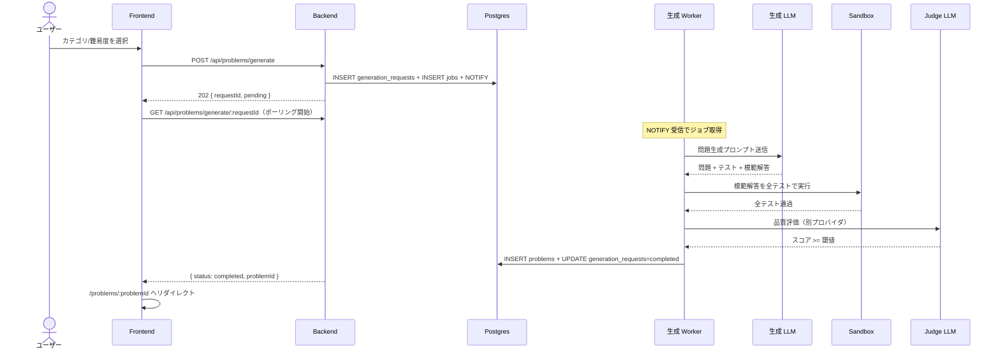

# 問題生成リクエスト

<!--
配置先：`docs/requirements/4-features/<name>.md`（フラット配置、数値 ID なし）
新規作成・更新は `/new-requirements` カスタムコマンド経由を推奨。
セクション順序：WHY（ストーリー）→ WHAT（概要 / ビジネスルール / スコープ外）→
              機能一覧（全体俯瞰）→ HOW（データ / 画面 / フロー / API / バリデーション）
              → 完成検証（受入条件）→ 進捗（ステータス）→ 外部参照（関連）

長期運用の原則（このファイルを更新する全タイミングで適用）：
  1. コードや OpenAPI / SQLAlchemy から読み取れる事実は書かない。書くのは "なぜ"（業務理由）と "観測可能な振る舞い" だけ
  2. ファイル長は許容する（行数で分割しない）。分割トリガはドメイン境界のみ
  3. ビジネスルールが 30 行を超えたら H3 サブセクションに割る（壁を防ぐ）
  4. バリデーション節は業務上の理由があるルールのみ書く（必須・長さ等の機械的検証は Pydantic / Zod が SSoT）
  5. **HTML コメント（`<!--` で始まる注釈ブロック）は削除しない**（このコメント自身を含む）。CLAUDE が将来の更新時に運用ルールを再認識するための裏ルールとして埋め込まれているため、本文整理時にまとめて消さない
-->

## ユーザーストーリー

- **役割**：認証ユーザー（プログラミング学習者）
- **やりたいこと**：カテゴリと難易度を指定して新しい TypeScript 問題を生成リクエストしたい
- **得られる価値**：既存の問題に縛られず、自分の興味・弱点に応じた練習問題を無限に得られる

<!-- 複数のロールが関わる場合は同じ 3 行セットを並べてよい -->

## 概要

LLM に問題本文・入出力例・テストケース・模範解答を生成させる機能。LLM の出力を信用せず、サンドボックス実行で動作保証してから DB に保存する点が本サービスの差別化軸。

## ビジネスルール

- **LLM の出力をそのまま信用しない**：必ずサンドボックス検証 + Judge を通したものだけを保存（→ [CLAUDE.md](../../../.claude/CLAUDE.md) 設計思想）
- **生成と Judge は別プロバイダ・別モデル**：自己評価バイアス回避（→ [ADR 0008](../../adr/0008-custom-llm-judge.md)）。**MVP（R1〜R2 ベンチマーク開始前）は Gemini 単独で例外保留**、R2 ベンチマーク開始時に切替（→ [ADR 0049](../../adr/0049-initial-llm-model-selection.md)）
- **モデル段階利用**：初回は低コスト・高速モデル、再生成時に上位モデル、Judge は中位モデル（→ [03-llm-pipeline.md: コスト最適化](../2-foundation/03-llm-pipeline.md#コスト最適化)）
- **同一プロンプトの結果は Redis キャッシュで再利用**（TTL 7 日、`prompt_hash` をキー）。**実装は R2「モデル段階利用 + プロンプトキャッシュ + Redis レスポンスキャッシュ」で対応予定**（R1-3 では `prompt_hash` 計算と `cache_hit` slog フィールドだけ先行整備済、Redis 連携は未実装のため値は常に `false`、→ [01-roadmap.md](../5-roadmap/01-roadmap.md#next次スプリント候補すべて-r2)）
- **キャンセル可能状態**：`status='pending'`（Worker 未着手）のリクエストのみキャンセル可能。Worker が処理を開始した後は中断しない（LLM 呼び出し中の中断はコスト削減効果が小さく、Worker 側のキャンセル機構を持たない方が実装単純）。Worker は `pending` から `completed` / `failed` へ 1 ステップで遷移させ、中間状態（`running`）を DB に書かない設計のため、`status` カラムの取り得る値は `pending` / `completed` / `failed` / `canceled` の 4 値のみ
- **再試行は新規リクエストとして複製**：`failed` リクエストの再試行は、元の `generation_requests` 行を上書きせず**新規行を作成**し `retry_of` カラムで元 ID を指す。履歴をトレースできるように両方を残す。回数上限は設けず、レート制限（1 分 5 回）で吸収する
- **生成所要時間と失敗理由の永続化**：`completed` / `failed` / `canceled` 遷移時に `completed_at` を書き、`failed` の時は `failure_reason` も書く。履歴画面で「経過時間 / 所要時間」「失敗理由」を表示するために必要
- **生成ステップの可視化**：Worker は pending 中に現在処理中のステップを `generation_requests.progress_step` に書く（4 値固定 enum、`ProgressStep`）。FE は `<GenerationProgress>` 部品でステップインジケータを描画する（生成ステータス画面では full variant、生成履歴では compact variant）。terminal 行（completed / failed / canceled）では progress_step は API レスポンスから外す（status を見れば終了状態が分かるため）：
  - `llm_generating` — AI が問題を作成中（LLM 呼び出し）
  - `sandbox_verifying` — 模範解答を実行して検証中（vitest）
  - `judging` — 品質をチェック中（judge LLM 評価）
  - `persisting` — 結果を保存中（problems INSERT + generation_requests 完了処理）
- **失敗理由タグ taxonomy**：`failure_reason` は Worker が以下の固定タグから 1 つを書き込む（10 値固定）。ops は DB から `SELECT failure_reason, count(*) FROM generation_requests WHERE status='failed' GROUP BY 1` で頻度分布を取り、どこを改善すべきか（プロンプト改善 / LLM プロバイダ切替 / threshold 調整 / sandbox 安定化）の優先度判断に使う。**API は本タグを `failureReason` enum として返す**（`FailureReasonTag`）。FE はタグを switch して日本語文言に変換して表示する（§生成履歴画面 §表示項目）。生タグ文字列は UI に出さない（タグそのものは内部識別子）：
  - `llm_unauthorized` — LLM API キー不正・権限不足（HTTP 401/403、即 dead）
  - `llm_cost_exceeded` — 1 ジョブのコスト上限（USD 0.20）超過（即 dead）
  - `judge_below_threshold` — judge スコアが閾値未満を再試行上限まで繰り返した
  - `sandbox_failed` — サンドボックス検証（reference_solution の Vitest 実行）が再試行上限まで失敗
  - `sandbox_infrastructure` — Docker daemon / image / コンテナ作成失敗が再試行上限まで継続（インフラ起因）
  - `llm_invalid_output` — LLM 応答が ProblemDraft schema を満たさない（JSON 不正 / 必須フィールド欠落）が再試行上限まで継続
  - `llm_rate_limit` — LLM provider の 429 が再試行上限まで継続
  - `llm_timeout` — LLM 応答タイムアウトが再試行上限まで継続
  - `llm_schema_invalid` — provider 応答が JSON schema 違反（structured output 失敗）が再試行上限まで継続
  - `max_attempts_exceeded` — 上記いずれにも該当しない fallback（真に未知。`attemptErrors` の生エラー文字列を見て調査する）
- **試行ごとのエラー履歴**：Worker は `jobs.attempt_errors` JSONB array に MarkFailed / MarkDead のたびに 1 要素 append する。各要素は `{attempt, failureReason, message, failedAt}` で、`message` は 1000 文字 truncate 済の生エラー文字列。**API は本人のリクエスト（user_id 一致 WHERE 完備）に対してのみ `attemptErrors: AttemptError[]` として返す**（他人のジョブのエラーは取得経路ゼロのため情報漏洩懸念なし）。FE は `<AttemptErrorList>` で折りたたみ UI として表示し、「3 試行のうち何が起きたか」「全部 rate_limit なのか初回 sandbox なのか」のパターン特定を可能にする
- **生成ジョブの trace_id はリクエストから採点完了まで連結**（→ [ADR 0010](../../adr/0010-w3c-trace-context-in-job-payload.md)）
- **API は enqueue 専用**：LLM 呼び出しは Worker 側に閉じる（実装制約、→ [ADR 0040](../../adr/0040-worker-grouping-and-llm-in-worker.md)）
- **Worker の所在**：R1〜R6 は採点 Worker（`apps/workers/grading`）が兼務、R7 で `apps/workers/generation` に切り出し（実装ロードマップ、→ [01-roadmap.md](../5-roadmap/01-roadmap.md)）
- **Judge LLM の用途**：Judge は**問題品質評価専用**（問題文の明確さ・テストケース網羅性・難易度妥当性・教育的価値・独自性の 5 軸評価）。ユーザー解答の採点には関与しない（→ [grading.md](./grading.md)）。Judge プロンプトは R1〜R6 の間 `apps/workers/grading/prompts/judge/` 配下に置かれるが、責務は本機能側にある
- **LLM 呼び出しのタイムアウト**：単発呼び出しは 30 秒、生成ジョブ全体（生成 + サンドボックス + Judge の合計）は 180 秒。超過は failed 扱い（再生成試行は内部で完結し、ユーザー観測には現れない）
- **1 生成あたりのコスト上限**：累積 USD 0.20（生成 + 再生成 + Judge の合計、初期値、運用ログで調整）。上限超過時点で再生成を打ち切り failed 扱い
- **非決定性パラメータの既定値**：生成プロンプトは `temperature=0.7` + JSON mode 強制（多様性確保）、Judge プロンプトは `temperature=0.0` + JSON mode 強制（評価のブレ抑制）。詳細は [03-llm-pipeline.md: 構造化出力](../2-foundation/03-llm-pipeline.md#構造化出力) を参照

## スコープ外（このスプリントでは扱わない）

- 学習履歴・弱点に基づく適応生成（[適応型出題](../5-roadmap/01-roadmap.md#適応型出題) で別途実装）
- ユーザーが独自プロンプトを書ける生成モード（プロンプトインジェクションリスクのため当面実装しない）
- 複数問題のバッチ生成（必要性が出てから検討）
- 問題の差し替え・再生成リクエスト（モデル変更後の品質再評価バッチは R7 で）
- 問題の手動編集機能（[管理ダッシュボード](../5-roadmap/01-roadmap.md#管理ダッシュボード) で扱う）

## 機能一覧

このドメインで提供する操作の全体俯瞰。詳細仕様は下の各 HOW セクション + OpenAPI（`apps/api/openapi.json`）が SSoT。

| 操作 | 対象ロール | 認証 | 概要 | 詳細 |
|---|---|---|---|---|
| 問題生成リクエスト | 認証ユーザー | 必須 | `POST /api/problems/generate` でカテゴリ・難易度を指定し、生成ジョブを投入。202 即返 | [#問題生成画面対象認証ユーザー](#問題生成画面対象認証ユーザー) |
| 生成ステータス取得 | 認証ユーザー | 必須 | `GET /api/problems/generate/:requestId` でポーリング、完了時に `problemId` を取得 | [#生成ステータス画面対象認証ユーザー](#生成ステータス画面対象認証ユーザー) |
| 生成履歴一覧 | 認証ユーザー | 必須 | `GET /api/me/generations?page=N` で自分の生成リクエスト履歴を取得（1 秒ポーリングで進行中行の状態を追従） | [#生成履歴画面対象認証ユーザー](#生成履歴画面対象認証ユーザー) |
| 生成キャンセル | 認証ユーザー | 必須 | `POST /api/me/generations/:id/cancel` で `pending` のリクエストを止める | [#履歴上のアクション](#履歴上のアクション) |
| 生成再試行 | 認証ユーザー | 必須 | `POST /api/me/generations/:id/retry` で `failed` のリクエストを新規 generation_request として複製 | [#履歴上のアクション](#履歴上のアクション) |

## データモデル

> **関わるテーブル名の列挙のみ**。カラム定義・関係詳細は書かない（drift 防止）。スキーマの SSoT は SQLAlchemy model（`apps/api/app/models/`、→ [ADR 0037](../../adr/0037-sqlalchemy-alembic-for-database.md)）、全体俯瞰は [3-cross-cutting/01-data-model.md](../3-cross-cutting/01-data-model.md)。

関わるテーブル：`generation_requests` / `problems` / `jobs`

## 画面

### 問題生成画面（対象：認証ユーザー）

- **ルート**：`/problems/new`
- **目的**：カテゴリ・難易度を選択して問題生成をリクエストする
- **使用 API**：
  - `POST /api/problems/generate` — 生成リクエスト（202 + requestId）
- **到達経路**：
  - 問題一覧ページ（[problem-display-and-answer.md §問題一覧画面](./problem-display-and-answer.md)）のヘッダー領域に常設する「新規問題を生成」ボタンから遷移
  - ゲスト（未認証）のままボタンを押した場合は `/login?next=/problems/new` にリダイレクトし、ログイン完了後に本画面へ復帰
  - 生成ステータス画面で `status === 'failed'` 時の「もう一度生成する」ボタンからも遷移（再試行用の二次導線）
- **主要インタラクション**：
  - 送信後はそのまま生成ステータス画面に遷移（同期でユーザーを待たせない）

### 生成ステータス画面（対象：認証ユーザー）

- **ルート**：`/problems/generate/:requestId`（Next.js ページパス、API パスとは別。API は `/api/problems/generate/:requestId`）
- **目的**：非同期生成の進捗を表示し、完了時に問題詳細へ自動遷移する
- **使用 API**：
  - `GET /api/problems/generate/:requestId` — ステータス取得
- **主要インタラクション**：
  - `status === 'completed'` で `/problems/:problemId` に自動リダイレクト
  - `status === 'failed'`（最大 3 回再生成しても全失敗）で再試行ボタンを表示
  - 内部の失敗種別（LLM 出力スキーマ違反 / サンドボックス失敗 / Judge スコア不合格）はユーザーには区別せず「生成に失敗しました」と表示する（情報漏洩防止）

### 生成履歴画面（対象：認証ユーザー）

- **ルート**：`/me/generations`
- **目的**：自分が過去に発行した生成リクエストを新しい順に並べ、進行中のものはリアルタイムに状態を追従し、終端状態のものはアクション（再試行 / 問題詳細遷移）の入口にする
- **使用 API**：
  - `GET /api/me/generations?page=N` — 自分の生成リクエスト履歴一覧（ページネーション）
  - `POST /api/me/generations/:id/cancel` — pending のキャンセル
  - `POST /api/me/generations/:id/retry` — failed の再試行（新規 generation_request 作成）
- **到達経路**：
  - ヘッダーグローバルナビの「生成履歴」リンクから（[3-cross-cutting/03-page-routing.md §4](../3-cross-cutting/03-page-routing.md)）
- **主要インタラクション**：
  - **行クリック**：状態に応じて遷移先を分岐
    - `completed` → `/problems/:problemId`（生成された問題本体）
    - `pending` → `/problems/generate/:requestId`（既存のステータス画面）
    - `failed` / `canceled` → 遷移なし。行内に失敗理由 / キャンセル済を表示
  - **キャンセル**：`pending` 行のみボタン表示。押すと即座にステータスが `canceled` に遷移
  - **再試行**：`failed` 行のみボタン表示。押すと新規 generation_request が作成され、ヘッダーに新しい行が追加される
- **ポーリング**：
  - **1 秒間隔**で `GET /api/me/generations` を再フェッチ
  - 全件が終端状態（`completed` / `failed` / `canceled`）になったら停止（無駄な API 呼び出しを抑える）
  - **タブ非アクティブで停止**（TanStack Query の `refetchIntervalInBackground: false`）
- **表示項目**：
  - カテゴリ / 難易度 / 状態 / リクエスト日時 / 経過時間または所要時間 / 失敗理由（failed のみ） / リトライ回数（retry_of チェーンを辿った N 回目） / LLM プロンプトバージョン
  - **失敗理由はカテゴリ別の文言を表示する**：API は `failureReason` フィールドを `FailureReasonTag` enum（§ビジネスルール §失敗理由タグ taxonomy の 6 タグ）として返し、FE は enum を switch して文言マップで変換する。**生タグ文字列は UI に出さない**（タグそのものは内部識別子）。`failureReason` を free-form string ではなく固定 enum に絞っているため、API 境界での「内部状態漏洩」懸念は構造的に解消されている。想定外値（旧データ等）はサーバ側で `null` に倒し、FE は `max_attempts_exceeded` 相当のフォールバック文言を出す
    - 例：`judge_below_threshold` → 「品質チェックを通過する問題を生成できませんでした。もう一度お試しください。」
    - 例：`llm_unauthorized` → 「AI サービスとの認証に失敗しました。管理者にお問い合わせください。」
    - 例：`max_attempts_exceeded` → 「問題を生成できませんでした。もう一度お試しください。」

### 履歴上のアクション

- **キャンセル**：`pending` のみ対象。Worker 着手前なので、対応する `jobs` 行を `state='dead'` に UPDATE + `generation_requests.status='canceled'` + `completed_at=NOW()` を同一トランザクションで行う。Worker は `state='queued'` のみ取得するため、Worker 側のキャンセル機構は不要
- **再試行**：`failed` のみ対象。新規 `generation_request` を作成（同じ category / difficulty）+ `retry_of=<直前の親 ID>` でリンク（チェーンの根 ID ではなく、ユーザーが押した failed 行 1 つだけを指す。N 回目の再試行は前回の retry レコードを親にする線形チェーンとして伸びる）+ 新規 `jobs` INSERT + NOTIFY。元レコードは status='failed' のまま残る（履歴としてトレース可能）。チェーン全体の N 回目はサーバ側で `WITH RECURSIVE` の深さ計算（`retryCount`）として返す
- **所有権チェック**：両エンドポイントとも `Submission.user_id == current_user.id` 相当の WHERE を必ず付け、他人のリクエストを 404 で隠す（権限漏洩防止）

## ユーザーフロー

### 問題生成フロー（対象：認証ユーザー）

時系列で actor 間メッセージ（ユーザー / Frontend / Backend / DB / Worker / LLM / Sandbox / Judge）が交錯するため Mermaid `sequenceDiagram` で示す。



凡例：

- 失敗系（LLM 出力スキーマ違反 / サンドボックス失敗 / Judge スコア不合格）は**上位モデルで最大 3 回再生成**。全試行失敗で `status='failed'` をフロントに返す
- ジョブキュー機構の詳細（`SELECT FOR UPDATE SKIP LOCKED` 等）は [02-architecture.md: 1 ジョブが流れる完全な経路](../2-foundation/02-architecture.md#1-ジョブが流れる完全な経路) を参照
- 図中「品質評価（別プロバイダ）」は ADR 0008 の長期方針。**MVP は Gemini 単独で例外保留**、R2 ベンチマーク開始時に別プロバイダ Judge に切替（→ [ADR 0049](../../adr/0049-initial-llm-model-selection.md)）

## API

<!--
本セクションは API-first 設計の SSoT（実装前の契約）。以下 4 ステップを必ず意識する：

  1. API 設計：このセクションで API テーブル + JSON 例を先に書く（実装前）
  2. バックエンド実装：/backend-implement が本セクションに沿って Pydantic + FastAPI を実装
  3. API の吐き出し：mise run api:openapi-export で apps/api/openapi.json を出力
  4. API 設計をバックエンド実装に合わせて更新：差分があれば本セクションを追従更新
     （実装が SSoT、本セクションは契約の鏡）

所有権ルール：本ドメインは `/api/problems/generate` 系エンドポイントを所有する。他 feature は
`→ [problem-generation.md#xxx](./problem-generation.md#xxx)` でアンカー参照のみ。
-->

| メソッド | パス | 用途 | 認証 | 詳細 |
|---|---|---|---|---|
| POST | `/api/problems/generate` | 生成リクエスト（202 + requestId 即返） | 必須 | [#post-apiproblemsgenerate](#post-apiproblemsgenerate) |
| GET | `/api/problems/generate/:requestId` | 生成ステータス取得（単件、ポーリング用） | 必須 | [#get-apiproblemsgeneraterequestid](#get-apiproblemsgeneraterequestid) |
| GET | `/api/me/generations` | 自分の生成リクエスト履歴一覧（ページネーション） | 必須 | [#get-apimegenerations](#get-apimegenerations) |
| POST | `/api/me/generations/:id/cancel` | pending のキャンセル | 必須 | [#post-apimegenerationsidcancel](#post-apimegenerationsidcancel) |
| POST | `/api/me/generations/:id/retry` | failed の再試行（新規 generation_request 作成） | 必須 | [#post-apimegenerationsidretry](#post-apimegenerationsidretry) |

機械可読の最新仕様は OpenAPI（`apps/api/openapi.json`、ランタイムは FastAPI の `/openapi.json`）が SSoT。本セクションは API-first 設計の人間可読版 + 契約の鏡。

### JSON 例

#### POST /api/problems/generate

- 認証：必須
- 使う feature：[problem-generation.md](./problem-generation.md)
- リクエスト:

```json
{ "category": "array", "difficulty": "easy" }
```

- レスポンス 202:

```json
{ "requestId": "<uuid>", "status": "pending" }
```

#### GET /api/problems/generate/:requestId

- 認証：必須
- 使う feature：[problem-generation.md](./problem-generation.md)
- レスポンス 200（生成完了時）:

```json
{
  "requestId": "<uuid>",
  "status": "completed",
  "problemId": "<uuid>"
}
```

- レスポンス 200（生成中）:

```json
{ "requestId": "<uuid>", "status": "pending" }
```

- レスポンス 200（生成失敗、最大 3 回再生成後）:

```json
{ "requestId": "<uuid>", "status": "failed" }
```

#### GET /api/me/generations

- 認証：必須
- クエリ：`page`（1 始まり、既定 1）
- レスポンス 200:

```json
{
  "items": [
    {
      "id": "<uuid>",
      "category": "array",
      "difficulty": "easy",
      "status": "completed",
      "producedProblemId": "<uuid>",
      "promptVersion": "v1",
      "retryOf": null,
      "retryCount": 0,
      "failureReason": null,
      "createdAt": "2026-05-21T10:00:00Z",
      "completedAt": "2026-05-21T10:01:30Z"
    },
    {
      "id": "<uuid>",
      "category": "string",
      "difficulty": "medium",
      "status": "failed",
      "producedProblemId": null,
      "promptVersion": "v1",
      "retryOf": null,
      "retryCount": 0,
      "failureReason": "judge_below_threshold",
      "createdAt": "2026-05-21T10:05:00Z",
      "completedAt": "2026-05-21T10:08:00Z"
    }
  ],
  "page": 1,
  "pageSize": 20,
  "totalPages": 3
}
```

#### POST /api/me/generations/:id/cancel

- 認証：必須 + 所有権チェック
- レスポンス 200:

```json
{ "id": "<uuid>", "status": "canceled" }
```

- レスポンス 409（pending 以外をキャンセルしようとした時）:

```json
{ "detail": "generation request is not cancelable (status=completed)" }
```

status には実際に DB 上で観測された遷移先（`completed` / `failed` / `canceled` のいずれか）が入る。race window（SELECT 時 pending → cancel UPDATE 時に Worker が確定）で 409 になるケースもこれに含まれる。

#### POST /api/me/generations/:id/retry

- 認証：必須 + 所有権チェック
- レスポンス 202（新規 generation_request 作成）:

```json
{
  "id": "<new-uuid>",
  "status": "pending",
  "retryOf": "<original-uuid>"
}
```

- レスポンス 409（failed 以外を再試行しようとした時）:

```json
{ "detail": "generation request is not retryable (status=completed)" }
```

## バリデーション

> **業務上の理由があるルールのみ**を書く（例：「ニックネームに本名を含めさせない方針」「招待コードは大文字英数字 8 桁の決まり」）。必須・最大長・型・正規表現等の**機械的検証は Pydantic / Zod が SSoT** なのでここには書かない（drift 防止、→ [ADR 0006](../../adr/0006-json-schema-as-single-source-of-truth.md)）。

| フィールド | 業務ルール | 理由 / エラーメッセージ |
|---|---|---|
| `category` | 許可値は `string` / `array` / `recursion` / `async` / `type-puzzle` のみ | MVP の業務スコープとして対応カテゴリを限定する判断（プロンプト・採点ロジック整備が済んだものから順次拡張）。「カテゴリを指定してください」 |
| `difficulty` | 許可値は `easy` / `medium` / `hard` のみ | MVP では 3 段階で UX を単純化する業務決定（細粒度の難易度は将来）。「難易度を指定してください」 |

## 受け入れ条件（Definition of Done）

> **役割**：プロダクトとして "完成した" と言える条件。**ユーザー / API クライアントから観測可能なふるまい** だけに絞る。「DB 上で○○」「Depends で○○」等の実装制約はビジネスルールに書く。
>
> **長期運用**：機能の振る舞い仕様の累積。機能が育つほど条件は**追加されていく**し、既存条件も仕様変更で**更新される**。**変更・追加された条件は再検証が必要なので未チェックに戻す**（既存で変わってない条件はチェック維持、全リセットはしない）。観測可能な振る舞いが変わったらここを直すのが SSoT 更新の第一歩。過去版の履歴は git log で辿る。

- [x] 問題一覧画面 (`/problems`) のヘッダー領域に「新規問題を生成」ボタンが表示され、`/problems/new` に遷移できる（ゲストの場合は `/login?next=/problems/new` 経由でログイン後に到達できる）
- [x] 問題生成画面でカテゴリ・難易度を選択して送信できる
- [x] 送信後、API は `202 Accepted` + `requestId` を即座に返す（同期で待たせない）
- [x] 生成中はステータス画面で「生成中…」と表示される
- [x] `GET /api/problems/generate/:requestId` のポーリングでステータス遷移が取得できる
- [x] 生成成功時：新規作成された問題ページに自動遷移する
- [x] 生成失敗時（最大 3 回再生成しても全失敗）：失敗ステータスを表示し、再試行ボタンを提供する
- [x] LLM 単発呼び出しが 30 秒を超えた場合に `status='failed'` が返る（単発タイムアウトの SSoT は `internal/llm/provider.go:SingleCallTimeoutDefault`）
- [ ] **ジョブ全体 180 秒タイムアウト超過時に `status='failed'` が返る**（R2「非同期ジョブ化の完全実装」で対応予定、→ [01-roadmap.md](../5-roadmap/01-roadmap.md#next次スプリント候補すべて-r2)）
- [ ] **1 生成あたりの累積コストが USD 0.20 を超えた時点で再生成を打ち切り `status='failed'` が返る**（R2「非同期ジョブ化の完全実装」で対応予定、ジョブ跨ぎのコスト集計が必要なため `generation_requests` スキーマ拡張を伴う）
- [x] 観測ログに `provider` / `model` / `prompt_version` / `input_tokens` / `output_tokens` / `cost_usd` / `cache_hit` / 所要時間が記録される（→ [04-observability.md](../2-foundation/04-observability.md)。slog フィールドは `problem_generate.go:llm done` ログで全項目記録、OTel span 統合は R4 で追加（→ [ADR 0049 §実装の優先順位](../../adr/0049-initial-llm-model-selection.md)））
- [x] レート制限：同一ユーザーで `1 分 / 5 回` を超えると `429` を返す（→ [02-api-conventions.md](../3-cross-cutting/02-api-conventions.md#レート制限)）
- [ ] `/me/generations` を踏むと自分の過去生成リクエストが新しい順に表示される
- [ ] 進行中（`pending`）の行がある間は 1 秒間隔でポーリングが走り、状態遷移が画面に反映される
- [ ] 全件が終端状態（completed / failed / canceled）になるとポーリングが止まる
- [ ] タブ非アクティブの間はポーリングが止まる（タブを戻すと再開）
- [ ] `pending` 行に「キャンセル」ボタンが表示され、押すと status が `canceled` に遷移する
- [ ] `failed` 行に「再試行」ボタンが表示され、押すと新規 generation_request が作成され `retry_of` で元 ID が記録される
- [ ] `failed` 行に失敗理由が表示される（API は `failureReason` を `FailureReasonTag` enum（6 値固定）で返し、FE は switch で日本語文言マップに変換して表示する。生タグ文字列は UI には出さない）
- [ ] retry_of チェーンを辿ったリトライ回数（N 回目）が表示される
- [ ] 他人の generation_request を `/api/me/generations/:id/cancel` `/retry` で操作しようとすると 404 が返る

## ステータス

> **役割**：開発工程としてどこまで進んだかのチェックリスト（"プロダクトの完成条件" は上の受け入れ条件、"リリース単位の進捗" は [01-roadmap.md](../5-roadmap/01-roadmap.md) で管理）。
>
> **長期運用**：機能を再着手・大きく改修するたびに**チェックを外してリセットする**（過去の完了履歴は残さない、履歴は git log と PR で辿る）。常に「この機能の現在の状態」だけを映す鏡として使う。

- [ ] バックエンド実装完了（generation ルーター：enqueue + ステータス取得 + 履歴一覧 / キャンセル / 再試行、LLM 呼び出しは含めない、→ [ADR 0040](../../adr/0040-worker-grouping-and-llm-in-worker.md)）
- [ ] バックエンドユニットテスト完了（pytest、→ [ADR 0038](../../adr/0038-test-frameworks.md)）
- [ ] フロントエンド実装完了（生成画面 / ステータス画面 / 履歴画面）
- [ ] フロントエンドユニットテスト完了（Vitest、→ [ADR 0038](../../adr/0038-test-frameworks.md)）
- [ ] ワーカー実装完了（生成 Worker + completed_at / failure_reason の書き込み。R1〜R6 は `apps/workers/grading` が兼務、R7 以降に `apps/workers/generation` に切り出し予定）
- [ ] ワーカーユニットテスト完了（Go testing + testify、→ [ADR 0038](../../adr/0038-test-frameworks.md)）
- [ ] E2E テスト完了（生成 → 完了 → 問題遷移の主要フロー + 履歴画面の表示 / キャンセル / 再試行、Playwright、→ [ADR 0038](../../adr/0038-test-frameworks.md)）
- [ ] **受け入れ条件すべて満たす**（R2 分離の 2 項目（ジョブ全体 180 秒 / コスト USD 0.20 累積上限）は R2 完了後に達成）

## 関連

- **関連機能**：
  - [問題表示・解答](./problem-display-and-answer.md)（生成された問題はここで使われる）
  - [自動採点](./grading.md)（生成時のサンドボックス検証は採点と同じ仕組み）
- **関連 ADR**：
  - [ADR 0004: Postgres ジョブキュー](../../adr/0004-postgres-as-job-queue.md)
  - [ADR 0008: LLM-as-a-Judge を自前実装](../../adr/0008-custom-llm-judge.md)
  - [ADR 0007: LLM プロバイダ抽象化（Worker 側に集約）](../../adr/0007-llm-provider-abstraction.md)
  - [ADR 0010: W3C Trace Context をジョブペイロードに埋め込む](../../adr/0010-w3c-trace-context-in-job-payload.md)
  - [ADR 0034: バックエンドフレームワークに FastAPI](../../adr/0034-fastapi-for-backend.md)
  - [ADR 0040: Worker のグルーピングと LLM 呼び出しを Worker 側に置く](../../adr/0040-worker-grouping-and-llm-in-worker.md)
- **横断要件**：
  - LLM パイプライン：[2-foundation/03-llm-pipeline.md](../2-foundation/03-llm-pipeline.md)
  - レート制限：[2-foundation/01-non-functional.md](../2-foundation/01-non-functional.md)
  - 観測性：[2-foundation/04-observability.md](../2-foundation/04-observability.md)
- **実装ルール**：[.claude/rules/backend.md](../../../.claude/rules/backend.md)、[.claude/rules/prompts.md](../../../.claude/rules/prompts.md)
