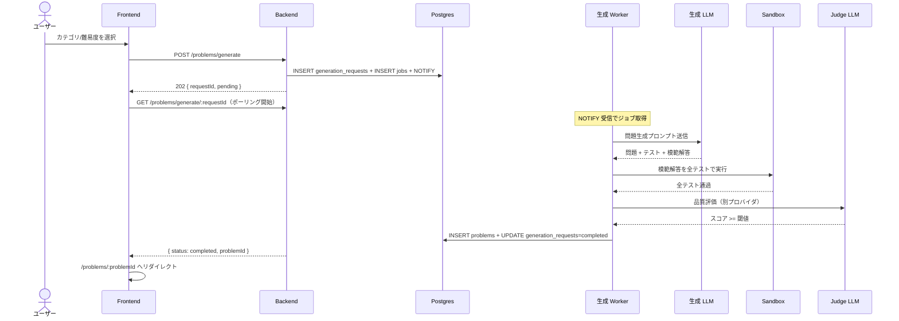

# 問題生成リクエスト

<!--
配置先：`docs/requirements/4-features/<name>.md`（フラット配置、数値 ID なし）
新規作成・更新は `/new-requirements` カスタムコマンド経由を推奨。
セクション順序：WHY（ストーリー）→ WHAT（概要 / ビジネスルール / スコープ外）→
              機能一覧（全体俯瞰）→ HOW（データ / 画面 / フロー / API / バリデーション）
              → 完成検証（受入条件）→ 進捗（ステータス）→ 外部参照（関連）

長期運用の原則（このファイルを更新する全タイミングで適用）：
  1. コードや OpenAPI / SQLAlchemy から読み取れる事実は書かない。書くのは "なぜ"（業務理由）と "観測可能な振る舞い" だけ
  2. ファイル長は許容する（行数で分割しない）。分割トリガはドメイン境界のみ
  3. ビジネスルールが 30 行を超えたら H3 サブセクションに割る（壁を防ぐ）
  4. バリデーション節は業務上の理由があるルールのみ書く（必須・長さ等の機械的検証は Pydantic / Zod が SSoT）
  5. **HTML コメント（`<!--` で始まる注釈ブロック）は削除しない**（このコメント自身を含む）。CLAUDE が将来の更新時に運用ルールを再認識するための裏ルールとして埋め込まれているため、本文整理時にまとめて消さない
-->

## ユーザーストーリー

- **役割**：認証ユーザー（プログラミング学習者）
- **やりたいこと**：カテゴリと難易度を指定して新しい TypeScript 問題を生成リクエストしたい
- **得られる価値**：既存の問題に縛られず、自分の興味・弱点に応じた練習問題を無限に得られる

<!-- 複数のロールが関わる場合は同じ 3 行セットを並べてよい -->

## 概要

LLM に問題本文・入出力例・テストケース・模範解答を生成させる機能。LLM の出力を信用せず、サンドボックス実行で動作保証してから DB に保存する点が本サービスの差別化軸。

## ビジネスルール

- **LLM の出力をそのまま信用しない**：必ずサンドボックス検証 + Judge を通したものだけを保存（→ [CLAUDE.md](../../../.claude/CLAUDE.md) 設計思想）
- **生成と Judge は別プロバイダ・別モデル**：自己評価バイアス回避（→ [ADR 0008](../../adr/0008-custom-llm-judge.md)）。**MVP（R1〜R2 ベンチマーク開始前）は Gemini 単独で例外保留**、R2 ベンチマーク開始時に切替（→ [ADR 0049](../../adr/0049-initial-llm-model-selection.md)）
- **モデル段階利用**：初回は低コスト・高速モデル、再生成時に上位モデル、Judge は中位モデル（→ [03-llm-pipeline.md: コスト最適化](../2-foundation/03-llm-pipeline.md#コスト最適化)）
- **同一プロンプトの結果は Redis キャッシュで再利用**（TTL 7 日、`prompt_hash` をキー）
- **生成ジョブの trace_id はリクエストから採点完了まで連結**（→ [ADR 0010](../../adr/0010-w3c-trace-context-in-job-payload.md)）
- **API は enqueue 専用**：LLM 呼び出しは Worker 側に閉じる（実装制約、→ [ADR 0040](../../adr/0040-worker-grouping-and-llm-in-worker.md)）
- **Worker の所在**：R1〜R6 は採点 Worker（`apps/workers/grading`）が兼務、R7 で `apps/workers/generation` に切り出し（実装ロードマップ、→ [01-roadmap.md](../5-roadmap/01-roadmap.md)）
- **Judge LLM の用途**：Judge は**問題品質評価専用**（問題文の明確さ・テストケース網羅性・難易度妥当性・教育的価値・独自性の 5 軸評価）。ユーザー解答の採点には関与しない（→ [grading.md](./grading.md)）。Judge プロンプトは R1〜R6 の間 `apps/workers/grading/prompts/judge/` 配下に置かれるが、責務は本機能側にある
- **LLM 呼び出しのタイムアウト**：単発呼び出しは 30 秒、生成ジョブ全体（生成 + サンドボックス + Judge の合計）は 180 秒。超過は failed 扱い（再生成試行は内部で完結し、ユーザー観測には現れない）
- **1 生成あたりのコスト上限**：累積 USD 0.20（生成 + 再生成 + Judge の合計、初期値、運用ログで調整）。上限超過時点で再生成を打ち切り failed 扱い
- **非決定性パラメータの既定値**：生成プロンプトは `temperature=0.7` + JSON mode 強制（多様性確保）、Judge プロンプトは `temperature=0.0` + JSON mode 強制（評価のブレ抑制）。詳細は [03-llm-pipeline.md: 構造化出力](../2-foundation/03-llm-pipeline.md#構造化出力) を参照

## スコープ外（このスプリントでは扱わない）

- 学習履歴・弱点に基づく適応生成（[適応型出題](../5-roadmap/01-roadmap.md#適応型出題) で別途実装）
- ユーザーが独自プロンプトを書ける生成モード（プロンプトインジェクションリスクのため当面実装しない）
- 複数問題のバッチ生成（必要性が出てから検討）
- 問題の差し替え・再生成リクエスト（モデル変更後の品質再評価バッチは R7 で）
- 問題の手動編集機能（[管理ダッシュボード](../5-roadmap/01-roadmap.md#管理ダッシュボード) で扱う）

## 機能一覧

このドメインで提供する操作の全体俯瞰。詳細仕様は下の各 HOW セクション + OpenAPI（`apps/api/openapi.json`）が SSoT。

| 操作 | 対象ロール | 認証 | 概要 | 詳細 |
|---|---|---|---|---|
| 問題生成リクエスト | 認証ユーザー | 必須 | `POST /problems/generate` でカテゴリ・難易度を指定し、生成ジョブを投入。202 即返 | [#問題生成画面対象認証ユーザー](#問題生成画面対象認証ユーザー) |
| 生成ステータス取得 | 認証ユーザー | 必須 | `GET /problems/generate/:requestId` でポーリング、完了時に `problemId` を取得 | [#生成ステータス画面対象認証ユーザー](#生成ステータス画面対象認証ユーザー) |

## データモデル

> **関わるテーブル名の列挙のみ**。カラム定義・関係詳細は書かない（drift 防止）。スキーマの SSoT は SQLAlchemy model（`apps/api/app/models/`、→ [ADR 0037](../../adr/0037-sqlalchemy-alembic-for-database.md)）、全体俯瞰は [3-cross-cutting/01-data-model.md](../3-cross-cutting/01-data-model.md)。

関わるテーブル：`generation_requests` / `problems` / `jobs`

## 画面

### 問題生成画面（対象：認証ユーザー）

- **ルート**：`/problems/new`
- **目的**：カテゴリ・難易度を選択して問題生成をリクエストする
- **使用 API**：
  - `POST /problems/generate` — 生成リクエスト（202 + requestId）
- **主要インタラクション**：
  - 送信後はそのまま生成ステータス画面に遷移（同期でユーザーを待たせない）

### 生成ステータス画面（対象：認証ユーザー）

- **ルート**：`/problems/generate/:requestId`
- **目的**：非同期生成の進捗を表示し、完了時に問題詳細へ自動遷移する
- **使用 API**：
  - `GET /problems/generate/:requestId` — ステータス取得
- **主要インタラクション**：
  - `status === 'completed'` で `/problems/:problemId` に自動リダイレクト
  - `status === 'failed'`（最大 3 回再生成しても全失敗）で再試行ボタンを表示
  - 内部の失敗種別（LLM 出力スキーマ違反 / サンドボックス失敗 / Judge スコア不合格）はユーザーには区別せず「生成に失敗しました」と表示する（情報漏洩防止）

## ユーザーフロー

### 問題生成フロー（対象：認証ユーザー）

時系列で actor 間メッセージ（ユーザー / Frontend / Backend / DB / Worker / LLM / Sandbox / Judge）が交錯するため Mermaid `sequenceDiagram` で示す。



凡例：

- 失敗系（LLM 出力スキーマ違反 / サンドボックス失敗 / Judge スコア不合格）は**上位モデルで最大 3 回再生成**。全試行失敗で `status='failed'` をフロントに返す
- ジョブキュー機構の詳細（`SELECT FOR UPDATE SKIP LOCKED` 等）は [02-architecture.md: 1 ジョブが流れる完全な経路](../2-foundation/02-architecture.md#1-ジョブが流れる完全な経路) を参照
- 図中「品質評価（別プロバイダ）」は ADR 0008 の長期方針。**MVP は Gemini 単独で例外保留**、R2 ベンチマーク開始時に別プロバイダ Judge に切替（→ [ADR 0049](../../adr/0049-initial-llm-model-selection.md)）

## API

<!--
本セクションは API-first 設計の SSoT（実装前の契約）。以下 4 ステップを必ず意識する：

  1. API 設計：このセクションで API テーブル + JSON 例を先に書く（実装前）
  2. バックエンド実装：/backend-implement が本セクションに沿って Pydantic + FastAPI を実装
  3. API の吐き出し：mise run api:openapi-export で apps/api/openapi.json を出力
  4. API 設計をバックエンド実装に合わせて更新：差分があれば本セクションを追従更新
     （実装が SSoT、本セクションは契約の鏡）

所有権ルール：本ドメインは `/problems/generate` 系エンドポイントを所有する。他 feature は
`→ [problem-generation.md#xxx](./problem-generation.md#xxx)` でアンカー参照のみ。
-->

| メソッド | パス | 用途 | 認証 | 詳細 |
|---|---|---|---|---|
| POST | `/problems/generate` | 生成リクエスト（202 + requestId 即返） | 必須 | [#post-problemsgenerate](#post-problemsgenerate) |
| GET | `/problems/generate/:requestId` | 生成ステータス取得（ポーリング用） | 必須 | [#get-problemsgeneraterequestid](#get-problemsgeneraterequestid) |

機械可読の最新仕様は OpenAPI（`apps/api/openapi.json`、ランタイムは FastAPI の `/openapi.json`）が SSoT。本セクションは API-first 設計の人間可読版 + 契約の鏡。

### JSON 例

#### POST /problems/generate

- 認証：必須
- 使う feature：[problem-generation.md](./problem-generation.md)
- リクエスト:

```json
{ "category": "array", "difficulty": "easy" }
```

- レスポンス 202:

```json
{ "requestId": "<uuid>", "status": "pending" }
```

#### GET /problems/generate/:requestId

- 認証：必須
- 使う feature：[problem-generation.md](./problem-generation.md)
- レスポンス 200（生成完了時）:

```json
{
  "requestId": "<uuid>",
  "status": "completed",
  "problemId": "<uuid>"
}
```

- レスポンス 200（生成中）:

```json
{ "requestId": "<uuid>", "status": "pending" }
```

- レスポンス 200（生成失敗、最大 3 回再生成後）:

```json
{ "requestId": "<uuid>", "status": "failed" }
```

## バリデーション

> **業務上の理由があるルールのみ**を書く（例：「ニックネームに本名を含めさせない方針」「招待コードは大文字英数字 8 桁の決まり」）。必須・最大長・型・正規表現等の**機械的検証は Pydantic / Zod が SSoT** なのでここには書かない（drift 防止、→ [ADR 0006](../../adr/0006-json-schema-as-single-source-of-truth.md)）。

| フィールド | 業務ルール | 理由 / エラーメッセージ |
|---|---|---|
| `category` | 許可値は `string` / `array` / `recursion` / `async` / `type-puzzle` のみ | MVP の業務スコープとして対応カテゴリを限定する判断（プロンプト・採点ロジック整備が済んだものから順次拡張）。「カテゴリを指定してください」 |
| `difficulty` | 許可値は `easy` / `medium` / `hard` のみ | MVP では 3 段階で UX を単純化する業務決定（細粒度の難易度は将来）。「難易度を指定してください」 |

## 受け入れ条件（Definition of Done）

> **役割**：プロダクトとして "完成した" と言える条件。**ユーザー / API クライアントから観測可能なふるまい** だけに絞る。「DB 上で○○」「Depends で○○」等の実装制約はビジネスルールに書く。
>
> **長期運用**：機能の振る舞い仕様の累積。機能が育つほど条件は**追加されていく**し、既存条件も仕様変更で**更新される**。**変更・追加された条件は再検証が必要なので未チェックに戻す**（既存で変わってない条件はチェック維持、全リセットはしない）。観測可能な振る舞いが変わったらここを直すのが SSoT 更新の第一歩。過去版の履歴は git log で辿る。

- [ ] 問題生成画面でカテゴリ・難易度を選択して送信できる
- [ ] 送信後、API は `202 Accepted` + `requestId` を即座に返す（同期で待たせない）
- [ ] 生成中はステータス画面で「生成中…」と表示される
- [ ] `GET /problems/generate/:requestId` のポーリングでステータス遷移が取得できる
- [ ] 生成成功時：新規作成された問題ページに自動遷移する
- [ ] 生成失敗時（最大 3 回再生成しても全失敗）：失敗ステータスを表示し、再試行ボタンを提供する
- [ ] LLM 単発呼び出し 30 秒 / ジョブ全体 180 秒のタイムアウト超過時に `status='failed'` が返る
- [ ] 1 生成あたりの累積コストが USD 0.20 を超えた時点で再生成を打ち切り `status='failed'` が返る
- [ ] 観測ログに `provider` / `model` / `prompt_version` / `input_tokens` / `output_tokens` / `cost_usd` / `cache_hit` / 所要時間が記録される（→ [04-observability.md](../2-foundation/04-observability.md)）
- [x] レート制限：同一ユーザーで `1 分 / 5 回` を超えると `429` を返す（→ [02-api-conventions.md](../3-cross-cutting/02-api-conventions.md#レート制限)）

## ステータス

> **役割**：開発工程としてどこまで進んだかのチェックリスト（"プロダクトの完成条件" は上の受け入れ条件、"リリース単位の進捗" は [01-roadmap.md](../5-roadmap/01-roadmap.md) で管理）。
>
> **長期運用**：機能を再着手・大きく改修するたびに**チェックを外してリセットする**（過去の完了履歴は残さない、履歴は git log と PR で辿る）。常に「この機能の現在の状態」だけを映す鏡として使う。

- [x] バックエンド実装完了（generation ルーター：enqueue + ステータス取得のみ、LLM 呼び出しは含めない、→ [ADR 0040](../../adr/0040-worker-grouping-and-llm-in-worker.md)）
- [x] バックエンドユニットテスト完了（pytest、→ [ADR 0038](../../adr/0038-test-frameworks.md)）
- [x] フロントエンド実装完了（生成画面 / ステータス画面）
- [x] フロントエンドユニットテスト完了（Vitest、→ [ADR 0038](../../adr/0038-test-frameworks.md)）
- [x] ワーカー実装完了（生成 Worker。R1〜R6 は `apps/workers/grading` が兼務（`problem_generate.go` / `generation_prompt.go`）、R7 以降に `apps/workers/generation` に切り出し予定）
- [x] ワーカーユニットテスト完了（Go testing + testify、`problem_generate_test.go` / `generation_prompt_test.go`、実 LLM を叩く smoke は `generation_smoke_integration_test.go`、→ [ADR 0038](../../adr/0038-test-frameworks.md)）
- [ ] E2E テスト完了（生成 → 完了 → 問題遷移の主要フロー、Playwright、→ [ADR 0038](../../adr/0038-test-frameworks.md)）
- [ ] **受け入れ条件すべて満たす**

## 関連

- **関連機能**：
  - [問題表示・解答](./problem-display-and-answer.md)（生成された問題はここで使われる）
  - [自動採点](./grading.md)（生成時のサンドボックス検証は採点と同じ仕組み）
- **関連 ADR**：
  - [ADR 0004: Postgres ジョブキュー](../../adr/0004-postgres-as-job-queue.md)
  - [ADR 0008: LLM-as-a-Judge を自前実装](../../adr/0008-custom-llm-judge.md)
  - [ADR 0007: LLM プロバイダ抽象化（Worker 側に集約）](../../adr/0007-llm-provider-abstraction.md)
  - [ADR 0010: W3C Trace Context をジョブペイロードに埋め込む](../../adr/0010-w3c-trace-context-in-job-payload.md)
  - [ADR 0034: バックエンドフレームワークに FastAPI](../../adr/0034-fastapi-for-backend.md)
  - [ADR 0040: Worker のグルーピングと LLM 呼び出しを Worker 側に置く](../../adr/0040-worker-grouping-and-llm-in-worker.md)
- **横断要件**：
  - LLM パイプライン：[2-foundation/03-llm-pipeline.md](../2-foundation/03-llm-pipeline.md)
  - レート制限：[2-foundation/01-non-functional.md](../2-foundation/01-non-functional.md)
  - 観測性：[2-foundation/04-observability.md](../2-foundation/04-observability.md)
- **実装ルール**：[.claude/rules/backend.md](../../../.claude/rules/backend.md)、[.claude/rules/prompts.md](../../../.claude/rules/prompts.md)
