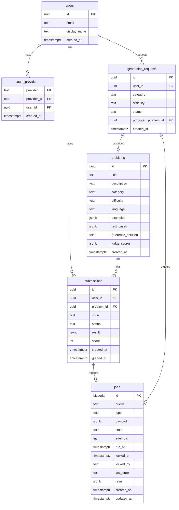

# 09. データモデル

> **このドキュメントの守備範囲**：ER 図、主要テーブル定義、ジョブペイロードのスキーマ、インデックス設計、命名規則。
> **ORM・マイグレーションツールの選定**は [07_tech_stack.md](./07_tech_stack.md#データベース) を、**コンポーネントとデータの関係**は [04_architecture.md](./04_architecture.md) を参照。

---

## ER 図（概要）



---

## テーブル定義

### `users`
プロバイダ非依存のユーザー本体（→ [ADR 0015](../../adr/0015-github-oauth-with-extensible-design.md)）

| カラム | 型 | 制約 | 説明 |
|---|---|---|---|
| `id` | UUID | PK | ユーザー ID |
| `email` | TEXT |  | メールアドレス（取得できれば、UNIQUE 制約は付けない） |
| `display_name` | TEXT |  | 表示名 |
| `created_at` | TIMESTAMPTZ | NOT NULL DEFAULT now() | |

### `auth_providers`
ユーザーと OAuth プロバイダの紐付け。1 ユーザーが将来複数プロバイダで紐づけ可能。

| カラム | 型 | 制約 | 説明 |
|---|---|---|---|
| `provider` | TEXT | NOT NULL | `github`（MVP）、将来：`google`, `email` 等 |
| `provider_id` | TEXT | NOT NULL | プロバイダ側のユーザー ID |
| `user_id` | UUID | FK → users.id, NOT NULL | |
| `created_at` | TIMESTAMPTZ | NOT NULL DEFAULT now() | |
| **PK** | | (provider, provider_id) | 複合主キー |
| **INDEX** | | (user_id) | ユーザー側からの逆引き |

### `problems`
| カラム | 型 | 制約 | 説明 |
|---|---|---|---|
| `id` | UUID | PK | 問題 ID |
| `title` | TEXT | NOT NULL | 問題タイトル |
| `description` | TEXT | NOT NULL | 問題文 |
| `category` | TEXT | NOT NULL | 配列操作 / 非同期 / 型パズル など |
| `difficulty` | TEXT | NOT NULL | easy / medium / hard |
| `language` | TEXT | NOT NULL DEFAULT 'typescript' | 採点対象言語 |
| `examples` | JSONB | NOT NULL | 入出力例 `[{ input, output }]` |
| `test_cases` | JSONB | NOT NULL | 採点用テストケース `[{ input, expected }]` |
| `reference_solution` | TEXT | NOT NULL | 模範解答（TS コード） |
| `judge_scores` | JSONB |  | LLM-as-a-Judge の評価スコア（多軸） |
| `created_at` | TIMESTAMPTZ | NOT NULL DEFAULT now() | |

### `submissions`
| カラム | 型 | 制約 | 説明 |
|---|---|---|---|
| `id` | UUID | PK | 解答 ID |
| `user_id` | UUID | FK → users.id, NOT NULL | |
| `problem_id` | UUID | FK → problems.id, NOT NULL | |
| `code` | TEXT | NOT NULL | ユーザーが書いた TS コード |
| `status` | TEXT | NOT NULL | pending / graded / failed |
| `result` | JSONB |  | 採点結果（テストケースごとの成否、エラー詳細） |
| `score` | INT |  | 通過テストケース数 / 全数 |
| `created_at` | TIMESTAMPTZ | NOT NULL DEFAULT now() | |
| `graded_at` | TIMESTAMPTZ |  | 採点完了時刻 |

### `generation_requests`
| カラム | 型 | 制約 | 説明 |
|---|---|---|---|
| `id` | UUID | PK | 生成リクエスト ID |
| `user_id` | UUID | FK → users.id | リクエスト元（任意） |
| `category` | TEXT | NOT NULL | |
| `difficulty` | TEXT | NOT NULL | |
| `status` | TEXT | NOT NULL | pending / completed / failed |
| `produced_problem_id` | UUID | FK → problems.id | 成功時の生成問題 |
| `created_at` | TIMESTAMPTZ | NOT NULL DEFAULT now() | |

### `jobs`（ジョブキュー）
| カラム | 型 | 制約 | 説明 |
|---|---|---|---|
| `id` | BIGSERIAL | PK | ジョブ ID |
| `queue` | TEXT | NOT NULL | キュー名（grading / generation） |
| `type` | TEXT | NOT NULL | grade / generate-problem 等 |
| `payload` | JSONB | NOT NULL | ジョブごとのデータ（後述） |
| `state` | TEXT | NOT NULL DEFAULT 'queued' | queued / running / done / failed / dead |
| `attempts` | INT | NOT NULL DEFAULT 0 | 試行回数 |
| `run_at` | TIMESTAMPTZ | NOT NULL DEFAULT now() | 実行可能になる時刻（リトライ用） |
| `locked_at` | TIMESTAMPTZ |  | 取得時刻 |
| `locked_by` | TEXT |  | 取得したワーカー名 |
| `last_error` | TEXT |  | 直近の失敗理由 |
| `result` | JSONB |  | 完了時の結果 |
| `created_at` | TIMESTAMPTZ | NOT NULL DEFAULT now() | |
| `updated_at` | TIMESTAMPTZ | NOT NULL DEFAULT now() | |

---

## インデックス設計

### `jobs`
- `(queue, state, run_at)` — ワーカーの取得クエリ高速化（最重要）
- `(state, locked_at)` — スタックジョブのリクレイム検索
- `(created_at)` — 古いジョブのアーカイブバッチ

### `submissions`
- `(user_id, created_at DESC)` — 学習履歴表示
- `(problem_id, status)` — 問題ごとの正答率集計

### `problems`
- `(category, difficulty)` — 出題候補絞り込み
- `(created_at DESC)` — 新着取得

---

## ジョブペイロードのスキーマ

ジョブの中身は JSON Schema で管理し、TS（NestJS）と Go 両方の型を自動生成する。

### 採点ジョブ（`type='grade'`）
```json
{
  "$schema": "https://json-schema.org/draft/2020-12/schema",
  "type": "object",
  "required": ["submissionId", "problemId", "code", "language"],
  "properties": {
    "submissionId": { "type": "string", "format": "uuid" },
    "problemId":    { "type": "string", "format": "uuid" },
    "userId":       { "type": "string", "format": "uuid" },
    "code":         { "type": "string" },
    "language":     { "type": "string", "enum": ["typescript"] },
    "timeoutMs":    { "type": "integer", "default": 5000 }
  }
}
```

### 問題生成ジョブ（`type='generate-problem'`）
```json
{
  "$schema": "https://json-schema.org/draft/2020-12/schema",
  "type": "object",
  "required": ["requestId", "category", "difficulty"],
  "properties": {
    "requestId":   { "type": "string", "format": "uuid" },
    "userId":      { "type": "string", "format": "uuid" },
    "category":    { "type": "string" },
    "difficulty":  { "type": "string", "enum": ["easy", "medium", "hard"] },
    "language":    { "type": "string", "enum": ["typescript"], "default": "typescript" }
  }
}
```

### ジョブ結果のスキーマ（`jobs.result`）

採点ジョブの結果例：
```json
{
  "passed": true,
  "passedCount": 5,
  "totalCount": 5,
  "durationMs": 1340,
  "stdout": "...",
  "stderr": "",
  "testResults": [
    { "name": "case1", "passed": true, "durationMs": 120 }
  ]
}
```

---

## 命名規則

- **テーブル名**：複数形・スネークケース（`users`, `submissions`, `generation_requests`）
- **カラム名**：スネークケース（`created_at`, `user_id`）
- **主キー**：`id`（UUID または BIGSERIAL）
- **外部キー**：`<参照テーブル単数形>_id`（`user_id`, `problem_id`）
- **タイムスタンプ**：`created_at`, `updated_at`, `<イベント名>_at`（`graded_at`, `locked_at`）
- **状態カラム**：`state`（マシン的）/ `status`（ユーザー視点）を使い分け
- **JSON カラム**：JSONB を使う、必ずスキーマを別途文書化

---

## マイグレーション運用

- マイグレーションは Prisma または Drizzle で管理（→ [07_tech_stack.md](./07_tech_stack.md#データベース)）
- 1 マイグレーション = 1 つの論理変更
- 後方互換性を保つ順序で書く（カラム追加 → 書き込みコード更新 → 旧カラム削除）
- 本番マイグレーションは GitHub Actions の手動承認ジョブで実行

---

## 将来拡張の想定（Phase 7：pgvector / ベクトル検索）

Phase 7 で RAG・重複検出・意味的検索・教材引用ヒント等を導入する際、以下のスキーマ変更を予定する。MVP では未導入。

### 拡張機能の有効化
```sql
CREATE EXTENSION IF NOT EXISTS vector;
```

### `problems` テーブルへのカラム追加
| カラム | 型 | 用途 |
|---|---|---|
| `embedding` | `vector(1536)` | 問題文 + 模範解答の埋め込み。重複検出・意味的検索・類似問題推薦で使用 |

### 新規 `documents` テーブル（RAG 用教材）
| カラム | 型 | 制約 | 説明 |
|---|---|---|---|
| `id` | UUID | PK | |
| `source` | TEXT | NOT NULL | 出典（例：`MDN`, `TS Handbook`, `自作ノート`） |
| `chapter` | TEXT |  | 章・セクション識別子 |
| `url` | TEXT |  | 出典 URL |
| `content` | TEXT | NOT NULL | 段落本文（チャンキング後） |
| `embedding` | `vector(1536)` | NOT NULL | content の埋め込み |
| `license` | TEXT |  | 著作権・ライセンス情報（CC-BY-SA 等） |
| `created_at` | TIMESTAMPTZ | NOT NULL DEFAULT now() | |

### インデックス（Phase 7 で追加）
- `problems.embedding`：HNSW（精度優先）または IVFFlat（速度優先）。運用ログに基づいて選定
- `documents.embedding`：HNSW
- `documents (source, chapter)`：教材内ナビゲーション用

### embedding 生成方針
- 次元数 1536 は OpenAI `text-embedding-3-small` を初期想定（モデルは [ADR 0011](../../adr/0011-llm-provider-abstraction.md) に従い実装時決定）
- 既存問題の埋め戻しは Python バッチ（Phase 7 の評価・分析パイプライン）で実施
- 新規問題は生成完了時に embedding を計算して保存

### 詳細
Phase 7 着手時に新規 ADR（例：`0012-pgvector-for-rag-and-dedup.md`）で意思決定を記録する。それまでは本セクションを「将来拡張の想定」として参照。
